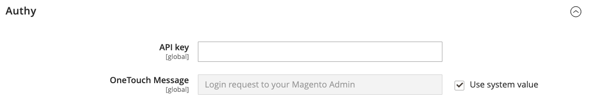

# [!UICONTROL Security] > [!UICONTROL 2FA]

>[!NOTE]
>
>As lojas que ativaram a autenticação do Adobe Identity Management Services (IMS) têm a Adobe Commerce nativa e a autenticação de dois fatores (2FA) da Magento Open Source desativadas. Os usuários administradores que estão conectados à instância do Adobe Commerce com suas credenciais do Adobe não precisam se autenticar novamente para muitas tarefas administrativas. A autenticação é tratada pelo Adobe IMS quando o usuário administrador faz logon em sua sessão atual. Consulte [Visão geral da integração do Adobe Commerce com o Adobe IMS](https://experienceleague.adobe.com/docs/commerce-admin/start/admin/ims/adobe-ims-integration-overview.html).

{{config}}

Para obter mais informações sobre como alterar essas configurações, consulte [Autenticação de dois fatores (2FA)](../../systems/security-two-factor-authentication.md) no _Guia de Sistemas de Administração_.

## [!UICONTROL General]

<!-- zoom -->

| Campo | [Escopo](../../getting-started/websites-stores-views.md#scope-settings) | Descrição |
|--- |--- |--- |
| [!UICONTROL Providers to use] | Global | Indica os métodos de autenticação de dois fatores necessários. Se você selecionar mais de um provedor, cada usuário deverá configurar cada método 2FA na próxima vez que fizer logon. |
| [!UICONTROL Configuration Email URL for Web API] | Global | Para implementações personalizadas, a URL para um link alternativo de configuração de email que é enviado aos usuários _Administrador_ no primeiro logon. No modelo de email, use o espaço reservado `:tfat` para indicar onde o token é inserido. |
| [!UICONTROL Retry attempt limit for Two-Factor Authentication] | Global | Determina quantas vezes um administrador pode inserir um [!DNL one-time password (OTP)] antes que sua conta seja temporariamente desabilitada. Padrão: `10` |
| [!UICONTROL Two-Factor Authentication lockout time (seconds)] | Global | Determina quanto tempo (em segundos) um administrador pode esperar para inserir um [!DNL one-time password (OTP)] antes que sua conta seja temporariamente desabilitada. Padrão: `300` |

{style="table-layout:auto"}

## [!UICONTROL Google]

<!-- zoom -->

| Campo | [Escopo](../../getting-started/websites-stores-views.md#scope-settings) | Descrição |
|--- |--- |--- |
| [!UICONTROL OTP Window] | Global | Determina quanto tempo (em segundos) o sistema aceita o [!DNL one-time-password (OTP)] de um administrador após a expiração. Não pode ser maior do que o tempo de vida de um único OTP (geralmente 30 segundos). Padrão: `29` |

{style="table-layout:auto"}

## [!UICONTROL Duo Security]

<!-- zoom -->

| Campo | [Escopo](../../getting-started/websites-stores-views.md#scope-settings) | Descrição |
|--- |--- |--- |
| [!UICONTROL Client Id] | Global | A ID do cliente da sua conta [!DNL Duo Security]. |
| [!UICONTROL Client Secret] | Global | O Segredo do Cliente da sua conta [!DNL Duo Security]. |
| [!UICONTROL Integration Key] | Global | A chave de integração da sua conta de API [!DNL Duo Security]. |
| [!UICONTROL Secret Key] | Global | A chave secreta da sua conta de API do [!DNL Duo Security]. |
| [!UICONTROL API Hostname] | Global | O nome de host da API da sua conta [!DNL Duo Security]. |

{style="table-layout:auto"}

## [!UICONTROL Authy]

<!-- zoom -->

| Campo | [Escopo](../../getting-started/websites-stores-views.md#scope-settings) | Descrição |
|--- |--- |--- |
| [!UICONTROL API Key] | Global | A chave de API da sua conta [!DNL Authy]. |
| [!UICONTROL OneTouch Message] | Global | A mensagem que aparece no autenticador [!DNL Authy] no logon. Padrão: `Login request to your Magento Admin` |

{style="table-layout:auto"}

## [!UICONTROL U2F Key]

<!-- zoom -->

| Campo | [Escopo](../../getting-started/websites-stores-views.md#scope-settings) | Descrição |
|--- |--- |--- |
| [!UICONTROL WebApi Challenge Domain] | Global | O domínio usado para emitir e processar desafios do [!DNL WebAuthn] para implementações WebAPI personalizadas. |

{style="table-layout:auto"}
