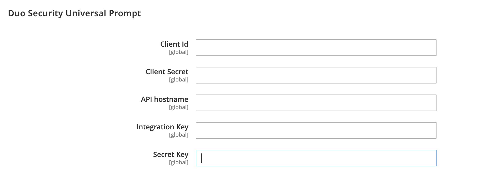

# [!UICONTROL Security] > [!UICONTROL 2FA]

>[!NOTE]
>
>Lojas que habilitaram a autenticação Adobe Systems Identity Management Services (IMS) têm nativo Adobe Systems Comércio e Magento Open Source autenticação de dois fatores (2FA) desativados. Os usuários administradores que fazem logon em suas Adobe Systems Comércio instância com suas credenciais Adobe Systems não precisam reauttenticar para muitas tarefas de administrador. Authentication é tratado por Adobe Systems IMS quando o administrador usuário faz logon em sua sessão atual. Consulte [Integração de Adobe Systems Comércio com Adobe Systems visão geral](https://experienceleague.adobe.com/docs/commerce-admin/start/admin/ims/adobe-ims-integration-overview.html) do IMS.

{{config}}

Para obter mais informações sobre como alterar essas configurações, consulte [Autenticação de dois fatores (2FA)](../../systems/security-two-factor-authentication.md) no Guia _de_ sistemas de administração.

## [!UICONTROL General]

<!-- zoom -->

| Campo | [Âmbito](../../getting-started/websites-stores-views.md#scope-settings) | Descrição |
|--- |--- |--- |
| [!UICONTROL Providers to use] | Global | Indica os métodos de autenticação de dois fatores necessários. Se você selecionar mais de um provedor, cada usuário deverá configurar cada método 2FA na próxima vez que fizer logon. |
| [!UICONTROL Configuration Email URL for Web API] | Global | Para implementações personalizadas, a URL para um link alternativo de configuração de email que é enviado aos usuários _Administrador_ no primeiro logon. No modelo de email, use o espaço reservado `:tfat` para indicar onde o token é inserido. |
| [!UICONTROL Retry attempt limit for Two-Factor Authentication] | Global | Determina quantas vezes um administrador pode inserir um [!DNL one-time password (OTP)] antes que sua conta seja temporariamente desabilitada. Padrão: `10` |
| [!UICONTROL Two-Factor Authentication lockout time (seconds)] | Global | Determina quanto tempo (em segundos) um administrador pode esperar para inserir um [!DNL one-time password (OTP)] antes que sua conta seja temporariamente desabilitada. Padrão: `300` |

{style="table-layout:auto"}

## [!UICONTROL Google]

<!-- zoom -->

| Campo | [Âmbito](../../getting-started/websites-stores-views.md#scope-settings) | Descrição |
|--- |--- |--- |
| [!UICONTROL OTP Window] | Global | Determina por quanto tempo (em segundos) o sistema aceita os dados de [!DNL one-time-password (OTP)] um administrador depois de expirar. Não pode ser maior do que a tempo de vida de um único OTP (geralmente 30 segundos). Inadimplência: `29` |

{style="table-layout:auto"}

## [!UICONTROL Duo Security]

<!-- zoom -->

| Campo | [Âmbito](../../getting-started/websites-stores-views.md#scope-settings) | Descrição |
|--- |--- |--- |
| [!UICONTROL Client Id] | Global | A ID do cliente da sua conta [!DNL Duo Security]. |
| [!UICONTROL Client Secret] | Global | O Segredo do Cliente da sua conta [!DNL Duo Security]. |
| [!UICONTROL Integration Key] | Global | A chave de integração da sua conta de API [!DNL Duo Security]. |
| [!UICONTROL Secret Key] | Global | A chave secreta da sua conta de API do [!DNL Duo Security]. |
| [!UICONTROL API Hostname] | Global | O nome de host da API da sua conta [!DNL Duo Security]. |

{style="table-layout:auto"}

## [!UICONTROL Authy]

<!-- zoom -->

| Campo | [Âmbito](../../getting-started/websites-stores-views.md#scope-settings) | Descrição |
|--- |--- |--- |
| [!UICONTROL API Key] | Global | A chave de API da sua conta [!DNL Authy]. |
| [!UICONTROL OneTouch Message] | Global | A mensagem que aparece no autenticador [!DNL Authy] no logon. Padrão: `Login request to your Magento Admin` |

{style="table-layout:auto"}

## [!UICONTROL U2F Key]

<!-- zoom -->

| Campo | [Escopo](../../getting-started/websites-stores-views.md#scope-settings) | Descrição |
|--- |--- |--- |
| [!UICONTROL WebApi Challenge Domain] | Global | O domínio usado para emitir e processar desafios do [!DNL WebAuthn] para implementações WebAPI personalizadas. |

{style="table-layout:auto"}
