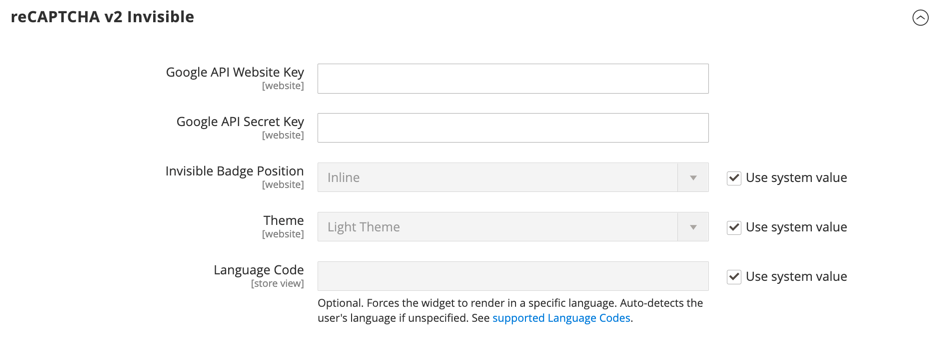

# [!UICONTROL Security] > [!UICONTROL Google reCAPTCHA Storefront]

>[!IMPORTANT]
>
>Antes de configurar o Google reCAPTCHA, verifique se o arquivo `PHP.ini` inclui a seguinte configuração: `allow_url_fopen = 1`. Isso pode exigir ajuda do desenvolvedor. Consulte [Configurações do PHP](https://experienceleague.adobe.com/docs/commerce-operations/installation-guide/prerequisites/php-settings.html) no _Guia de Instalação_.

{{config}}

Para obter mais informações sobre como usar o Google reCAPTCHA para proteger sua loja, consulte o Google [reCAPTCHA](../../systems/security-google-recaptcha.md) no _Guia de Sistemas de Administração_.

## [!UICONTROL reCAPTCHA v2 ("I am not a robot")]

<!-- zoom -->

| Campo | [Escopo](../../getting-started/websites-stores-views.md#scope-settings) | Descrição |
|--|--|--|
| [!UICONTROL Google API Website Key] | Site | A chave do site que é criada ao registrar sua conta do Google reCAPTCHA. |
| [!UICONTROL Google API Secret Key] | Site | A chave secreta associada à sua conta do Google reCAPTCHA. |
| [!UICONTROL Size] | Site | O tamanho da caixa do Google reCAPTCHA que aparece quando um cliente faz logon em sua conta. Opções: `Normal` (padrão) / `Compact` |
| [!UICONTROL Theme] | Site | Determina o estilo da caixa do reCAPTCHA do Google. Opções: `Light Theme` (padrão) / `Dark Theme` |
| [!UICONTROL Language Code] | Exibição de loja | O [código de dois caracteres](https://developers.google.com/recaptcha/docs/language) que especifica o idioma usado para texto e mensagens do Google reCAPTCHA. |

{style="table-layout:auto"}

## [!UICONTROL reCAPTCHA v2 Invisible]

<!-- zoom -->

| Campo | [Escopo](../../getting-started/websites-stores-views.md#scope-settings) | Descrição |
|--|--|--|
| [!UICONTROL Google API Website Key] | Site | A chave do site que é criada ao registrar sua conta do Google reCAPTCHA. |
| [!UICONTROL Google API Secret Key] | Site | A chave secreta associada à sua conta do Google reCAPTCHA. |
| [!UICONTROL Invisible Badge Position] | Site | A posição do selo reCAPTCHA invisível em cada página. Opções: `Inline` / `Bottom Right` / `Bottom Left` |
| [!UICONTROL Theme] | Global | Determina o estilo da caixa do reCAPTCHA do Google. Opções: `Light Theme` (padrão) / `Dark Theme` |
| [!UICONTROL Language Code] | Exibição de loja | Um [código de dois caracteres](https://developers.google.com/recaptcha/docs/language) que especifica o idioma usado para texto e mensagens do Google reCAPTCHA. |

{style="table-layout:auto"}

## [!UICONTROL reCAPTCHA v3 Invisible]

<!-- zoom -->

| Campo | [Escopo](../../getting-started/websites-stores-views.md#scope-settings) | Descrição |
|--|--|--|
| [!UICONTROL Google API Website Key] | Site | A chave do site que é criada ao registrar sua conta do Google reCAPTCHA. |
| [!UICONTROL Google API Secret Key] | Site | A chave secreta associada à sua conta do Google reCAPTCHA. |
| [!UICONTROL Minimum Score Threshold] | Global | A pontuação mínima que identifica uma interação do usuário como um risco potencial, onde 1,0 é uma interação típica do usuário e 0,0 provavelmente é um bot. Padrão: `0.5` |
| [!UICONTROL Invisible Badge Position] | Site | A posição do selo reCAPTCHA invisível em cada página. Opções: `Inline` / `Bottom Right` / `Bottom Left` |
| [!UICONTROL Theme] | Site | Determina o estilo da caixa do reCAPTCHA do Google. Opções: `Light Theme` (padrão) / `Dark Theme` |
| [!UICONTROL Language Code] | Exibição de loja | Um [código de dois caracteres](https://developers.google.com/recaptcha/docs/language) que especifica o idioma usado para texto e mensagens do Google reCAPTCHA. |

{style="table-layout:auto"}

## [!UICONTROL reCAPTCHA Enterprise]

[!BADGE Somente SaaS]{type=Positive url="https://experienceleague.adobe.com/en/docs/commerce/user-guides/product-solutions" tooltip="Aplicável somente a projetos do Adobe Commerce as a Cloud Service (infraestrutura SaaS gerenciada pela Adobe)."}

[!BADGE Sandbox]{type=Caution tooltip="Os itens listados estão disponíveis atualmente apenas em ambientes de sandbox. A Adobe disponibiliza novas versões em ambientes de sandbox primeiro para fornecer tempo para que você teste as alterações futuras antes que a versão esteja disponível em ambientes de produção."}

<!-- zoom -->

| Campo | [Escopo](../../getting-started/websites-stores-views.md#scope-settings) | Descrição |
|--|--|--|
| [!UICONTROL Site Key] | Site | A chave do site criada quando você registra sua conta do Google reCAPTCHA Enterprise. |
| [!UICONTROL Google Cloud Project ID] | Site | A ID do projeto é exibida na seção **Informações do projeto** no painel do projeto. |
| [!UICONTROL Service Account JSON] | Site | Baixe a chave da conta de serviço do console do Google Cloud e cole seu conteúdo nesse campo. |
| [!UICONTROL Minimum Score Threshold] | Site | A pontuação mínima que identifica uma interação do usuário como um risco potencial, onde 1,0 é uma interação típica do usuário e 0,0 provavelmente é um bot. Padrão: `0.5` |
| [!UICONTROL Badge Position] | Site | A posição do selo reCAPTCHA invisível em cada página. Opções: `Inline` / `Bottom Right` / `Bottom Left` |
| [!UICONTROL Theme] | Site | Determina o estilo da caixa do reCAPTCHA do Google. Opções: `Light Theme` (padrão) / `Dark Theme` |
| [!UICONTROL Language Code] | Exibição de loja | Um [código de dois caracteres](https://developers.google.com/recaptcha/docs/language) que especifica o idioma usado para texto e mensagens do Google reCAPTCHA. Deixe o campo em branco para usar o idioma padrão do navegador do usuário. |
| [!UICONTROL Validation Failure Message] | Exibição de loja | Uma mensagem a ser exibida quando a validação falhar. |

{style="table-layout:auto"}

## [!UICONTROL reCAPTCHA Failure Messages]

<!-- zoom -->

| Campo | [Escopo](../../getting-started/websites-stores-views.md#scope-settings) | Descrição |
|--|--|--|
| [!UICONTROL reCAPTCHA Validation Failure Message] | Exibição de loja | A mensagem que é exibida na loja se a verificação falhar. Texto padrão: `reCAPTCHA verification failed.` |
| [!UICONTROL reCAPTCHA Technical Failure Message] | Exibição de loja | A mensagem exibida na loja se o reCAPTCHA não retornar um resultado de verificação. Texto padrão: `Something went wrong with reCAPTCHA. Please contact the store owner.` |

{style="table-layout:auto"}

## [!UICONTROL Storefront]

<!-- zoom -->

>[!NOTE]
>
>O tipo do reCAPTCHA escolhido deve corresponder ao tipo associado à chave de API da sua conta do Google reCAPTCHA.

>[!WARNING]
>
>Ao usar o reCAPTCHA versão 3, um usuário genuíno com baixa pontuação não pode continuar. Para a versão 2, um usuário genuíno com uma pontuação baixa recebe um desafio. Considere cuidadosamente se os usuários originais com uma pontuação baixa devem ter a oportunidade de resolver um desafio (versão 2) ou ser bloqueados (versão 3).

| Campo | [Escopo](../../getting-started/websites-stores-views.md#scope-settings) | Descrição |
|--|--|--|
| [!UICONTROL Enable for Customer Login] | Site | Especifica o tipo de reCAPTCHA que é usado quando os clientes [entram](../../customers/customer-sign-in.md) em suas contas. Opções: **`No`**- (padrão) Não valida a solicitação de logon. **`reCAPTCHA v2 ("I am not a robot")`** - Exige que o usuário marque a caixa de seleção _Não sou um robô_. **`Invisible reCAPTCHA v2`**- Valida o comportamento do usuário em segundo plano sem exigir interações com base na pontuação. **`Invisible reCAPTCHA v3`** - (Recomendado) Valida o comportamento do usuário em segundo plano com base na pontuação de interação. |
| [!UICONTROL Enable for Forgot Password] | Site | Especifica o tipo de reCAPTCHA que é usado quando os clientes solicitam uma [redefinição de senha](../../customers/password-reset.md). Opções: **`No`**- (padrão) Não valida a solicitação de redefinição de senha. **`reCAPTCHA v2 ("I am not a robot")`** - Exige que o usuário marque a caixa de seleção _Não sou um robô_. **`Invisible reCAPTCHA v2`**- Valida o comportamento do usuário em segundo plano sem exigir interações com base na pontuação. **`Invisible reCAPTCHA v3`** - (Recomendado) Valida o comportamento do usuário em segundo plano com base na pontuação de interação. |
| [!UICONTROL Enable for Create New Customer Account] | Site | Especifica o tipo de reCAPTCHA que é usado quando o cliente se inscreve em uma [nova conta](../../customers/account-create.md). Opções: **`No`**- (padrão) Não valida a solicitação de conta. **`reCAPTCHA v2 ("I am not a robot")`** - Exige que o usuário marque a caixa de seleção _Não sou um robô_. **`Invisible reCAPTCHA v2`**- Valida o comportamento do usuário em segundo plano sem exigir interações com base na pontuação. **`Invisible reCAPTCHA v3`** - (Recomendado) Valida o comportamento do usuário em segundo plano com base na pontuação de interação. |
| [!UICONTROL Enable for Edit Customer Account] | Site | Especifica o tipo de reCAPTCHA que é usado quando o cliente altera suas [informações de conta](../../customers/account-dashboard-account-information.md). Opções: **`No`**- (padrão) Não valida a solicitação de conta. **`reCAPTCHA v2 ("I am not a robot")`** - Exige que o usuário marque a caixa de seleção _Não sou um robô_. **`Invisible reCAPTCHA v2`**- Valida o comportamento do usuário em segundo plano sem exigir interações com base na pontuação. **`Invisible reCAPTCHA v3`** - (Recomendado) Valida o comportamento do usuário em segundo plano com base na pontuação de interação. |
| [!UICONTROL Enable for Create New Company Account] | Site |  (Disponível somente com Adobe Commerce B2B) Especifica o tipo de reCAPTCHA usado quando uma nova [conta da empresa](../../b2b/account-company-create.md) é criada. Opções: **`No`**- (padrão) Não valida a solicitação de conta. **`reCAPTCHA v2 ("I am not a robot")`** - Exige que o usuário marque a caixa de seleção _Não sou um robô_. **`Invisible reCAPTCHA v2`**- Valida o comportamento do usuário em segundo plano sem exigir interações com base na pontuação. **`Invisible reCAPTCHA v3`** - (Recomendado) Valida o comportamento do usuário em segundo plano com base na pontuação de interação. |
| [!UICONTROL Enable for Contact Us] | Site | Especifica o tipo de reCAPTCHA usado para enviar uma mensagem da página [Fale Conosco](../../getting-started/store-details.md#contact-us-form) de seu armazenamento. Opções: **`No`**- (padrão) Não valida a solicitação de mensagem. **`reCAPTCHA v2 ("I am not a robot")`** - Exige que o usuário marque a caixa de seleção _Não sou um robô_. **`Invisible reCAPTCHA v2`**- Valida o comportamento do usuário em segundo plano sem exigir interações com base na pontuação. **`Invisible reCAPTCHA v3`** - (Recomendado) Valida o comportamento do usuário em segundo plano com base na pontuação de interação. |
| [!UICONTROL Enable for Product Review] | Site | Especifica o tipo de reCAPTCHA que é usado quando os clientes enviam uma [avaliação do produto](../../merchandising-promotions/product-reviews.md). Opções: **`No`**- (padrão) não valida a solicitação de revisão do produto. **`reCAPTCHA v2 ("I am not a robot")`** - Exige que o usuário marque a caixa de seleção _Não sou um robô_. **`Invisible reCAPTCHA v2`**- Valida o comportamento do usuário em segundo plano sem exigir interações com base na pontuação. **`Invisible reCAPTCHA v3`** - (Recomendado) Valida o comportamento do usuário em segundo plano com base na pontuação de interação. |
| [!UICONTROL Enable for Newsletter Subscription] | Site | Especifica o tipo de reCAPTCHA invisível que é usado quando os clientes se inscrevem em uma [assinatura de boletim informativo](../../merchandising-promotions/newsletter-subscribers.md). Opções: **`No`**- (padrão) não valida a solicitação de assinatura do boletim informativo. **`reCAPTCHA v2 ("I am not a robot")`** - Exige que o usuário marque a caixa de seleção _Não sou um robô_. **`Invisible reCAPTCHA v2`**- Valida o comportamento do usuário em segundo plano sem exigir interações com base na pontuação. **`Invisible reCAPTCHA v3`** - (Recomendado) Valida o comportamento do usuário em segundo plano com base na pontuação de interação. |
| [!UICONTROL Enable for Gift Card] | Site |  (somente Adobe Commerce) Especifica o tipo de reCAPTCHA que é usado quando os clientes inserem um código de [cartão-presente](../../catalog/product-gift-card-create.md). Opções: **`No`**- (padrão) Não valida o envio do código de cartão-presente. **`reCAPTCHA v2 ("I am not a robot")`** - Exige que o usuário marque a caixa de seleção _Não sou um robô_. **`Invisible reCAPTCHA v2`**- Valida o comportamento do usuário em segundo plano sem exigir interações com base na pontuação. **`Invisible reCAPTCHA v3`** - (Recomendado) Valida o comportamento do usuário em segundo plano com base na pontuação de interação. |
| [!UICONTROL Enable for Invitation Create Account] | Site | Especifica o tipo de reCAPTCHA que é usado quando os clientes enviam um código de [convite](../../merchandising-promotions/invitations.md) de criação de conta. Opções: **`No`**- (padrão) Não valida o envio de email de convite. **`reCAPTCHA v2 ("I am not a robot")`** - Exige que o usuário marque a caixa de seleção _Não sou um robô_. **`Invisible reCAPTCHA v2`**- Valida o comportamento do usuário em segundo plano sem exigir interações com base na pontuação. **`Invisible reCAPTCHA v3`** - (Recomendado) Valida o comportamento do usuário em segundo plano com base na pontuação de interação. |
| [!UICONTROL Enable for Send to Friend] | Site | Especifica o tipo de reCAPTCHA que é usado quando os clientes [compartilham um produto](../../stores-purchase/email-a-friend.md) com um amigo. Opções: **`No`**- (padrão) Não valida o envio de email. **`reCAPTCHA v2 ("I am not a robot")`** - Exige que o usuário marque a caixa de seleção _Não sou um robô_. **`Invisible reCAPTCHA v2`**- Valida o comportamento do usuário em segundo plano sem exigir interações com base na pontuação. **`Invisible reCAPTCHA v3`** - (Recomendado) Valida o comportamento do usuário em segundo plano com base na pontuação de interação. |
| [!UICONTROL Enable for Wishlist Sharing] | Site | Especifica o tipo de reCAPTCHA usado quando os clientes [compartilham uma lista de desejos](../../stores-purchase/wishlist-storefront.md#share-the-wish-list). Opções: **`No`**- (padrão) Não valida a mensagem e o envio de email. **`reCAPTCHA v2 ("I am not a robot")`** - Exige que o usuário marque a caixa de seleção _Não sou um robô_. **`Invisible reCAPTCHA v2`**- Valida o comportamento do usuário em segundo plano sem exigir interações com base na pontuação. **`Invisible reCAPTCHA v3`** - (Recomendado) Valida o comportamento do usuário em segundo plano com base na pontuação de interação. |
| [!UICONTROL Enable for Coupon Codes] | Site | Especifica o tipo de reCAPTCHA que é usado quando os clientes inserem um [código de cupom](../../merchandising-promotions/price-rules-cart-coupon.md). Opções: **`No`**- (padrão) Não valida o envio do código do cupom. **`reCAPTCHA v2 ("I am not a robot")`** - Exige que o usuário marque a caixa de seleção _Não sou um robô_. **`Invisible reCAPTCHA v2`**- Valida o comportamento do usuário em segundo plano sem exigir interações com base na pontuação. **`Invisible reCAPTCHA v3`** - (Recomendado) Valida o comportamento do usuário em segundo plano com base na pontuação de interação. |
| [!UICONTROL Enable for PayPal Payflow Pro payment form] | Site | Especifica o tipo de reCAPTCHA usado quando os clientes pagam uma compra com o [PayPal Payflow Pro](../../stores-purchase/paypal-payflow-pro.md). Opções: **`No`**- (padrão) Não valida a solicitação de redefinição de senha. **`reCAPTCHA v2 ("I am not a robot")`** - Exige que o usuário marque a caixa de seleção _Não sou um robô_. **`Invisible reCAPTCHA v2`**- Valida o comportamento do usuário em segundo plano sem exigir interações com base na pontuação. **`Invisible reCAPTCHA v3`** - (Recomendado) Valida o comportamento do usuário em segundo plano com base na pontuação de interação. |

{style="table-layout:auto"}
