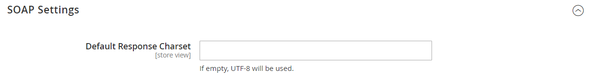
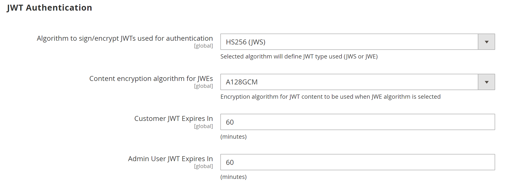

# [!UICONTROL Services] > [!UICONTROL Magento Web API]

{{config}}

<!-- [X-ref](../systems/integrations.md) -->

## [!UICONTROL SOAP Settings]

<!-- zoom -->

| Campo | [Escopo](../../getting-started/websites-stores-views.md#scope-settings) | Descrição |
|--- |--- |--- |
| [!UICONTROL Default Response Charset] | Exibição da loja | Determina o conjunto de caracteres padrão. Se estiver vazio, UTF-8 será usado. |

{style="table-layout:auto"}

## [!UICONTROL GraphQl Input Limits]

<!-- zoom -->

| Campo | [Escopo](../../getting-started/websites-stores-views.md#scope-settings) | Descrição |
|--- |--- |--- |
| [!UICONTROL Enable Input Limits] | Exibição da loja | Determina se os limites de entrada estão habilitados para chamadas GraphQL. Valor Padrão: `No`. |
| [!UICONTROL Maximum Page Size] | Exibição da loja | Define o número máximo de itens permitidos em um resultado de pesquisa paginado na resposta do GraphQL. Esta opção não está disponível quando _Habilitar Limites de Entrada_ = `No`. |

{style="table-layout:auto"}

## [!UICONTROL Web Api Input Limits]

<!-- zoom -->

| Campo | [Escopo](../../getting-started/websites-stores-views.md#scope-settings) | Descrição |
|--- |--- |--- |
| [!UICONTROL Enable Input Limits] | Exibição da loja | Determina se os limites de entrada estão habilitados para chamadas de API da Web. Valor Padrão: `No`. |
| Limite da lista de entrada | Exibição da loja | Define o número máximo de itens permitidos em uma propriedade de matriz de entidade na solicitação da API da Web. Esta opção não está disponível quando _Habilitar Limites de Entrada_ = `No`. |
| [!UICONTROL Maximum Page Size] | Exibição da loja | Define o número máximo de itens permitidos em um resultado de pesquisa paginado na resposta da API da Web. Esta opção não está disponível quando _Habilitar Limites de Entrada_ = `No`. |
| [!UICONTROL Default Page Size] | Exibição da loja | Define o número padrão de itens em um resultado de pesquisa paginado na resposta da API da Web. |

{style="table-layout:auto"}

## [!UICONTROL Web API Security]

<!-- zoom -->

| Campo | [Escopo](../../getting-started/websites-stores-views.md#scope-settings) | Descrição |
|--- |--- |--- |
| [!UICONTROL Allow Anonymous Guest Access] | Global | Determina se os convidados podem acessar anonimamente os recursos do CMS, do catálogo e da loja das APIs do SOAP e do REST. Por padrão, o acesso de convidado anônimo não é permitido. Opções: `Yes` / `No` |

{style="table-layout:auto"}

## [!UICONTROL JWT Authentication]

<!-- zoom -->

| Campo | [Escopo](../../getting-started/websites-stores-views.md#scope-settings) | Descrição |
|--- |--- |--- |
| [!UICONTROL Algorithm to sign/encrypt JWTs used for authentication] | Global | Especifica o tipo de algoritmo JWS ou JWE usado para a criptografia JWT (JSON Web Token) |
| [!UICONTROL Content encryption algorithm for JWEs] | Global | Especifica o tipo de algoritmo de criptografia de conteúdo usado para criptografia JWT quando o algoritmo JWE é selecionado. Essa opção é ignorada para algoritmos JWS. |
| [!UICONTROL Customer JWT Expires In] | Global | Define o tempo (em minutos) antes que um token de portador JWT do cliente expire. O token de portador JWT do cliente expira em 30 minutos se esse campo estiver vazio ou tiver um valor negativo. Valor padrão: `60` |
| [!UICONTROL Admin User JWT Expires In] | Global | Define o período de tempo (em minutos) antes que o token de portador do JWT Admin expire. O token de portador do JWT do administrador expira em 30 minutos se esse campo estiver vazio ou tiver um valor negativo. Valor padrão: `60` |

{style="table-layout:auto"}
