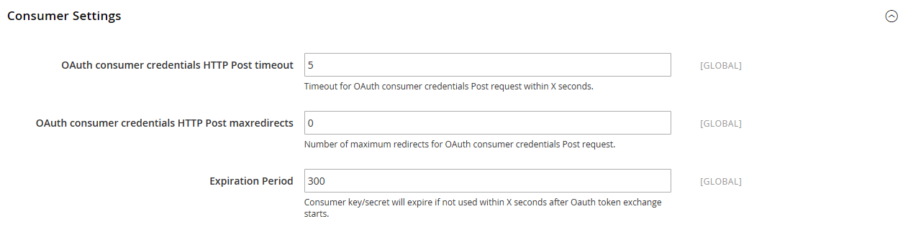

# [!UICONTROL Services] > [!UICONTROL OAuth]

{{config}}

## [!UICONTROL Access Token Expiration]

<!-- zoom -->

| Campo | [Escopo](../../getting-started/websites-stores-views.md#scope-settings) | Descrição |
|--- |--- |--- |
| [!UICONTROL Customer Token Lifetime (hours]) | Global | Determina o tempo em horas antes que um token de API do cliente expire. O token do cliente nunca expira se o campo estiver vazio. Valor padrão: `1` |
| [!UICONTROL Admin Token Lifetime (hours)] | Global | Determina o tempo em horas antes que um token de API de administrador expire. O token do administrador nunca expira se o campo estiver vazio. Valor padrão: `4` |

{style="table-layout:auto"}

>[!NOTE]
>
>Os algoritmos de Duração do token da API do portador e do administrador são controlados pelo [Autenticação JWT](magento-web-api.md#jwt-authentication) configurações.

## [!UICONTROL Cleanup Settings]

<!-- zoom -->

| Campo | [Escopo](../../getting-started/websites-stores-views.md#scope-settings) | Descrição |
|--- |--- |--- |
| [!UICONTROL Cleanup Probability] | Global | Especifica o número de solicitações OAuth antes que a limpeza seja iniciada. Não insira `0` para desativar a limpeza. |
| [!UICONTROL Enable WSDL Cache] | Global | Determina a idade das entradas em minutos, antes de serem limpas. |

{style="table-layout:auto"}

## [!UICONTROL Consumer Settings]

<!-- zoom -->

| Campo | [Escopo](../../getting-started/websites-stores-views.md#scope-settings) | Descrição |
|--- |--- |--- |
| [!UICONTROL OAuth consumer credentials HTTP Post timeout] | Global | Especifica o número de segundos que leva para o sistema expirar quando os clientes postam suas credenciais. |
| [!UICONTROL OAuth consumer credentials HTTP Post maxredirects] | Global | Especifica o número máximo de redirecionamentos relacionados a um lançamento de credenciais do consumidor. |
| [!UICONTROL Expiration Period] | Global | Determina o número de segundos antes de uma chave/segredo não utilizado expirar após o início da troca de tokens OAuth. |

{style="table-layout:auto"}

## [!UICONTROL Authentication Locks]

<!-- zoom -->

| Campo | [Escopo](../../getting-started/websites-stores-views.md#scope-settings) | Descrição |
|--- |--- |--- |
| [!UICONTROL Maximum Login Failures to Lock Out Account] | Global | Especifica o Número Máximo de falhas de autenticação para bloquear a conta. |
| [!UICONTROL Lockout Time (seconds)] | Global | Especifica o período em segundos após o qual a conta é desbloqueada. |

{style="table-layout:auto"}
