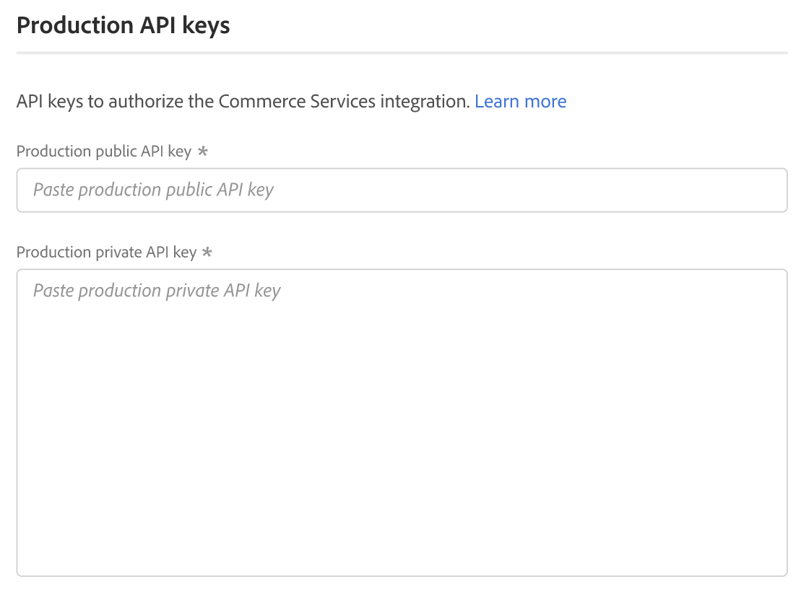

# [!UICONTROL Services] > [!UICONTROL Commerce Services Connector]

Para saber como conectar sua loja aos serviços da Adobe Commerce, consulte [Serviços da Commerce](https://experienceleague.adobe.com/docs/commerce/user-guides/integration-services/saas.html).

{{config}}

## [!UICONTROL Sandbox API Keys]

<!-- zoom -->

| Campo | [Escopo](../../getting-started/websites-stores-views.md#scope-settings) | Descrição |
|--- |--- |--- |
| [!UICONTROL Sandbox public API key] | Global | Chave de API que identifica o autor e seus direitos, se houver. |
| [!UICONTROL Sandbox private API key] | Global | Uma chave privada associada à chave de API. |

{style="table-layout:auto"}

## [!UICONTROL Production Keys]

<!-- zoom -->

| Campo | [Escopo](../../getting-started/websites-stores-views.md#scope-settings) | Descrição |
|--- |--- |--- |
| [!UICONTROL Production public API key] | Global | Chave de API que identifica o autor e seus direitos, se houver. |
| [!UICONTROL Production private API key] | Global | Uma chave privada associada à chave de API. |

{style="table-layout:auto"}

## [!UICONTROL SaaS Identifier]

<!-- zoom -->

| Campo | [Escopo](../../getting-started/websites-stores-views.md#scope-settings) | Descrição |
|--- |--- |--- |
| [!UICONTROL Project] | Global | Nome do projeto SaaS que agrupa todos os espaços de dados SaaS. O botão _Criar projeto_ será exibido se não houver nenhum projeto SaaS. |
| [!UICONTROL Data Space] | Global | Lista os espaços de dados SaaS no projeto SaaS especificado. O número de espaços de dados SaaS depende da sua [licença do Commerce](https://experienceleague.adobe.com/docs/commerce/user-guides/integration-services/saas.html): Adobe Commerce - Um espaço de dados de produção; dois espaços de dados de teste; Magento Open Source - Um espaço de dados de produção; sem espaços de dados de teste |

{style="table-layout:auto"}

## [!UICONTROL IMS Organization]

<!-- zoom -->

| Campo | Descrição |
|--- |--- |
| [!UICONTROL Sign in using Adobe ID] | Seu Adobe ID geralmente é o endereço de email que você usou pela primeira vez quando iniciou sua associação ou comprou um aplicativo ou serviço da Adobe. Seu Adobe ID é a chave necessária para acessar sua conta do Adobe. |

{style="table-layout:auto"}
