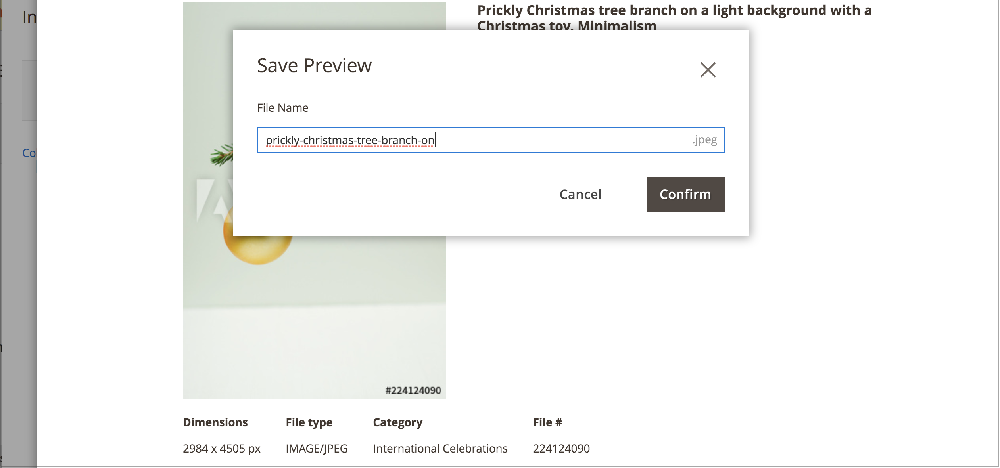

# Salvar uma visualização de imagem do Adobe Stock

Uma visualização de imagem é uma versão com marca d&#39;água de um ativo do Adobe Stock. As visualizações de imagem são gratuitas e são uma boa maneira de experimentar imagens diferentes antes de [comprar uma licença](./adobe-stock-license-image.md) para imagens específicas e usá-las em suas lojas de produção.

Quando você estiver pronto para licenciar uma imagem, o novo [[!DNL Media Gallery]](media-gallery.md) fornecerá uma integração direta com o Adobe Stock, facilitando o licenciamento da imagem diretamente da página da galeria.

## Pré-requisitos

Este recurso requer o módulo e a configuração da [Integração do Adobe Stock](./adobe-stock.md).

## Salvar uma imagem de visualização

1. [Acessar a grade de pesquisa do Adobe Stock](./adobe-stock-manage.md#access-the-adobe-stock-search-grid).

1. Para [exibir os detalhes da imagem](./adobe-stock-manage.md#view-image-details), clique em uma imagem na grade de pesquisa.

1. Clique em **[!UICONTROL Save Preview]**.

   Esta ação exibe um prompt para que você especifique um nome de arquivo que seja usado para salvar a imagem no [armazenamento de mídia](./media-storage.md). Um nome de arquivo padrão é fornecido, mas você pode personalizar o nome de acordo com suas preferências.

   {width="500" zoomable="yes"}

1. Clique em **[!UICONTROL Confirm]**.

   A página é redirecionada para o armazenamento de mídia e a visualização salva é exibida.
