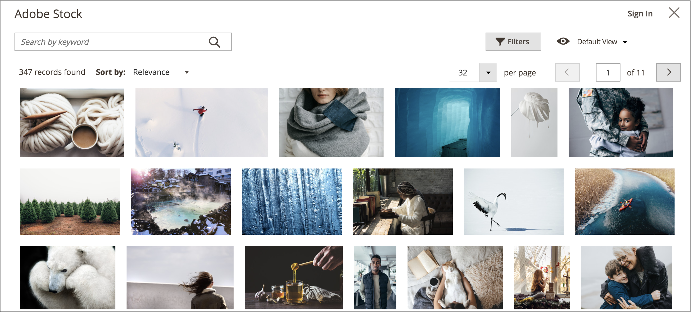

# Integração do Adobe Stock

Para obter acesso a inúmeros ativos de mídia para uso em sua loja, integre o [Adobe Stock](https://stock.adobe.com) ao [!UICONTROL Commerce].

{width="700" zoomable="yes"}

O serviço Adobe Stock fornece às empresas acesso a milhões de fotos, vetores, ilustrações, vídeos, modelos e ativos 3D de alta qualidade, com curadoria e isentos de royalties, para todos os seus projetos criativos. Os usuários do [!DNL Commerce] podem rapidamente encontrar, visualizar e licenciar os ativos da Adobe Stock. Os usuários também podem salvá-los no [armazenamento de mídia](./media-storage.md), tudo sem sair do espaço de trabalho de Administrador.

## Pré-requisitos

Essa integração exige:

- Uma conta do [Adobe Developer](https://developer.adobe.com/console/home)
- Adobe Commerce ou Magento Open Source, 2.3.4 ou posterior

O licenciamento de imagens do Adobe Stock exige:

- Uma [conta do Adobe](https://helpx.adobe.com/manage-account/using/access-adobe-id-account.html)
- Um plano pago [Adobe Stock](https://stock.adobe.com) associado à conta

## Integrar o [!DNL Commerce] e o Adobe Stock

A configuração da integração do Adobe Stock para o Adobe Commerce é um processo de duas etapas:

1. [Crie uma integração adobe.developer](#create-an-adobe-developer-integration) para gerar uma Chave de API
1. [Configurar a integração do Adobe Stock no Commerce Admin](#configure-the-adobe-stock-integration)

### Criar uma integração do Adobe Developer

1. Navegue até [Adobe Developer Console](https://developer.adobe.com/console/home).

1. Em _[!UICONTROL Quick Start]_, clique em **[!UICONTROL Create new project]**.

1. No bloco _[!UICONTROL Project overview]_, clique em **[!UICONTROL Add API]**.

1. Selecione **[!UICONTROL Adobe Stock]** na lista de integrações e clique em **[!UICONTROL Next]**.

1. Selecione o OAuth 2.0 **[!UICONTROL Web App]**.

1. Especifique o **[!UICONTROL redirect URI]**.

   O URI de redirecionamento padrão está no formato `${HOST}/${ADMIN_URI}/adobe_ims/oauth/callback/`, como `https://store.myshop.com/admin_hgkq1l/adobe_ims/oauth/callback/`, onde:

   - `${HOST}` é seu nome de domínio [!DNL Commerce] totalmente qualificado (por exemplo, `https://store.myshop.com`).
   - `${ADMIN_URI}` é o URI do Administrador [!DNL Commerce] (como `admin_hgkq1l`), que pode ser recuperado executando `magento info:adminuri`.

1. Especifique o **[!UICONTROL Redirect URI pattern]**, que é o mesmo que o URI de redirecionamento com duas diferenças:

   - Todos os pontos (`.`) devem ser evitados com duas barras invertidas (`\\`).
   - Adicionar `.*` ao final do padrão.

   Usando o exemplo do URI de redirecionamento padrão anterior, o padrão seria `https://store\\.myshop\\.com/admin_hgkq1l/adobe_ims/oauth/callback/.*`

1. Clique em **[!UICONTROL Next]**.

1. Revise os escopos disponíveis e clique em **[!UICONTROL Save configured API]**.

1. Na página a seguir, copie o **[!UICONTROL Client ID]** (Chave de API) e o **[!UICONTROL Client secret]**.

   Essas informações são usadas nas etapas da próxima seção.

### Configurar a integração do Adobe Stock

Para definir a configuração do sistema no Administrador [!DNL Commerce], use a _Chave da API_ e o _Segredo do cliente_ gerados na [seção anterior](#create-an-adobeio-integration).

1. Na barra lateral _Admin_, vá para **[!UICONTROL Stores]** > _[!UICONTROL Settings]_>**[!UICONTROL Configuration]**.

1. No painel esquerdo, expanda **[!UICONTROL Advanced]** e escolha **[!UICONTROL System]**.

1. Expanda  **[!UICONTROL Adobe Stock Integration]** e faça o seguinte:

   - Defina **[!UICONTROL Enabled Adobe Stock]** como `Yes`.

   - Insira seu **[!UICONTROL API Key (Client ID)]**.

   - Insira seu **[!UICONTROL Client Secret]**.

   - Clique em **[!UICONTROL Test Connection]** para validar suas chaves.

   {width="600" zoomable="yes"}

   Conceda alguns segundos à validação. Se suas credenciais forem válidas, você deverá ver uma _Conexão bem-sucedida!_ verde mensagem.

1. Quando terminar, clique em **[!UICONTROL Save Config]**.
