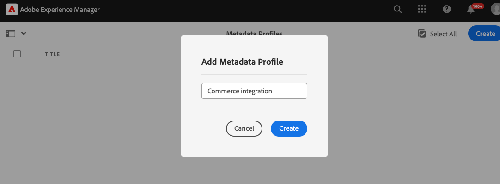

# Configurar Experience Manager Assets

{{$include /help/_includes/aem-assets-integration-beta-note.md}}

Prepare o ambiente do AEM as a Cloud Service para gerenciar ativos do Commerce atualizando a configuração do ambiente e configurando os metadados do Assets para identificar e gerenciar ativos do Commerce.

A integração exige a adição de um namespace `Commerce` personalizado e [metadados de perfil](https://experienceleague.adobe.com/en/docs/experience-manager-cloud-service/content/assets/manage/metadata-profiles) e [metadados de esquema](https://experienceleague.adobe.com/en/docs/experience-manager-cloud-service/content/assets/manage/metadata-schemas) adicionais.

O Adobe fornece um modelo de projeto AEM para adicionar os recursos de namespace e esquema de metadados à configuração de ambiente as a Cloud Service do AEM Assets. O modelo adiciona:

- Um [namespace personalizado](https://github.com/ankumalh/assets-commerce/blob/main/ui.config/jcr_root/apps/commerce/config/org.apache.sling.jcr.repoinit.RepositoryInitializer~commerce-namespaces.cfg.json), `Commerce` para identificar propriedades relacionadas ao Commerce.

- Um tipo de metadados personalizado `commerce:isCommerce` com o rótulo `Does it exist in Commerce?` para marcar ativos da Commerce associados a um projeto do Adobe Commerce.

- Um tipo de metadados personalizado `commerce:productmetadata` e um componente correspondente da interface do usuário para adicionar uma propriedade *[!UICONTROL Product Data]*. Os Dados do produto incluem as propriedades de metadados para associar um ativo do Commerce às SKUs do produto e para especificar os atributos da imagem `role` e `position` para o ativo.

  {width="600" zoomable="yes"}

- Um formulário de esquema de metadados com uma guia Commerce que inclui os campos `Does it exist in Adobe Commerce?` e `Product Data` para marcar ativos do Commerce. O formulário também fornece opções para mostrar ou ocultar os campos `roles` e `order` (posição) da interface do usuário do AEM Assets.

  {width="600" zoomable="yes"}

- Um [ativo de Commerce marcado e aprovado](https://github.com/ankumalh/assets-commerce/blob/main/ui.content/src/main/content/jcr_root/content/dam/wknd/en/activities/hiking/equipment_6.jpg/.content.xml) `equipment_6.jpg` de amostra para oferecer suporte à sincronização de ativos inicial. Somente ativos aprovados do Commerce podem ser sincronizados do AEM Assets para o Adobe Commerce.

Para obter informações adicionais sobre o projeto Commerce-Assets AEM, consulte o [Readme](https://github.com/ankumalh/assets-commerce).

## Personalizar a configuração do ambiente do AEM Assets

>[!BEGINSHADEBOX]

**Pré-requisitos**

- [Acesso ao Programa e aos ambientes do AEM Assets Cloud Manager](https://experienceleague.adobe.com/en/docs/experience-manager-cloud-service/content/onboarding/journey/cloud-manager#access-sysadmin-bo) com as funções de Gerente de Programa e de Implantação.

- Um [ambiente local de desenvolvimento do AEM](https://experienceleague.adobe.com/en/docs/experience-manager-learn/cloud-service/local-development-environment-set-up/overview) e familiaridade com o processo de desenvolvimento local do AEM.

- Entenda a [estrutura do projeto AEM](https://experienceleague.adobe.com/pt-br/docs/experience-manager-cloud-service/content/implementing/developing/aem-project-content-package-structure) e como implantar pacotes de conteúdo personalizados usando o Cloud Manager.

>[!ENDSHADEBOX]

### Implantar o projeto Commerce-Assets AEM no ambiente de criação do AEM Assets

1. No Cloud Manager, crie ambientes de produção e de preparo para seu projeto do AEM Assets, se necessário.

1. Configurar um pipeline de implantação, se necessário.

1. No GitHub, baixe o código padrão do [projeto Commerce-Assets AEM](https://github.com/ankumalh/assets-commerce).

1. A partir do [ambiente de desenvolvimento local do AEM](https://experienceleague.adobe.com/en/docs/experience-manager-learn/cloud-service/local-development-environment-set-up/overview), instale o código personalizado na configuração do ambiente do AEM Assets como um pacote Maven ou copie manualmente o código na configuração do projeto existente.

1. Confirme as alterações e envie a ramificação de desenvolvimento local para o repositório Git do Cloud Manager.

1. No Cloud Manager, [implante seu código para atualizar o ambiente AEM](https://experienceleague.adobe.com/en/docs/experience-manager-cloud-service/content/implementing/using-cloud-manager/deploy-code#deploying-code-with-cloud-manager).

## Configurar um perfil de metadados

Defina valores padrão para os metadados de ativos do Commerce criando um perfil de metadados. Depois de configurado, aplique esse perfil às pastas de ativos AEM para usar esses padrões automaticamente. Essa configuração opcional ajuda a simplificar o processamento de ativos, reduzindo as etapas manuais.

1. No espaço de trabalho do Adobe Experience Manager, acesse o espaço de trabalho de administração de conteúdo do autor para o AEM Assets clicando no ícone Adobe Experience Manager.

   {width="600" zoomable="yes"}

1. Abra as Ferramentas do administrador selecionando o ícone de martelo.

   {width="600" zoomable="yes"}

1. Abra a página de configuração do perfil clicando em **[!UICONTROL Metadata Profiles]**.

1. **[!UICONTROL Create]** um perfil de metadados para a integração com o Commerce.

   {width="600" zoomable="yes"}

1. Adicione uma guia para metadados do Commerce.

   1. À esquerda, clique em **[!UICONTROL Settings]**.

   1. Clique em **[!UICONTROL +]** na seção da guia e especifique o **[!UICONTROL Tab Name]**, `Commerce`.

1. Adicione o campo `Does it exist in Commerce?` ao formulário e defina o valor padrão como `yes`.

   {width="600" zoomable="yes"}

1. Salve a atualização.

1. Aplique o perfil de metadados `Commerce integration` à pasta em que os ativos do Commerce estão armazenados.

   1. Na página [!UICONTROL  Metadata Profiles], selecione o perfil de integração do Commerce.

   1. No menu de ações, selecione **[!UICONTROL Apply Metadata Profiles to Folder(s)]**.

   1. Selecione a pasta que contém os ativos do Commerce.

      Crie uma pasta do Commerce se ela não existir.

   1. Clique em **[!UICONTROL Apply]**.

>[!TIP]
>
>Você pode sincronizar automaticamente os ativos do Commerce à medida que forem carregados para o ambiente do AEM Assets, atualizando o perfil de metadados para definir o valor padrão do campo _[!UICONTROL Review Status]_como `Approved`. O tipo de propriedade para o campo `Review Status` é `./jcr:content/metadata/dam:status`.

## Próximas etapas

Depois de atualizar o ambiente do AEM, configure o Adobe Commerce:

1. [Instalar e configurar a Integração do AEM Assets para o Commerce](aem-assets-configure-commerce.md)
2. [Ativar a sincronização de ativos para transferir ativos entre o ambiente do projeto do Adobe Commerce e o ambiente do projeto do AEM Assets](aem-assets-setup-synchronization.md)
