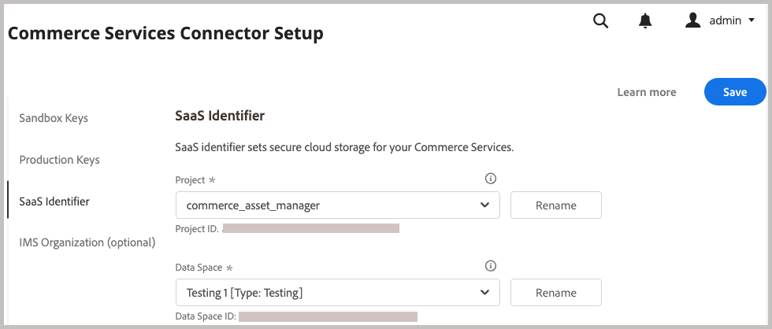

# Instalar e configurar a Integração do AEM Assets para o Commerce

{{$include /help/_includes/aem-assets-integration-beta-note.md}}

Instale e configure a integração do AEM Assets para o Commerce adicionando a extensão ao aplicativo do Commerce, conectando aos serviços SaaS do Commerce, ao serviço e Adobe I/O Events e conectando ao SaaS do Commerce.

## Requisitos do sistema

**Requisitos de software**

- Adobe Commerce 2.4.5+
- PHP 8.1, 8.2, 8.3
- Compositor: 2.x

## Pré-requisitos

- O Adobe Commerce deve ser configurado para usar a [autenticação do Adobe IMS](/help/getting-started/adobe-ims-config.md).
- Provisionamento e permissões de conta — Os administradores devem ter acesso aos seguintes recursos para configurar a integração com o Experience Manager Assets:
   - Administrador do aplicativo Commerce — Instale as extensões necessárias e configure o servidor de aplicativos Commerce a partir do Admin ou da linha de comando
   - [Administrador do Commerce](https://experienceleague.adobe.com/en/docs/commerce-admin/start/guide-overview)—Atualize a configuração de armazenamento e gerencie as contas de usuário do Commerce
   - [Experience Manager Assets](https://experienceleague.adobe.com/en/docs/experience-manager-assets-essentials/help/introduction) — Administrador do aplicativo Adobe IMS ou conta de usuário. A conta deve ter permissões para criar e gerenciar pastas e criar coleções públicas, fazer upload de ativos, configurar permissões e configurar metadados.

## Visão geral da configuração

Habilite a integração concluindo as seguintes tarefas:

1. [Instale a extensão de integração do AEM Assets (`aem-assets-integration`)](#install-the-aem-assets-integration-extension).
1. [Configure o Commerce Service Connector](#configure-the-commerce-services-connector) para conectar sua instância do Adobe Commerce e com os serviços que permitem a transmissão de dados entre o Adobe Commerce e o AEM Assets.
1. [Configurar eventos de Adobe I/O para o Commerce](#configure-adobe-io-events-for-commerce)
1. [Obter credenciais de autenticação para acesso à API](#get-authentication-credentials-for-api-access)

## Instalar a extensão de Integração do AEM Assets

>[!BEGINSHADEBOX]

**Pré-requisito**

- Acesse [repo.magento.com](https://repo.magento.com/admin/dashboard) para instalar a extensão. Para geração de chaves e obtenção dos direitos necessários, consulte [Obter suas chaves de autenticação](https://experienceleague.adobe.com/en/docs/commerce-operations/installation-guide/prerequisites/authentication-keys). Para instalações na nuvem, consulte o [Guia de Infraestrutura do Commerce na Nuvem](https://experienceleague.adobe.com/en/docs/commerce-cloud-service/user-guide/develop/authentication-keys)

- Acesso à linha de comando do servidor de aplicativos do Adobe Commerce.

>[!ENDSHADEBOX]

Instale a versão mais recente da extensão de Integração do AEM Assets (`aem-assets-integration`) em um Adobe Commerce que execute o Adobe Commerce 2.4.4 ou posterior. A Integração de Ativos AEM é fornecida como um metapackage de compositor no [repositório.magento.com](https://repo.magento.com/admin/dashboard).

>[!BEGINTABS]

>[!TAB Infraestrutura em nuvem]

Use este método para instalar a extensão [!DNL AEM Assets Integration] para uma instância de Commerce Cloud.

1. Na estação de trabalho local, altere para o diretório do projeto do Adobe Commerce na infraestrutura em nuvem.

   >[!NOTE]
   >
   >Para obter informações sobre o gerenciamento local de ambientes de projeto do Commerce, consulte [Gerenciamento de ramificações com a CLI](https://experienceleague.adobe.com/en/docs/commerce-cloud-service/user-guide/develop/cli-branches) no _Guia do Usuário do Adobe Commerce na Infraestrutura da Nuvem_.

1. Confira a ramificação do ambiente para atualizar usando a CLI do Adobe Commerce Cloud.

   ```shell
   magento-cloud environment:checkout <environment-id>
   ```

1. Adicione a extensão Integração do AEM Assets para Commerce.

   ```shell
   composer require "magento/aem-assets-integration" "<version-tbd>" --no-update
   ```

1. Atualizar dependências de pacote.

   ```shell
   composer update "magento/aem-assets-integration"
   ```

1. Confirmar e enviar alterações de código para os arquivos `composer.json` e `composer.lock`.

1. Adicione, confirme e envie por push as alterações de código dos arquivos `composer.json` e `composer.lock` para o ambiente de nuvem.

   ```shell
   git add -A
   git commit -m "Install AEM Assets Integration extension for Adobe Commerce"
   git push origin <branch-name>
   ```

   O envio das atualizações inicia o [processo de implantação da nuvem do Commerce](https://experienceleague.adobe.com/en/docs/commerce-cloud-service/user-guide/develop/deploy/process) para aplicar as alterações. Verifique o status da implantação no [log de implantação](https://experienceleague.adobe.com/en/docs/commerce-cloud-service/user-guide/develop/test/log-locations#deploy-log).

>[!TAB No local]

Use este método para instalar a extensão [!DNL AEM Assets Integration] para uma instância local.

1. Use o Composer para adicionar a extensão do AEM Assets Integration for Commerce ao seu projeto:

   ```shell
   composer require "magento/aem-assets-integration" --no-update
   ```

1. Atualize as dependências e instale a extensão:

   ```shell
   composer update  "magento/aem-assets-integration"
   ```

1. Atualizar o Adobe Commerce:

   ```shell
   bin/magento setup:upgrade
   ```

1. Limpe o cache:

   ```shell
   bin/magento cache:clean
   ```

   >[!TIP]
   >
   >Em alguns casos, especialmente ao implantar na produção, você pode evitar a limpeza do código compilado, pois pode levar algum tempo. Certifique-se de fazer backup do sistema antes de fazer qualquer alteração.

>[!ENDTABS]

## Configurar o Commerce Services Connector

O Commerce Services Connector permite a sincronização e a comunicação de dados entre a instância do Commerce, o Serviço do mecanismo de regras do ativo e outros serviços de suporte.

>[!NOTE]
>
>A instalação do Commerce Services Connector é um processo único necessário para usar os [serviços SaaS do Adobe Commerce](https://experienceleague.adobe.com/en/docs/commerce-merchant-services/user-guides/integration-services/saas#availableservices). Se você já tiver configurado o conector para outro serviço, poderá ver a configuração existente no Administrador do Commerce selecionando **[!UICONTROL Systems]** > [!UICONTROL Services] > **[!UICONTROL Commerce Services Connector]**.

Para transmitir dados entre sua instância do Adobe Commerce e os serviços que habilitam a Integração do AEM Assets, configure o Commerce Services Connector com o seguinte:

- Configure sua instância do Commerce com chaves de API de sandbox e produção para autenticação.
- Especifique um espaço de dados (identificador SaaS) para armazenamento em nuvem seguro.
- Faça logon na mesma organização IMS usada para acessar o AEM Assets e estabelecer a conexão entre seu conjunto de dados e a Adobe Experience Platform.

Para obter instruções detalhadas, consulte [Commerce Services Connector](https://experienceleague.adobe.com/en/docs/commerce-merchant-services/user-guides/integration-services/saas#organizationid).

Ao configurar o Commerce Services Connector, o sistema gera o projeto SaaS e as IDs do banco de dados. Essas IDs são necessárias durante o processo de integração do locatário.

{width="600" zoomable="yes"}

## Configurar eventos de Adobe I/O para o Commerce

A Integração do AEM Assets usa o serviço Adobe I/O Events para enviar dados de eventos personalizados entre a instância do Commerce e o Experience Cloud. Os dados do evento são usados para coordenar workflows para a integração do AEM Assets.

>[!BEGINSHADEBOX]

**Pré-requisito**

- Certifique-se de que o RabbitMQ esteja ativado e aguardando eventos.
   - [Instalação do RabbitMQ para Adobe Commerce no local](https://experienceleague.adobe.com/en/docs/commerce-cloud-service/user-guide/configure/service/rabbitmq)
   - [Instalação do RabbitMQ para Adobe Commerce na infraestrutura em nuvem](https://experienceleague.adobe.com/en/docs/commerce-cloud-service/user-guide/configure/service/rabbitmq)

>[!ENDSHADEBOX]

>[!NOTE]
>
>Para obter informações detalhadas sobre os Eventos do Adobe I/O para Commerce, consulte a documentação dos [Eventos do Adobe I/O para Commerce](https://developer.adobe.com/commerce/extensibility/events/) no site do Adobe Developer.

A configuração exige as seguintes etapas.

1. Ative a estrutura de eventos do Commerce configurando eventos de Adobe I/O no servidor de aplicativos e no Administrador.
1. Habilite a sincronização de dados entre o Adobe Commerce e o AEM Assets usando a API de serviço do mecanismo de regras do Assets para configurar a conexão.
1. Habilite a integração do AEM Assets no Administrador.

### Ativar a estrutura de eventos do Commerce

Ative a estrutura de eventos do Commerce usando as instruções para o ambiente em que o projeto do Commerce é implantado.

>[!BEGINTABS]

>[!TAB Infraestrutura em nuvem]

1. Habilite o serviço Adobe I/O Events no menu [!DNL Store Settings Configuration].

   1. No Admin, vá para **[!UICONTROL Stores]** > [!UICONTROL Settings] > **[!UICONTROL Configuration]** > **[!UICONTROL Adobe Services]** > **Adobe I/O Events**.

   1. Expandir **[!UICONTROL Commerce events]**.

   1. Defina **[!UICONTROL Enabled]** como `Yes`.

      {width="600" zoomable="yes"}

      >[!NOTE]
      >
      >[Habilite cron](https://developer.adobe.com/commerce/extensibility/events/configure-commerce/#check-cron-and-message-queue-configuration) para que o Commerce possa enviar eventos para os pontos de extremidade da API para gerenciar a comunicação e os fluxos de trabalho para a integração.

1. Atualize a configuração do projeto na nuvem.

   1. Adicione o arquivo `app/etc/config.php` ao seu repositório de trabalho:

   ```shell
   git add app/etc/config.php
   ```

   1. Execute o comando `composer info magento/ece-tools` para determinar sua versão das ferramentas ece. Se a versão for menor que `2002.1.13`, [atualize para a versão mais recente](https://experienceleague.adobe.com/en/docs/commerce-cloud-service/user-guide/dev-tools/ece-tools/update-package).

   1. Habilitar eventos no arquivo `.magento.env.yaml`:

      ```yaml
      stage:
         global:
            ENABLE_EVENTING: true
      ```

   1. Confirme e envie por push os arquivos atualizados para o ambiente em nuvem.

>[!TAB No local]

1. Habilite o serviço Adobe I/O Events no menu [!DNL Store Settings Configuration].

   1. No Admin, vá para **[!UICONTROL Stores]** > [!UICONTROL Settings] > **[!UICONTROL Configuration]** > **[!UICONTROL Adobe Services]** > **Adobe I/O Events**.

   1. Expandir **[!UICONTROL Commerce events]**.

   1. Defina **[!UICONTROL Enabled]** como `Yes`.

      {width="600" zoomable="yes"}

      >[!NOTE]
      >
      >[Habilite os trabalhos cron](https://developer.adobe.com/commerce/extensibility/events/configure-commerce/#check-cron-and-message-queue-configuration) para que o Commerce possa enviar eventos para gerenciar a comunicação e os fluxos de trabalho entre os ativos AEM e o Commerce.

>[!ENDTABS]

## Obter credenciais de autenticação para acesso à API

A integração do AEM Assets para o Commerce exige credenciais de autenticação do OAuth para permitir o acesso da API à instância do Commerce. Você precisa dessas credenciais para registrar o projeto do Commerce no serviço do Mecanismo de regras da Assets durante a integração do locatário e para enviar solicitações de API para gerenciar ativos entre o Adobe Commerce e o AEM Assets.

Gere as credenciais adicionando a integração à instância do Commerce e ativando-a.

### Adicionar a integração ao ambiente do Commerce

1. No Admin, vá para **Sistema** > Extensões > **Integrações** e clique em **Adicionar nova integração**.

1. Insira informações sobre a integração.

   Na seção **Geral**, especifique apenas o **Nome** e o **Email** da integração. Use o email para uma conta do Adobe IMS com acesso à organização em que o Commerce e o Experience Manager Assets são implantados.

   {width="600" zoomable="yes"}

1. Confirme sua identidade clicando em **Confirmar Identidade**.

   O sistema verifica sua identidade ao autenticar no Experience Cloud com sua ID de Adobe.

1. Configure os recursos da API.

   1. No painel esquerdo, clique em **[!UICONTROL API]**.
E
   1. Selecione o recurso de mídia externa **[!UICONTROL Catalog > Inventory > Products > External Media]**.

   {width="600" zoomable="yes"}

1. Clique em **[!UICONTROL Save]**.

### Gerar credenciais

Na página Integrações, gere as credenciais de autenticação do OAuth clicando em **Ativar** para a integração com o Assets. Você precisa dessas credenciais para registrar o projeto do Commerce com o serviço do Mecanismo de regras da Assets e para enviar solicitações de API para gerenciar ativos entre o Adobe Commerce e o AEM Assets.

1. Na página Integrações, gere as credenciais clicando em **[!UICONTROL Activate]**.

   {width="600" zoomable="yes"}

1. Salve as credenciais da chave do consumidor e do token de acesso para uso posterior.

{width="600" zoomable="yes"}

1. Clique em **[!UICONTROL Done]**.

>[!NOTE]
>
>Você também pode gerar credenciais de autenticação usando as APIs do Adobe Commerce. Para obter detalhes sobre esse processo e mais informações sobre a autenticação baseada em OAuth para o Adobe Commerce, consulte [Autenticação baseada em OAuth](https://developer.adobe.com/commerce/webapi/get-started/authentication/gs-authentication-oauth/) na documentação do Adobe Developer.
