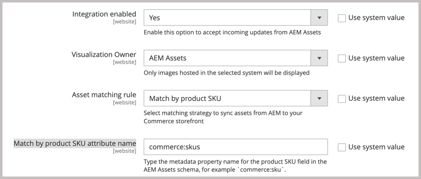

# Habilitar sincronização de ativos

>[!BEGINSHADEBOX]

**Pré-requisitos**

- [Configurar o AEM Experience Manager Assets para gerenciar ativos da Commerce](#aem-assets-configure-aem)
- [Instale e configure a Integração do AEM Assets para o Commerce](#aem-assets-configure-commerce.md) para adicionar a extensão e gerar as credenciais e conexões necessárias para usar a extensão.

>[!ENDSHADEBOX]

Durante esse processo de ativação, registre a ID do locatário fornecendo a ID do programa e do ambiente para o ambiente de criação do AEM. Essas IDs identificam o projeto do AEM Assets ao qual você está se conectando e fornecem as credenciais para habilitar a comunicação e os workflows entre o Commerce e o AEM Assets.

Depois de identificar o projeto de ativos AEM, selecione a regra de correspondência a ser usada para sincronizar ativos entre o Adobe Commerce e o AEM Assets.

A integração do AEM Assets para Commerce oferece suporte a duas regras correspondentes para sincronizar ativos entre o Adobe Commerce e o AEM Assets.

- **Corresponder por SKU de produto** — Esta é a regra de correspondência padrão que corresponde ativos com base na SKU (Unidade de Manutenção de Estoque) do produto. O SKU é um identificador exclusivo para cada produto. Essa regra corresponde a SKU nos metadados do ativo à SKU do produto Commerce para garantir que os ativos estejam associados aos produtos corretos.

- **Correspondência personalizada** — Esta regra de correspondência se destina a cenários mais complexos ou requisitos de negócios específicos que exigem lógica de correspondência personalizada. Para usar essa regra, você deve ter um código personalizado implementado no Adobe Developer App Builder que define como os ativos são correspondidos aos produtos. Mais detalhes em breve...

Para integração inicial, use a regra padrão `Match by product sku`. Se necessário, é possível alterar a regra de correspondência posteriormente.

## Habilitar a integração

1. Obtenha a ID do projeto e do ambiente para seu [Ambiente de Criação do AEM Assets](https://experienceleague.adobe.com/en/docs/experience-manager-cloud-service/content/sites/authoring/quick-start).

   1. Abra o console AEM Sites e selecione **[!UICONTROL Assets]**.

   1. Copie e salve as IDs de projeto e ambiente da URL: `https://author-p[Program ID]-e[EnvironmentID].adobeaemcloud.com/`|

1. No Administrador do Commerce, abra a configuração da Integração do AEM Assets.

   1. Selecione **[!UICONTROL Store]** > Configuração > **[!UICONTROL CATALOG]** > **[!UICONTROL Catalog]**.

   1. Expandir **[!UICONTROL Experience Manager Assets integration]**.

      {width="600" zoomable="yes"}

1. Identifique o projeto do Experience Manager Assets ao qual se conectar inserindo o **[!UICONTROL Program ID]** e **[!UICONTROL Environment ID]**.

1. Adicione as credenciais OAUTH para autenticar solicitações de API entre o Adobe Commerce e o serviço ARES selecionando o **[[!UICONTROL Commerce integration]](aem-assets-configure-commerce.md#add-the-integration-to-the-commerce-environment)**, por exemplo `Assets integration`.

1. Permitir que o Commerce aceite atualizações de entrada do AEM Assets definindo **[!UICONTROL Enable integration]** como `Yes`.

   Depois de habilitar a integração, é possível configurar a regra de correspondência de ativos.

   {width="600" zoomable="yes"}

1. Defina a regra de correspondência para a sincronização de ativos.

   1. Selecione **[!UICONTROL Match by product SKU]**.

   1. Adicione o [nome do campo de metadados do AEM Assets](aem-assets-configure-aem.md#configure-metadata) definido para SKUs de produtos Commerce no campo **[!UICONTROL Match by product SKU attribute name]**, `commerce:skus` por exemplo.

1. Aplicar a configuração e iniciar o processo de sincronização selecionando **[!UICONTROL Save Config]**.
