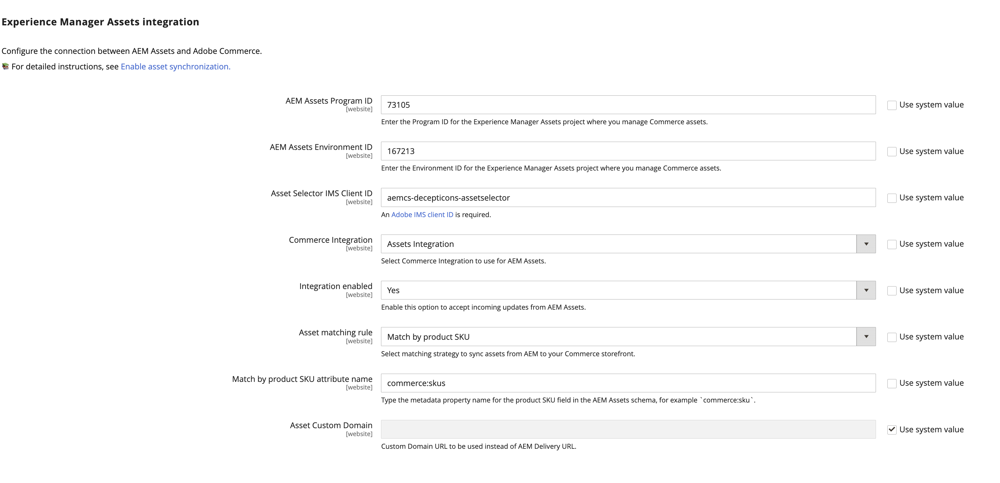

# Configurar a integração

Configure a integração conectando o Commerce à instância do AEM Assets e selecionando a estratégia correspondente para a sincronização de ativos.

Depois de identificar o projeto do AEM Assets, selecione a regra de correspondência para sincronizar ativos entre o Adobe Commerce e o AEM Assets.

- **[!UICONTROL Match by product SKU]** — Regra padrão que corresponde ao SKU nos metadados do ativo com o [SKU do produto Commerce](https://experienceleague.adobe.com/en/docs/commerce-operations/implementation-playbook/glossary#sku) para garantir que os ativos estejam associados aos produtos corretos.

- **[!UICONTROL Custom match]** — Regra de correspondência para cenários mais complexos ou requisitos de negócios específicos que exigem lógica de correspondência personalizada. A implementação da correspondência personalizada requer o desenvolvimento de código personalizado no Adobe Developer App Builder para definir como os ativos são correspondidos aos produtos. Mais detalhes em breve...

Para a configuração inicial, use a regra padrão *Corresponder por SKU de produto*.

## Pré-requisitos

- [Instalar pacote do AEM Assets](aem-assets-configure-aem.md)

- [Instale pacotes do Adobe Commerce](aem-assets-configure-commerce.md) para adicionar a extensão e gerar as credenciais e conexões necessárias para usar a extensão.

- Crie um tíquete de suporte para solicitar a ativação da integração do AEM Assets para Commerce. No tíquete, inclua o **[!UICONTROL Program ID]**, **[!UICONTROL Environment ID]** e **[!UICONTROL IMS Org ID]** para o ambiente de criação do AEM Assets que você deseja conectar ao Commerce.

  >[!TIP]
  >
  > (Opcional) Forneça o **[!UICONTROL Asset Selector IMS Client ID]**, se disponível. Consulte [ImsAuthProps](https://experienceleague.adobe.com/en/docs/experience-manager-cloud-service/content/assets/manage/asset-selector/asset-selector-integration/integrate-asset-selector-adobe-app) na documentação do *Seletor de AEM Assets*.

## Configurar a conexão

1. Obtenha o [Ambiente de Criação do AEM Assets](https://experienceleague.adobe.com/en/docs/experience-manager-cloud-service/content/sites/authoring/quick-start) e a ID do ambiente.

   1. Abra o console AEM Sites e selecione **[!UICONTROL Assets]**.

   1. Copie e salve as IDs de projeto e ambiente da URL: `https://author-p[Program ID]-e[EnvironmentID].adobeaemcloud.com/`
1. No Administrador do Commerce, abra a configuração da Integração do AEM Assets.

   1. Vá para **[!UICONTROL Store]** > Configuração > **[!UICONTROL ADOBE SERVICES]** > **[!UICONTROL AEM Assets Integration]**.

      {width="600" zoomable="yes"}

1. Entre no ambiente AEM Assets **[!UICONTROL Program ID]** e **[!UICONTROL Environment ID]**.

   Edite os valores de configuração removendo a seleção de *[!UICONTROL Use system value]*.

1. Insira o **[!UICONTROL Asset Selector IMS Client ID]**, se disponível.

   A [ID do Cliente IMS do Seletor de Ativos](https://experienceleague.adobe.com/en/docs/experience-manager-cloud-service/content/assets/manage/asset-selector/asset-selector-integration/integrate-asset-selector-adobe-app#ims-auth-props) é exigida pelo [!UICONTROL Assets Selector], um recurso do AEM Assets que permite que os usuários incorporem ativos visuais diretamente nas páginas de produto do Commerce.

1. Selecione o [[!UICONTROL Commerce integration]](aem-assets-configure-commerce.md#add-the-integration-to-the-commerce-environment) para solicitações de autenticação entre o Commerce e o serviço de correspondência de ativos.

1. Defina **[!UICONTROL Integration enabled]** como `Yes` para permitir que o Commerce aceite atualizações de entrada do AEM Assets.

   Depois de habilitar a integração, opções de configuração adicionais estão disponíveis para especificar os critérios de correspondência de ativos.

1. Defina a regra de correspondência para a sincronização de ativos.

   1. Selecione **[!UICONTROL Match by product SKU]** ou **[!UICONTROL Custom match (Requires App Builder)]**.

   1. Adicione o [nome do campo de metadados do AEM Assets](aem-assets-configure-aem.md#configure-metadata) definido para SKUs de produtos Commerce no campo **[!UICONTROL Match by product SKU attribute name]**, `commerce:skus` por exemplo.

1. Selecione **[!UICONTROL Save Config]** para aplicar atualizações e iniciar a sincronização de ativos.

   A atualização de configuração aciona o processo de sincronização inicial, permitindo que o Commerce aceite atualizações recebidas do AEM Assets. O tempo necessário para a sincronização depende do volume de ativos e de configurações específicas. A integração utiliza processos automatizados para minimizar o tempo necessário para a sincronização.

### Configurar o URL do domínio personalizado

Se um comerciante definir um [Nome de Domínio Personalizado](https://experienceleague.adobe.com/pt-br/docs/experience-manager-cloud-service/content/implementing/using-cloud-manager/custom-domain-names/add-custom-domain-name){target=_blank} no painel do AEM, será necessário adicionar esta **URL de Domínio Personalizado** no Commerce para que a integração do AEM Assets possa usá-la.

1. Navegue até **[!UICONTROL Store]** > Configuração > **[!UICONTROL ADOBE SERVICES]** > **[!UICONTROL AEM Assets Integration]**.

   {width="600" zoomable="yes"}

1. Adicione a **URL de Domínio Personalizado** ao campo **[!UICONTROL Asset Custom Domain]**.

1. Clique em **[!UICONTROL Save Config]** para aplicar atualizações e iniciar a sincronização de ativos.

## Próxima etapa

[Usar o AEM Assets com o Commerce](aem-assets-manage.md)
