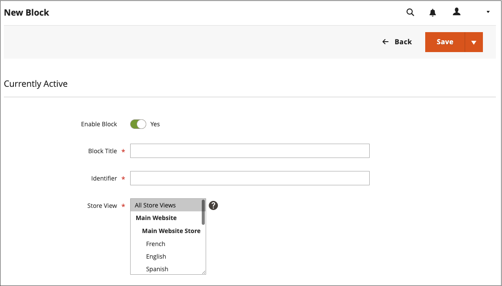

# Adicionar blocos de conteúdo

Blocos personalizados de conteúdo podem ser criados e, em seguida, adicionados a qualquer página, grupo de páginas ou até mesmo a outro bloco. Por exemplo, você pode colocar um controle deslizante de imagem em um bloco e, em seguida, colocar o bloco na página inicial. O espaço de trabalho Blocos usa os mesmos [controles básicos](pages-workspace.md) que o espaço de trabalho _Páginas_ para ajudá-lo a encontrar blocos disponíveis e executar a manutenção de rotina. Quando o bloqueio for concluído, você poderá usar a ferramenta [Widget](widget-static-block.md) para colocá-lo em páginas específicas da loja.

{width="700" zoomable="yes"}

## Criar um bloco

1. Na barra lateral _Admin_, vá para **[!UICONTROL Content]** > _[!UICONTROL Elements]_>**[!UICONTROL Blocks]**.

1. No canto superior direito, clique em **Adicionar novo bloco**.

   {width="500" zoomable="yes"}

1. Se você deseja alterar o status de habilitado por padrão do novo bloco, defina **Habilitar Bloco** como `No`.

1. Atribuir um **Título do Bloco** para referência interna.

1. Atribua um **Identificador** exclusivo para o bloco.

   Use todos os caracteres em minúsculas com sublinhados em vez de espaços.

1. Selecione cada **[!UICONTROL Store View]** onde deseja que o bloco fique disponível.

1. Adicione o conteúdo do bloco usando o conjunto de ferramentas de conteúdo exibido:

   - Se o [Page Builder](../page-builder/introduction.md) estiver habilitado, selecione **[!UICONTROL Edit with Page Builder]** para usar as ferramentas do Page Builder no conteúdo [espaço de trabalho](../page-builder/workspace.md).

     {width="500" zoomable="yes"}

     >[!NOTE]
     >
     >Para obter informações sobre como adicionar blocos com o Page Builder, consulte [Tutorial 2: Blocos](../page-builder/2-blocks.md).

   - Use o [editor](editor.md) para formatar texto, criar links e adicionar tabelas, imagens, vídeo e áudio.

     Se preferir trabalhar com código HTML, clique em **Mostrar/Ocultar editor**.

     {width="500" zoomable="yes"}

1. Quando terminar, clique na seta **[!UICONTROL Save]** e escolha **[!UICONTROL Save & Close]**.

   O novo bloco aparece na parte inferior da lista na grade Blocos.

1. Use a ferramenta [Widget](widget-static-block.md) para colocar o bloco concluído em uma página específica do armazenamento.

## Excluir um bloco

Há duas maneiras de remover um bloco personalizado. Você pode removê-lo da grade _Blocos_ ou da página de edição de blocos.

### Método 1: remover um bloco da grade Blocos

1. Na barra lateral _Admin_, vá para **[!UICONTROL Content]** > _[!UICONTROL Elements]_>**[!UICONTROL Blocks]**.
1. Localize os blocos usando filtros acima da grade e marque a caixa de seleção de um ou mais blocos a serem excluídos.
1. No canto superior esquerdo da lista, defina **[!UICONTROL Actions]** como `Delete`.
1. Para confirmar a ação, clique em **[!UICONTROL OK]**.

### Método 2: remover um bloco da página de edição

1. Na barra lateral _Admin_, vá para **[!UICONTROL Content]** > _[!UICONTROL Elements]_>**[!UICONTROL Blocks]**.
1. Localize o bloco a ser excluído.
1. Na coluna _Ações_ do bloco, clique em **[!UICONTROL Select]** e escolha **[!UICONTROL Edit]**.
1. Na barra de menus, clique em **[!UICONTROL Delete Block]**.
1. Para confirmar a ação, clique em **[!UICONTROL OK]**.

## Menu Salvar

| Comando | Descrição |
|----------|----------- |
| [!UICONTROL Save] | Salve o bloco atual e continue trabalhando. |
| [!UICONTROL Save & Duplicate] | Salvar e fechar o bloco atual e abrir uma nova cópia duplicada. |
| [!UICONTROL Save & Close] | Salve e feche o bloco atual e retorne à grade Blocos. |

{style="table-layout:auto"}

## Adicionar uma lightbox ou controle deslizante

- É fácil adicionar um [controle deslizante](../page-builder/slider.md) à sua loja com [[!DNL Page Builder]](../page-builder/introduction.md). O controle deslizante pode ser definido para ser reproduzido automaticamente ou controlado manualmente com botões de navegação.

  {width="600" zoomable="yes"}

  Há também uma grande variedade de lightboxes de imagem baseadas em jQuery disponíveis em [[!DNL Commerce Marketplace]][1], e algumas estão livres.

- Você também pode baixar uma extensão do [!DNL Commerce Marketplace]. Para obter ajuda adicional, consulte a documentação fornecida pelo desenvolvedor da extensão.

[1]: https://marketplace.magento.com/extensions.html?q=lightbox
