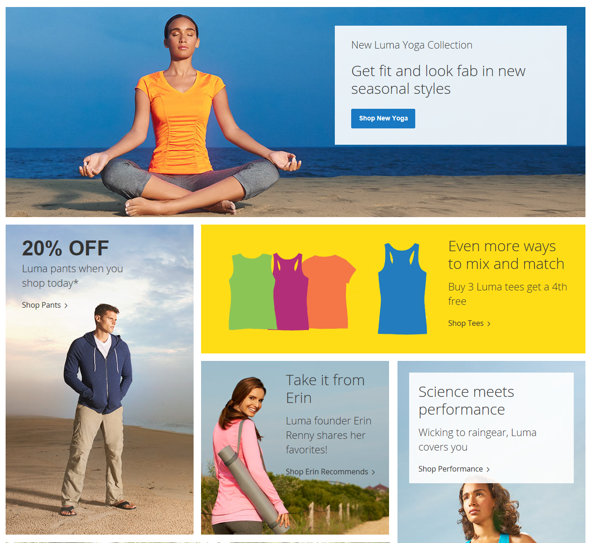

# Blocos de conteúdo

Um _bloco_ é uma unidade modular de conteúdo que pode ser posicionada em qualquer lugar da página. Os blocos de conteúdo às vezes são chamados de _blocos estáticos_ ou _blocos CMS_. Eles podem ser usados para exibir informações fixas, como texto, imagens e vídeo incorporado, e informações dinâmicas fornecidas por um widget ou originárias de um banco de dados ou outra fonte. A maioria dos elementos na página inicial são blocos que podem ser facilmente gerenciados.

Você pode criar blocos personalizados de conteúdo sem escrever qualquer código e atribuí-los para que apareçam em um lugar específico no layout da página. Os blocos podem ser posicionados usando a ferramenta [widget](widget-static-block.md) ou compondo uma [atualização de layout](layout-updates.md) em XML e salvando-a no servidor. Para obter mais informações sobre como usar atualizações de layout, consulte as informações de [Layout](https://developer.adobe.com/commerce/frontend-core/guide/layouts/) no _Guia do Desenvolvedor de Front-End_.

{width="600" zoomable="yes"}

## Demonstração de blocos estáticos e dinâmicos

Saiba mais sobre [blocos estáticos e &#x200B;](dynamic-blocks.md) dinâmicos assistindo a este vídeo:

>[!VIDEO](https://video.tv.adobe.com/v/3417365?captions=por_br&quality=12&learn=on)
