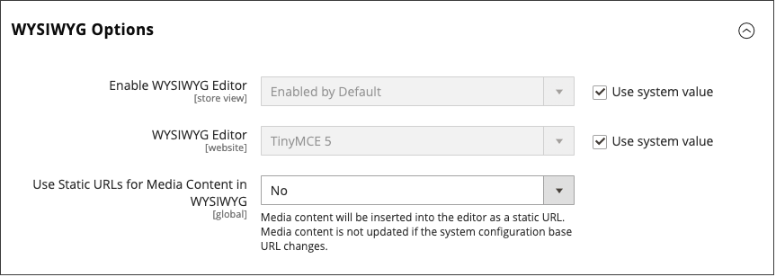

# URLs de mídia dinâmica

Um URL de mídia dinâmica é uma referência relativa a uma imagem ou outro ativo de mídia. Quando habilitadas, as URLs de mídia dinâmica podem ser usadas para vincular diretamente aos ativos no servidor ou aos arquivos armazenados em uma [rede de entrega de conteúdo](media-storage-content-delivery-network.md). O uso de URLs de mídia dinâmica pode afetar o desempenho do catálogo, e o [editor](editor.md#configure-the-editor) pode ser configurado para usar URLs de mídia estática ou dinâmica.

Como em todas as [marcas de marcação](../systems/markup-tags.md), a diretiva é delimitada por chaves duplas. O formato de um URL de mídia dinâmica é semelhante ao seguinte:

`\{\{media url="path/to/image.jpg"}}`

As diretivas de URL dinâmicas são processadas a partir do conteúdo HTML salvo quando a página é renderizada na loja. Cada vez que a página é renderizada, o conteúdo é verificado em busca de `\{\{media url="..."}}` e cada diretiva é substituída pela URL de mídia correspondente.

{{$include /help/_includes/directives-caution.md}}

## Configurar URLs de mídia estática

Por padrão, as imagens inseridas no catálogo do editor do WYSIWYG têm URLs relativos e dinâmicos. Se preferir usar um URL estático, é possível alterar a definição da configuração.

1. Na barra lateral _Admin_, vá para **[!UICONTROL Stores]** > _[!UICONTROL Settings]_>**[!UICONTROL Configuration]**.

1. No painel esquerdo, em _[!UICONTROL General]_, escolha **[!UICONTROL Content Management]**.

1. Expandir  a seção **[!UICONTROL WYSIWYG Options]**.

   {width="600" zoomable="yes"}

1. Defina **[!UICONTROL Use Static URLs for Media Content in WYSIWYG]** como um dos seguintes:

   - `Yes` - Usa URLs estáticas para conteúdo de mídia inserido com o editor do WYSIWYG. As URLs estáticas são absolutas e quebradas se a [URL de base](../stores-purchase/store-urls.md) do armazenamento for alterada.

   - `No` - (Padrão) Usa URLs dinâmicas para conteúdo de mídia inserido com o editor do WYSIWYG, com base na diretiva `\{\{media url="..."}}`. Os URLs dinâmicos são relativos e não se quebram se o URL de base do armazenamento for alterado.

1. Quando terminar, clique em **[!UICONTROL Save Config]**.
