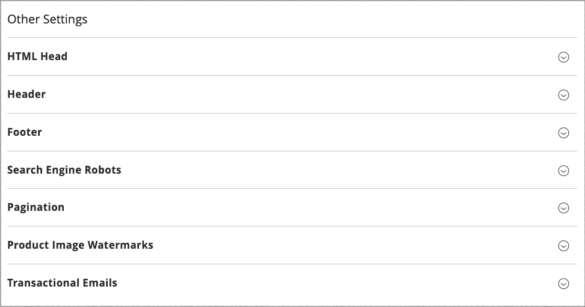

# Configuração de design

A configuração Design facilita a edição de regras e definições de configuração relacionadas ao design, exibindo as configurações em uma única página.

{width="700" zoomable="yes"}

## Alterar a configuração de design

1. Na barra lateral _Admin_, vá para **[!UICONTROL Content]** > _[!UICONTROL Design]_>**[!UICONTROL Configuration]**.

1. Localize a exibição de armazenamento que você deseja configurar e clique em **[!UICONTROL Edit]** na coluna _[!UICONTROL Action]_.

   A página exibe as configurações de design atuais para a exibição de loja.

1. Para alterar o tema padrão, defina **[!UICONTROL Applied Theme]** como o tema que deseja aplicar ao modo de exibição.

   Se nenhum tema for especificado, o tema padrão do sistema será usado. Algumas extensões de terceiros modificam o tema padrão do sistema.

1. [!BADGE PaaS only]{type=Informative url="https://experienceleague.adobe.com/en/docs/commerce/user-guides/product-solutions" tooltip="Aplica-se somente a projetos do Adobe Commerce na nuvem (infraestrutura do PaaS gerenciada pela Adobe) e a projetos locais."} Se o tema for ser usado apenas para um dispositivo específico, defina o **[!UICONTROL User Agent Rules]**.

   {width="400" zoomable="yes"}

   Para cada tipo de dispositivo em que você deseja especificar um tema:

   - Clique em **[!UICONTROL Add New User Agent Rule]**.

   - Para **[!UICONTROL Search String]**, insira a ID de navegador do dispositivo específico.

     Uma cadeia de caracteres de pesquisa pode ser uma expressão normal ou uma Expressão Regular Compatível com Perl (PCRE) (consulte [Agente do Usuário](https://en.wikipedia.org/wiki/User_agent) para obter mais informações). A sequência de pesquisa a seguir identifica o Firefox:

         /^mozilla/i
     
   - Para **[!UICONTROL Theme Name]**, escolha o tema a ser usado para o dispositivo especificado.

   >[!NOTE]
   >
   >É possível adicionar quantas regras desejar para os dispositivos designados. As cadeias de caracteres de pesquisa são correspondidas na ordem em que são inseridas.

1. Em _[!UICONTROL Other Settings]_, expanda cada seção e siga as instruções nos tópicos vinculados para editar as configurações conforme necessário.

   - [!BADGE Somente PaaS]{type=Informative url="https://experienceleague.adobe.com/en/docs/commerce/user-guides/product-solutions" tooltip="Aplica-se somente a projetos do Adobe Commerce na nuvem (infraestrutura do PaaS gerenciada pela Adobe) e a projetos locais."} [[!UICONTROL Pagination]](../catalog/navigation-product-listings.md#pagination-controls)
   - [!BADGE Somente PaaS]{type=Informative url="https://experienceleague.adobe.com/en/docs/commerce/user-guides/product-solutions" tooltip="Aplica-se somente a projetos do Adobe Commerce na nuvem (infraestrutura do PaaS gerenciada pela Adobe) e a projetos locais."} [[!UICONTROL HTML Head]](page-setup.md#html-head)
   - [!BADGE Somente PaaS]{type=Informative url="https://experienceleague.adobe.com/en/docs/commerce/user-guides/product-solutions" tooltip="Aplica-se somente a projetos do Adobe Commerce na nuvem (infraestrutura do PaaS gerenciada pela Adobe) e a projetos locais."} [[!UICONTROL Header]](page-setup.md#header)
   - [!BADGE Somente PaaS]{type=Informative url="https://experienceleague.adobe.com/en/docs/commerce/user-guides/product-solutions" tooltip="Aplica-se somente a projetos do Adobe Commerce na nuvem (infraestrutura do PaaS gerenciada pela Adobe) e a projetos locais."} [[!UICONTROL Footer]](page-setup.md#footer)
   - [!BADGE Somente PaaS]{type=Informative url="https://experienceleague.adobe.com/en/docs/commerce/user-guides/product-solutions" tooltip="Aplica-se somente a projetos do Adobe Commerce na nuvem (infraestrutura do PaaS gerenciada pela Adobe) e a projetos locais."} [[!UICONTROL Search Engine Robots]](../merchandising-promotions/seo-overview.md#search-engine-robots)
   - [[!UICONTROL Product Image Watermarks]](../catalog/product-image.md#watermarks)
   - [[!UICONTROL Transactional Emails]](../systems/email-templates.md#configure-email-templates)

   {width="500" zoomable="yes"}

1. Quando terminar, clique em **[!UICONTROL Save Configuration]**.
