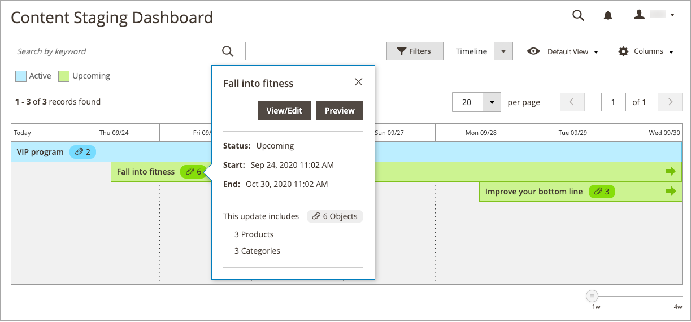

# Adicionar um item a uma campanha

{{ee-feature}}

O exemplo a seguir adiciona uma imagem promocional à página de categoria durante a campanha. Você também pode fazer o mesmo para uma página de produto ou página do CMS.

## Adicionar o item de campanha de uma categoria

1. Na barra lateral _Admin_, vá para **[!UICONTROL Catalog]** > **[!UICONTROL Categories]**.

1. Localize a categoria que deseja usar na campanha e abra-a no modo de edição.

1. Clique em **[!UICONTROL Schedule New Update]**.

1. Selecione **[!UICONTROL Assign to Existing Campaign]**.

1. Na lista, selecione a campanha que deve ser modificada.

   {width="600" zoomable="yes"}

1. Expandir  **[!UICONTROL Content]**.

1. Para **[!UICONTROL Category Image]**, clique em **[!UICONTROL Upload]** e selecione a imagem a ser exibida na página de categoria durante a campanha.

   {width="600" zoomable="yes"}

1. Quando terminar, clique em **[!UICONTROL Save]**.

## Validar o item

1. Na barra lateral _Admin_, vá para **[!UICONTROL Content]** > _[!UICONTROL Content Staging]_>**[!UICONTROL Dashboard]**.

1. Encontre a campanha na lista ou linha do tempo exibida e abra-a para acessar os detalhes:

   - Para exibir uma lista, clique em **[!UICONTROL Select]** e depois em **[!UICONTROL View/Edit]** na coluna _[!UICONTROL Action]_.
   - Para exibir uma linha do tempo, clique uma vez para exibir o resumo e clique em **[!UICONTROL View/Edit]**.

   {width="600" zoomable="yes"}

1. Expanda  **[!UICONTROL Categories]** para exibir a lista de categorias atribuídas.

1. Para revisar as páginas da categoria quando a campanha estiver ativa, retorne ao painel, clique na campanha novamente e clique em **[!UICONTROL Preview]**.
