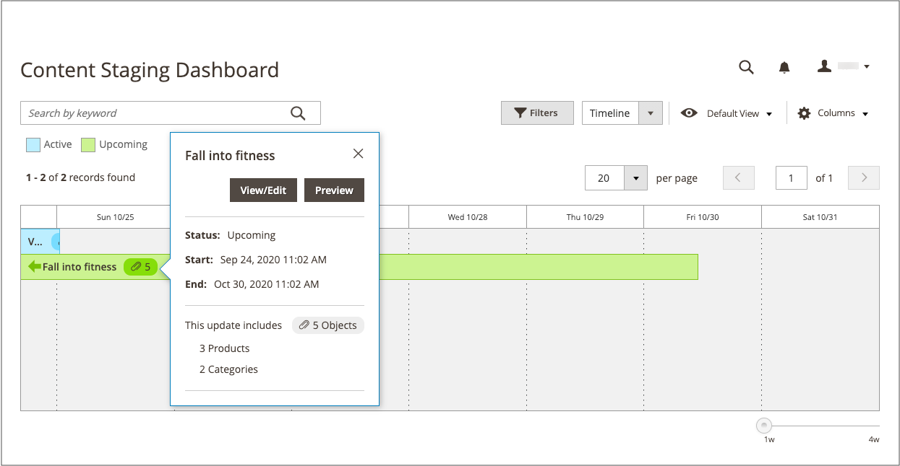

# Painel de preparo de conteúdo

{{ee-feature}}

O Painel [!UICONTROL Content Staging] fornece uma visão geral de todas as campanhas ativas e futuras. O formato do painel pode ser alterado de uma grade para uma linha do tempo. Também é possível usar filtros para localizar campanhas, personalizar o layout da coluna e salvar diferentes exibições da grade. Para obter mais informações sobre os controles do espaço de trabalho, consulte [Espaço de trabalho de administrador](../getting-started/admin-workspace.md).

{width="600" zoomable="yes"}

## Exibir o painel de preparo

1. Na barra lateral _Admin_, vá para **[!UICONTROL Content]** > _[!UICONTROL Content Staging]_>**[!UICONTROL Dashboard]**.

1. Para alterar o formato do painel, defina o controle **[!UICONTROL View As]** como `list`, `Grid` ou `Timeline`.

   {width="600" zoomable="yes"}

   Quando a linha do tempo é exibida, o controle deslizante no canto inferior direito pode ser usado para ajustar a exibição de uma a quatro semanas. Cada coluna representa um dia.

1. Se a linha do tempo for exibida, arraste o controle deslizante até a posição `4w` na extremidade direita para exibir um período de tempo mais longo.

   {width="600" zoomable="yes"}

1. Para exibir informações gerais sobre a campanha, clique em qualquer item na página.

   - Para abrir a campanha, clique em **[!UICONTROL View/Edit]**.

   - Para ver a aparência da campanha para os clientes da loja naquele dia, clique em **[!UICONTROL Preview]**.

   {width="600" zoomable="yes"}

## Descrições da coluna do painel de preparação

| Coluna | Descrição |
|--- |--- |
| [!UICONTROL Status] | Status da campanha. `Active` ou `Upcoming`. |
| [!UICONTROL Update Name] | O nome da campanha. |
| [!UICONTROL Includes] | Define quantos objetos são incluídos na campanha. |
| [!UICONTROL Start Time] | A data em que a campanha começa. |
| [!UICONTROL End Time] | A data em que a campanha termina. |
| [!UICONTROL Description] | Descrição adicional de cada campanha. |
| [!UICONTROL Action] | As ações que podem ser aplicadas a um registro individual incluem: **[!UICONTROL View/Edit]**- Abre a campanha no modo de edição. **[!UICONTROL Preview]** - Exibe a campanha no modo de visualização. |

{style="table-layout:auto"}

## Editar uma campanha

Os objetos de campanha existentes podem ser editados no painel de preparo, exceto para campanhas de regra de preço que não têm datas de término.

>[!NOTE]
>
>Se uma campanha que inclui uma regra de preço for criada inicialmente sem uma data final, a campanha não poderá ser editada posteriormente para incluir uma data final. Nesse caso, é necessário criar uma campanha duplicada e inserir a data final necessária.

{width="600" zoomable="yes"}

A campanha neste exemplo inclui duas categorias e três produtos individuais.

Siga as etapas abaixo para editar qualquer um dos objetos nesta campanha.

1. Na barra lateral _Admin_, vá para **[!UICONTROL Content]** > _[!UICONTROL Content Staging]_>**[!UICONTROL Dashboard]**.

1. Encontre a campanha na lista ou linha do tempo exibida e abra-a para acessar os detalhes:

   - Para exibir uma lista, clique em **[!UICONTROL Select]** e depois em **[!UICONTROL View/Edit]** na coluna _[!UICONTROL Action]_.
   - Para exibir uma linha do tempo, clique uma vez para exibir o resumo e clique em **[!UICONTROL View/Edit]**.

1. Atualize qualquer uma das configurações na seção _[!UICONTROL General]_, conforme necessário.

1. Expanda  qualquer seção que contenha um item a ser editado.

   {width="600" zoomable="yes"}

1. Clique em **[!UICONTROL Save]**.
