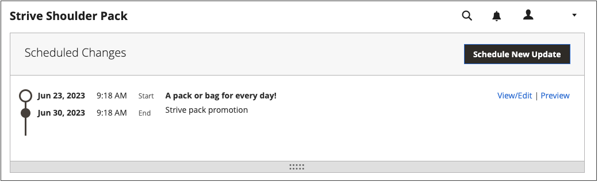

# Programar uma atualização de conteúdo

{{ee-feature}}

O exemplo a seguir mostra como programar uma alteração de preço temporária para um produto. Inclui agendamento e visualização de alterações e visualização de atualizações agendadas no calendário. Embora este exemplo inclua apenas uma única alteração, uma campanha pode incluir várias alterações em produtos, regras de preço, páginas CMS e outras entidades programadas para ocorrer ao mesmo tempo. Siga um método semelhante para especificar as datas de/até para a variável [!UICONTROL Set Product As New] atributo.

>[!NOTE]
>Você deve criar uma atualização agendada para especificar uma data de Início (e Término) para [!UICONTROL Set Product As New]. Para [!UICONTROL Special Price] e [!UICONTROL Design Change], os campos de data de/para são removidos do Adobe Commerce e estão disponíveis somente no Magento Open Source.
>
>Todas as atualizações programadas são aplicadas consecutivamente, o que significa que qualquer entidade pode ter apenas uma atualização programada de cada vez. Qualquer atualização agendada é aplicada a todas as exibições de loja dentro de seu período de tempo. Como resultado, uma entidade não pode ter uma atualização agendada diferente para diferentes exibições de loja ao mesmo tempo. Todos os valores de atributo de entidade em todas as exibições de armazenamento, que não são afetados pela atualização agendada atual, são obtidos dos valores padrão, e não da atualização agendada anterior.

## Programar uma atualização de um produto

1. No _[!UICONTROL Products]_abrir um produto no modo de edição.

1. No _[!UICONTROL Scheduled Changes]_na parte superior da página, clique em **[!UICONTROL Schedule New Update]**.

   {width="600" zoomable="yes"}

1. Com o **[!UICONTROL Save as a New Update]** selecionada, defina os parâmetros básicos da atualização:

   - Para **[!UICONTROL Update Name]**, digite um nome para a nova campanha de preparo de conteúdo.

   - Insira um resumo **[!UICONTROL Description]** da atualização e como ela será usada.

   - Usar o calendário () para escolher a **Data de início** e **Data final** para a campanha.

     Para criar uma campanha aberta, não especifique uma data final (deixe em branco). Para este exemplo, a campanha está programada para começar na meia-noite do ano novo, 1º de janeiro de 2021 às 12h PST.

     Para uma campanha de regra de preço criada sem uma data final, uma data final não pode ser adicionada posteriormente. Nesse caso, é necessário criar uma campanha e definir a data de início como a data em que deseja que a campanha antiga termine e a nova comece. Nessa data de início, a campanha antiga termina e a nova campanha começa conforme definido.

     {width="600" zoomable="yes"}

     >[!NOTE]
     >
     >A data de início e a data de término da campanha devem ser definidas usando **_padrão_** Fuso horário do administrador, que é convertido do fuso horário local de cada site. Por exemplo, quando você tem vários sites em fusos horários diferentes, mas deseja iniciar uma campanha com base em um fuso horário dos EUA (padrão), é necessário agendar uma atualização separada para cada fuso horário local. Nesse caso, defina **[!UICONTROL Start Date]** e **[!UICONTROL End Date]** conforme convertido do fuso horário de cada site local para o fuso horário padrão do Administrador.

1. Role para baixo até _[!UICONTROL Price]_e clique em **[!UICONTROL Advanced Pricing]**.

1. Insira um **[!UICONTROL Special Price]** do produto durante a campanha agendada e clique em **[!UICONTROL Done]**.

1. Quando terminar, clique em **[!UICONTROL Save]**.

   A alteração programada é exibida na parte superior da página do produto, com as datas de início e término da campanha.

   {width="600" zoomable="yes"}

## Editar a alteração agendada

1. No _Alterações Agendadas_ na parte superior da página, clique em **[!UICONTROL View/Edit]**.

1. Faça as alterações necessárias na atualização agendada.

1. Clique em **[!UICONTROL Save]**.

## Visualizar a alteração agendada

No _Alterações Agendadas_ na parte superior da página, clique em **[!UICONTROL Preview]**.

A visualização abre uma nova guia do navegador e mostra como o produto aparece durante a campanha agendada.

>[!NOTE]
>
>Uma visualização de preparo para uma atualização agendada sempre começa no **padrão** visualização de loja, que emula a experiência do cliente de navegar pela campanha de atualização de preparo.

Para obter mais informações sobre como usar as ferramentas de conteúdo de visualização para alterar a data e o escopo da visualização, consulte [Pré-visualização de uma campanha](content-staging-preview.md). Você também pode compartilhar um link para a visualização da loja com seus colegas.
