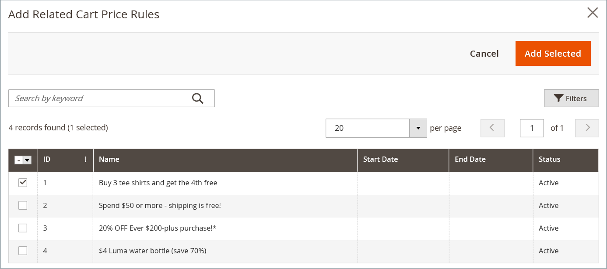

# Blocos dinâmicos em regras de preço

{{ee-feature}}

Qualquer [bloco dinâmico](dynamic-blocks.md) que você criar poderá ser associado a uma promoção. Para fazer a associação, primeiro crie o bloco dinâmico e a variável [regra de preço de catálogo](../merchandising-promotions/price-rules-catalog.md) ou [regra de preço do carrinho](../merchandising-promotions/price-rules-cart.md). A associação pode ser feita ao trabalhar em uma regra de preço ou ao trabalhar em um bloco dinâmico.

>[!IMPORTANT]
>
>Após criar essa associação, o bloco dinâmico é exibido **somente** quando a regra é acionada. Se a promoção for direcionada para o segmento A, o bloco será exibido para o segmento A. Se a promoção não estiver ativa, o bloco não será exibido.

## Associar um bloco dinâmico a uma regra de preço

1. No _Admin_ barra lateral, vá para **[!UICONTROL Marketing]** > _[!UICONTROL Promotions]_e escolha uma das seguintes opções:

   - **[!UICONTROL Catalog Price Rules]**
   - **[!UICONTROL Cart Price Rules]**

1. Na grade, localize a regra que deseja associar ao bloco dinâmico e abra no modo de edição.

1. Rolar para baixo e expandir  **[!UICONTROL Related Dynamic Blocks]**.

1. Na primeira coluna, defina o filtro como `Any` e clique em **[!UICONTROL Reset Filter]**.

   A grade agora lista todos os blocos dinâmicos disponíveis.

1. Marque a caixa de seleção de cada bloco dinâmico que você deseja associar à regra.

   {width="600" zoomable="yes"}

1. Quando terminar, clique em **[!UICONTROL Save]**.

## Associar uma regra de preço a um bloco dinâmico

1. No _Admin_ barra lateral, vá para **[!UICONTROL Content]** > _[!UICONTROL Elements]_>**[!UICONTROL Dynamic Blocks]**.

1. Encontre o bloco dinâmico na grade e abra no modo de edição.

1. Rolar para baixo e expandir **[!UICONTROL Related Promotions]**.

   Todas as regras de preços atualmente associadas aparecem na grade.

1. Adicione uma nova regra associada ou remova uma associação atual.

   - Para associar uma promoção de carrinho de compras, clique em **[!UICONTROL Add Cart Price Rules]**.

   - Para associar uma promoção relacionada ao produto, clique em **[!UICONTROL Add Catalog Price Rules]**.

1. Na grade, marque a caixa de seleção de cada regra que deseja associar ao bloco dinâmico.

1. Clique em **[!UICONTROL Add Selected]**.

   {width="600" zoomable="yes"}

1. Quando terminar, clique em **[!UICONTROL Save]**.
