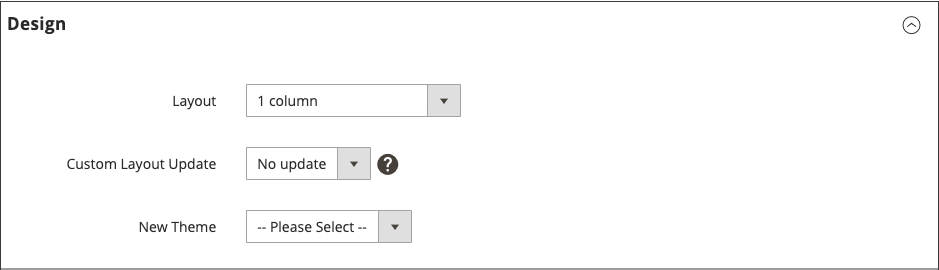

# Atualizações de layout

Antes de começar a trabalhar com atualizações de layout personalizadas, é importante entender como as páginas de seu armazenamento são construídas e a diferença entre os termos *layout* e *atualização de layout*. Layout refere-se à composição visual e estrutural da página. A atualização de layout se refere a um conjunto específico de instruções XML que podem substituir ou personalizar como a página é construída.

O layout XML do armazenamento [!DNL Commerce] é uma estrutura hierárquica de contêineres e blocos. Alguns elementos são exibidos em cada página e outros somente em páginas específicas. Para saber mais sobre layout, contêineres e blocos, consulte a [Visão geral dos layouts](https://developer.adobe.com/commerce/frontend-core/guide/layouts/) no _Guia do desenvolvedor de front-end_.

A ferramenta [Widget](widgets.md) é uma maneira fácil de adicionar um [bloco de conteúdo](blocks.md) existente ao layout padrão de uma página. Para obter atualizações mais avançadas, você deve salvar o código de atualização do layout XML no servidor e, em seguida, fazer referência ao arquivo como uma atualização de layout personalizada no Administrador. Para obter uma visão geral do processo, consulte [Usar atualizações de layout](layout-updates.md#place-a-block-using-layout-updates).

No diagrama a seguir, os nomes que se referem aos contêineres são pretos e os tipos de bloco, ou caminhos de classe de bloco, são azuis.

{width="500" zoomable="yes"}

| Tipo de bloco | Descrição |
|--- |--- |
| `page/html` | O nome deste bloco é `root` e é um dos poucos blocos raiz do layout. Você também pode criar seu próprio bloco e nomeá-lo como `root`, que é o nome padrão para blocos desse tipo. Só pode haver um bloco desse tipo por página. |
| `page/html_head` | O nome do bloco é `head` e é filho do bloco raiz. Só pode haver um bloco desse tipo por página e ele não deve ser removido. |
| `page/html_notices` | O nome do bloco é `global_notices` e é filho do bloco raiz. Se esse bloco for removido do layout, os avisos globais não aparecerão na página. Só pode haver um bloco desse tipo por página. |
| `page/html_header` | O nome do bloco é `header` e é filho do bloco raiz. Esse bloco corresponde ao cabeçalho visual na parte superior da página e contém vários blocos padrão. Só pode haver um bloco desse tipo por página e ele não deve ser removido. |
| `page/html_wrapper` | Embora incluído no layout padrão, esse bloco está obsoleto e é incluído apenas para garantir a compatibilidade com versões anteriores. Não use blocos desse tipo. |
| `page/html_breadcrumbs` | O nome deste bloco é `breadcrumbs` e é filho do bloco de cabeçalho. Esse bloco exibe navegações estruturais para a página atual. Só pode haver um bloco desse tipo por página. |
| `page/html_footer` | O nome do bloco é `footer` e é filho do bloco raiz. O bloco de rodapé corresponde ao rodapé visual na parte inferior da página e contém vários blocos padrão. Só pode haver um bloco desse tipo por página e ele não deve ser removido. |
| `page/template_links` | Há dois blocos desse tipo no layout padrão. O bloco `top.links` é filho do bloco de cabeçalho e corresponde ao menu de navegação superior. O bloco `footer_links` é filho do bloco de rodapé e corresponde ao menu de navegação inferior.   **_Observação:_**é possível manipular os links de modelo, conforme mostrado nos exemplos. |
| `page/switch` | Há dois blocos desse tipo no layout padrão. O bloco `store_language` é filho do bloco de cabeçalho e corresponde ao alternador de idioma superior. O bloco `store_switcher` é filho do bloco de rodapé e corresponde ao alternador de repositório inferior. |
| core/messages | Há dois blocos desse tipo no layout padrão. O bloco `global_messages` exibe mensagens globais. O bloco `messages` é usado para exibir todas as outras mensagens. Se você remover esses blocos, o cliente não verá nenhuma mensagem. |
| `core/text_list` | Esse tipo de bloco é amplamente usado em [!DNL Commerce] como um espaço reservado para renderização de blocos filhos. |
| `core/profiler` | Há apenas uma instância desse tipo de bloco por página. Ela é usada para o criador de perfil interno [!DNL Commerce] e não deve ser usada para nenhuma outra finalidade. |

{style="table-layout:auto"}

## Inserir um bloco usando atualizações de layout

[Atualizações de layout](layout-updates.md) possibilitam personalizar o layout de uma página. As atualizações de layout oferecem mais flexibilidade do que um [widget](widgets.md), mas exigem acesso ao servidor e conhecimento básico de XML.

As etapas a seguir mostram como usar uma atualização de layout para colocar um bloco em uma página. Para obter exemplos específicos e ajuda com a sintaxe, consulte [Tarefas comuns de personalização de layout](https://developer.adobe.com/commerce/frontend-core/guide/layouts/) no _Guia do desenvolvedor de front-end_.

### Etapa 1: criar o bloco

1. Crie o [bloco](block-add.md) que deseja posicionar.

1. Anote o `block_id`, pois ele é usado nas instruções de atualização do layout.

### Etapa 2: compor a atualização do layout em XML

1. Componha as instruções de layout em XML para [Referenciar um Bloco de CMS](https://developer.adobe.com/commerce/frontend-core/guide/layouts/xml-manage/).

1. Salve as [instruções de layout](https://developer.adobe.com/commerce/frontend-core/guide/layouts/xml-instructions/) no servidor, na pasta de layout onde os arquivos XML são salvos para o tema.

   Por exemplo:

   `<theme_dir>/<Namespace>_<Module>/layout`

   O identificador de layout é o nome de arquivo que começa com `cms_page_view_selectable_`, seguido pela chave de URL da página do CMS, a opção de atualização de layout e o sufixo de arquivo `xml`. No exemplo a seguir, `customer-service` é a chave de URL da página e `ChatTool` é a opção selecionada para aplicar a atualização de layout à página.

   `cms_page_view_selectable_`&lt;`customer-service`>`_`&lt;`ChatTool`>`.xml`

   | Elemento | Descrição |
   |--- |--- |
   | Identificador de página do CMS | A chave da URL da página com qualquer barra (`/`) substituída por um sublinhado (`_`). |
   | Nome da atualização de layout | A opção que aparece para _Atualização de Layout Personalizado_. |

   {style="table-layout:auto"}

### Etapa 3: referenciar a atualização do layout da página

1. Na barra lateral _Admin_, vá para **[!UICONTROL Content]** > _[!UICONTROL Elements]_>**[!UICONTROL Pages]**.

1. Localize a página onde deseja colocar o bloco e abra-o no modo de edição.

1. Role para baixo e expanda  na seção **[!UICONTROL Design]**.

1. Para exibir todas as atualizações de layout disponíveis associadas à página, clique no menu **[!UICONTROL Custom Layout Update]**.

   {width="400" zoomable="yes"}

1. Selecione a atualização de layout que deseja aplicar à página.

### Etapa 4: salvar e atualizar o cache

1. Quando terminar, clique em **[!UICONTROL Save & Close]**.

1. Na mensagem na parte superior do espaço de trabalho, clique em **[!UICONTROL Cache Management]** e atualize todos os itens de cache inválidos.
