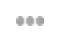
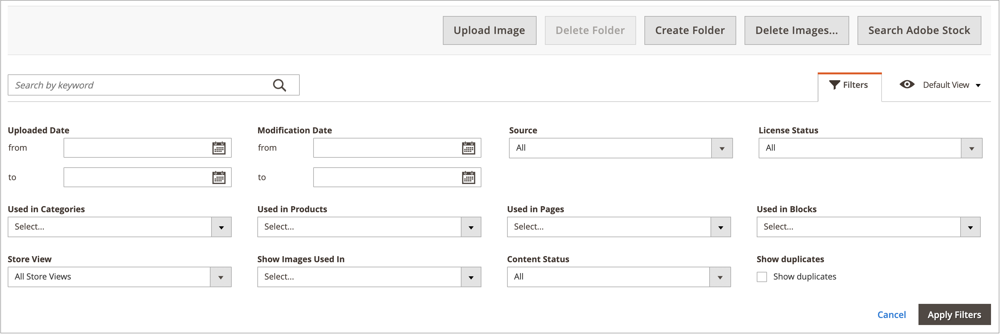

# Gerenciamento de ativos da Galeria de mídia

O novo [Galeria de mídia](media-gallery.md) O fornece ferramentas para gerenciar arquivos de mídia carregados e ativos adquiridos por meio de um [Integração do Adobe Stock](adobe-stock.md). Se tiver salvo uma Adobe Stock [visualização da imagem](adobe-stock-save-preview.md), você também pode [licença](adobe-stock-license-image.md) a imagem na nova Galeria de mídia.

## Fazer upload de um ativo

1. No _Admin_ barra lateral, vá para **[!UICONTROL Content]** > _[!UICONTROL Media]_>**[!UICONTROL Media Gallery]**.

1. Clique em **[!UICONTROL Upload Image]**.

1. Selecione o arquivo a ser carregado.

   O ativo selecionado é carregado automaticamente na pasta selecionada (ou na raiz de armazenamento se nenhuma pasta for selecionada).

## Exibir detalhes do ativo

1. No _Admin_ barra lateral, vá para **[!UICONTROL Content]** > _[!UICONTROL Media]_>**[!UICONTROL Media Gallery]**.

1. Clique nos três pontos abaixo do ativo ({width="10" zoomable="no"}) e clique em **[!UICONTROL View Details]**.

   {width="600" zoomable="yes"}

   Os detalhes do ativo são exibidos em um painel deslizante. Eles incluem as informações em que o ativo está sendo usado:

   - **[!UICONTROL Categories]**
   - **[!UICONTROL Products]**
   - **[!UICONTROL Pages]**
   - **[!UICONTROL Blocks]**

   {width="600" zoomable="yes"}

   Para ver os detalhes, clique no link **[!UICONTROL Used In]** links . A grade no exemplo a seguir mostra todas as categorias em que um ativo específico é usado.

   {width="600" zoomable="yes"}

   Também é possível excluir o ativo da variável _Exibir detalhes_ seção.

## Editar um ativo

1. No _Admin_ barra lateral, vá para **[!UICONTROL Content]** > _[!UICONTROL Media]_>**[!UICONTROL Media Gallery]**.

1. Clique nos três pontos abaixo do ativo ({width="10" zoomable="no"}) e clique em **[!UICONTROL Edit]**.

   {width="600" zoomable="yes"}

1. Se necessário, altere um dos seguintes valores de metadados:

   - **[!UICONTROL Title]**
   - **[!UICONTROL Description]**
   - **[!UICONTROL Tags/Keywords]**

   Esses dados são salvos na base de dados e nos próprios metadados do arquivo. Atualmente, os formatos XMP e IPTC são compatíveis.

   Você pode baixar a imagem com os metadados atualizados.

## Usar um ativo

Os ativos podem ser usados extensivamente pelo administrador, como [adicionar ou editar uma página](page-add.md), [criar ou editar uma categoria](../catalog/category-create.md)ou [inserir imagens do Editor de conteúdo](editor-insert-image.md).

1. Acesse a nova Galeria de mídia em uma área que permite usar ativos de mídia.

1. Selecione o ativo e clique em **[!UICONTROL Add Selected]**.

{{$include /help/_includes/image-optimization-animated-gif-note.md}}

## Excluir ativos

1. No _Admin_ barra lateral, vá para **[!UICONTROL Content]** > _[!UICONTROL Media]_>**[!UICONTROL Media Gallery]**.

1. Clique em **[!UICONTROL Delete Images...]** e marque a caixa de seleção para cada ativo que deseja excluir.

1. Na caixa de diálogo de confirmação, clique em **[!UICONTROL Delete Image]**.

   {width="500" zoomable="yes"}

## Pesquisar por ativos

1. No _Admin_ barra lateral, vá para **[!UICONTROL Content]** > _[!UICONTROL Media]_>**[!UICONTROL Media Gallery]**.

1. Use o **[!UICONTROL Search by keywords]** entrada para executar a pesquisa de imagem por palavras-chave/tags.

   A pesquisa no exemplo a seguir encontra ativos que contêm uma tag específica (`mountain`).

   {width="600" zoomable="yes"}

>[!NOTE]
>
>Para saber como atualizar tags de imagem, consulte a _[Editar um ativo](#edit-an-asset)_ seção.

## Filtrar ativos

>[!NOTE]
>
>A variável _Usado em_ A funcionalidade exige que [!UICONTROL Media Gallery Image Optimization] está ativado na variável [definições de configuração](media-gallery-image-optimization.md).

1. No _Admin_ barra lateral, vá para **[!UICONTROL Content]** > _[!UICONTROL Media]_>**[!UICONTROL Media Gallery]**.

1. Clique em **[!UICONTROL Filters]** guia.

   {width="600" zoomable="yes"}

1. Defina as opções de filtro.

   Você pode filtrar os ativos de acordo com o uso pelas entidades:

   - **[!UICONTROL Used in Categories]**
   - **[!UICONTROL Used in Products]**
   - **[!UICONTROL Used in Pages]**
   - **[!UICONTROL Used in Blocks]**

   Também é possível filtrar os ativos por **[!UICONTROL Store View]**, **[!UICONTROL License Status]**, e **[!UICONTROL Content Status]**. Definir um intervalo de datas para **[!UICONTROL Uploaded Date]** e/ou **[!UICONTROL Modification Date]** para filtrar ativos de acordo com as datas dos arquivos.

1. Clique em **[!UICONTROL Apply Filters]** para ver os resultados.

   A filtragem no exemplo a seguir encontra ativos usados em uma categoria específica (`cars`) e estão ativados.

   {width="600" zoomable="yes"}

## Localizar duplicatas de imagem

1. Clique em **[!UICONTROL Filters]** e selecione a guia **[!UICONTROL Show duplicates]** caixa de seleção

1. Para ver os resultados, clique em **[!UICONTROL Apply Filters]**.
