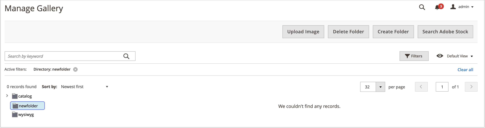

# Gerenciamento de pastas da Galeria de mídia

Use pastas para organizar imagens na nova [Galeria de Mídia](media-gallery.md). À medida que o número de ativos de mídia aumenta, as pastas facilitam a localização e o gerenciamento de ativos existentes na galeria de mídia.

## Criar uma pasta

Você só pode criar uma pasta em `pub/media/wysywig`, `pub/media/catalog/category` ou outras pastas adicionadas por módulos.

1. Na barra lateral _Admin_, vá para **[!UICONTROL Content]** > _[!UICONTROL Media]_>**[!UICONTROL Media Gallery]**.

1. Clique em **[!UICONTROL Create Folder]**.

   Para criar uma subpasta, selecione a pasta pai antes de clicar em **[!UICONTROL Create Folder]**.

1. Insira o novo nome de pasta e clique em **[!UICONTROL Confirm]**.

   {width="600" zoomable="yes"}

## Excluir uma pasta

>[!WARNING]
>
>Excluir uma pasta causa a remoção de todas as imagens dentro dessa pasta. Você só pode excluir uma pasta nas pastas `pub/media/wysywig` e `pub/media/catalog/category`.

1. Na barra lateral _Admin_, vá para **[!UICONTROL Content]** > _[!UICONTROL Media]_>**[!UICONTROL Media Gallery]**.

1. Selecione a pasta a ser excluída.

   {width="600" zoomable="yes"}

1. Clique em **[!UICONTROL Delete Folder]**.

1. Para confirmar a exclusão, clique em **[!UICONTROL OK]**.
