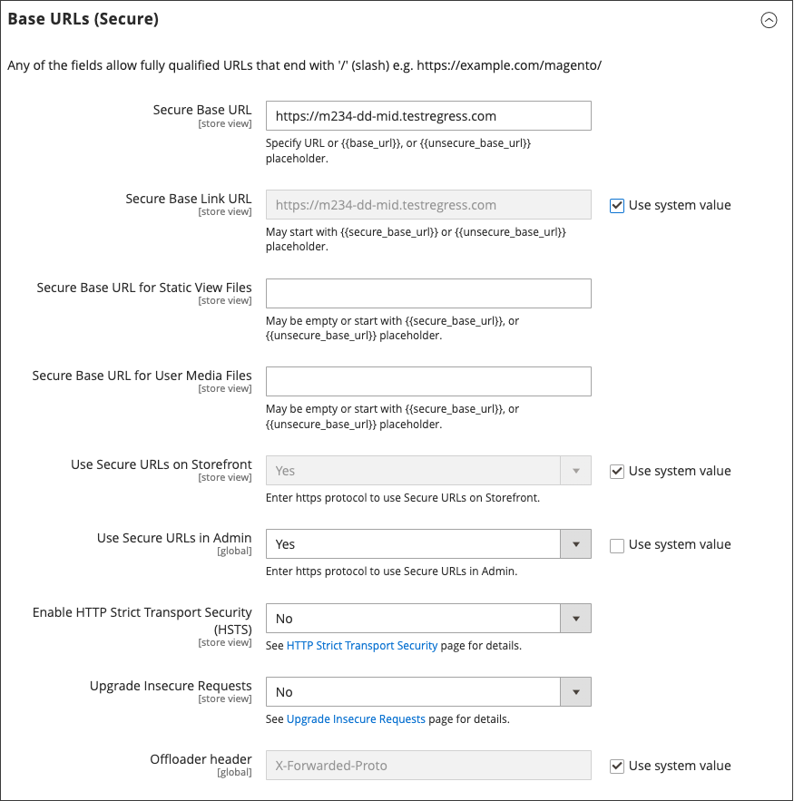

# Usar uma rede de entrega de conteúdo

Uma rede de entrega de conteúdo (CDN) pode ser usada para armazenar arquivos de mídia. O Adobe Commerce na infraestrutura em nuvem inclui a CDN Fastly (consulte [Fastly](https://experienceleague.adobe.com/docs/commerce-cloud-service/user-guide/cdn/fastly.html?lang=pt-BR) no _Guia do Commerce na Infraestrutura da Nuvem_). Uma instância do Commerce que esteja instalada _no local_ não inclui uma integração com qualquer CDN específica. Você pode usar a CDN de sua escolha.

Após configurar o CDN, você deve concluir a configuração no Admin. As alterações podem ser feitas no nível global ou do site. Quando um CDN é usado para armazenamento de mídia, todos os caminhos para mídia nas páginas de armazenamento do Commerce são alterados para os caminhos CDN especificados na configuração.

## Fluxo de trabalho CDN

1. **Mídia de solicitações do navegador** - Uma página da loja é aberta no navegador do cliente e o navegador solicita a mídia especificada no HTML.
1. **Solicitação enviada para a CDN; imagens encontradas e veiculadas** - A solicitação é enviada primeiro para a CDN. Se o CDN tiver as imagens armazenadas, ele fornecerá os arquivos de mídia ao navegador do cliente.
1. **Mídia não encontrada, solicitação enviada para o [!DNL Commerce] servidor Web** - Se a CDN não tiver os arquivos de mídia, a solicitação será enviada para o servidor Web [!DNL Commerce]. Se os arquivos de mídia forem encontrados no sistema de arquivos, o servidor da Web os enviará ao navegador do cliente.

>[!IMPORTANT]
>
>Por questões de segurança, quando um CDN é usado como armazenamento de mídia, o JavaScript pode não funcionar corretamente se o CDN estiver localizado fora do seu subdomínio.

## Configurar uma rede de entrega de conteúdo

1. Na barra lateral _Admin_, vá para **[!UICONTROL Stores]** > _[!UICONTROL Settings]_>**[!UICONTROL Configuration]**.

1. No painel esquerdo, em _[!UICONTROL General]_, escolha **[!UICONTROL Web]**.

1. No canto superior esquerdo, defina **[!UICONTROL Store View]** conforme necessário.

1. Expanda  a seção **[!UICONTROL Base URLs]** e faça o seguinte:

   {width="600" zoomable="yes"}

   - Atualize o **[!UICONTROL Base URL for Static View Files]** com a URL do local no CDN onde os arquivos de exibição estáticos estão armazenados.

   - Atualize o **[!UICONTROL Base URL for User Media Files]** com a URL dos arquivos JavaScript no CDN.

     Ambos os campos podem ser deixados em branco ou podem começar com o espaço reservado: `{{unsecure_base_url}}`

1. Expanda  a seção **[!UICONTROL Base URLs (Secure)]** e faça o seguinte:

   {width="600" zoomable="yes"}

   - Atualize o **[!UICONTROL Secure Base URL for Static View Files]** com a URL do local no CDN onde os arquivos de exibição estáticos estão armazenados.

   - Atualize o **[!UICONTROL Secure Base URL for User Media Files]** com a URL dos arquivos JavaScript no CDN.

     Ambos os campos podem ser deixados em branco ou podem começar com o espaço reservado: `{{unsecure_base_url}}`

1. Quando terminar, clique em **[!UICONTROL Save Config]**.
