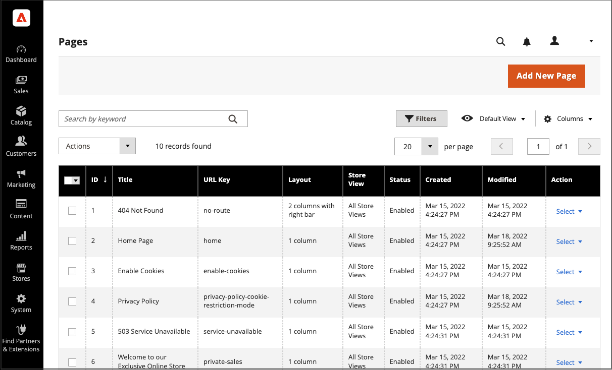
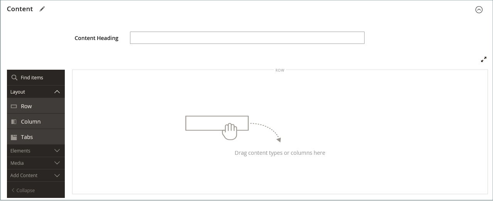
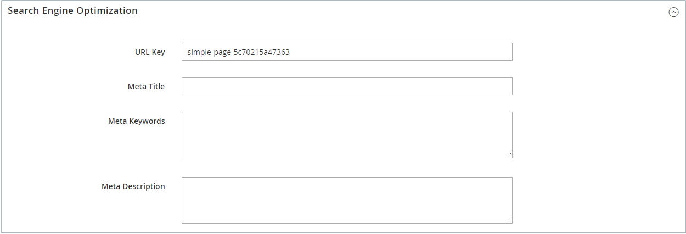

# Adicionar e remover páginas

O processo de adicionar uma página de conteúdo ao seu armazenamento é essencialmente o mesmo para qualquer tipo de página que você queira criar. É possível incluir texto, imagens, blocos de conteúdo, variáveis e widgets. A maioria das páginas de conteúdo é projetada para leitura primeiro pelos mecanismos de pesquisa e, depois, pelas pessoas. Lembre-se das necessidades de cada um desses dois públicos-alvo diferentes ao escolher o título da página, o URL e ao compor os metadados e o conteúdo. Quando a página é concluída, ela pode ser adicionada à navegação da loja, vinculada a outras páginas, vinculada do rodapé da loja ou usada como uma nova [página inicial](page-home-new.md).

{width="700" zoomable="yes"}

## Adicionar uma página

As instruções a seguir orientam você em cada etapa para criar uma página básica. Alguns recursos avançados são ignorados, mas são abordados em outros tópicos.

### Etapa 1: criar a página

1. Na barra lateral _Admin_, vá para **[!UICONTROL Content]** > _[!UICONTROL Elements]_>**[!UICONTROL Pages]**.

1. Clique em **[!UICONTROL Add New Page]**.

   {width="600" zoomable="yes"}

1. Se você não deseja publicar a página imediatamente, defina **[!UICONTROL Enable Page]** como `No`.

1. Insira o **[!UICONTROL Page Title]**.

   O título da página aparece na navegação [breadcrumb](../catalog/navigation-breadcrumb-trail.md).

### Etapa 2: concluir o conteúdo

Dependendo da sua [configuração de Ferramentas de Conteúdo Avançadas](../configuration-reference/general/content-management.md), adicione o conteúdo da página.

>[!NOTE]
>
>O editor de conteúdo do Page Builder não mostra uma pré-visualização dos elementos da Página do CMS que não estão disponíveis para a Exibição de armazenamento padrão. Por exemplo, não é possível visualizar um bloco do CMS que é atribuído apenas a exibições de loja não padrão. Nesse caso, você deve publicar sua página do CMS primeiro. Em seguida, é possível visualizar essa página diretamente na Loja. Como alternativa, você pode exibir a página da grade [!UICONTROL Pages] no Administrador selecionando a página do CMS [!UICONTROL View] na coluna [!UICONTROL Action].

#### Usar as ferramentas de conteúdo do Page Builder

1. Expandir  **[!UICONTROL Content]**.

   {width="600" zoomable="yes"}

1. Na caixa **[!UICONTROL Content Heading]**, digite o cabeçalho que você deseja que apareça na parte superior da página.

   Se habilitado, o estágio e o painel do [Page Builder](../page-builder/introduction.md) aparecerão abaixo do Cabeçalho do Conteúdo. Para obter mais informações, consulte [Workspace](../page-builder/workspace.md). Se o _Page Builder_ não estiver habilitado, o editor será aberto no modo WYSIWYG com a barra de ferramentas na parte superior.

1. Preencha o conteúdo e formate o texto conforme necessário.

#### Usar a barra de ferramentas do editor

1. Expandir  **[!UICONTROL Content]**.

   {width="600" zoomable="yes"}

1. Na caixa **[!UICONTROL Content Heading]**, digite o cabeçalho que você deseja que apareça na parte superior da página.

1. Preencha o conteúdo e formate o texto conforme necessário.

   Você pode adicionar [imagens](media-storage.md), [variáveis](../systems/variables-predefined.md) e [widgets](widgets.md) conforme necessário. Para obter mais informações, consulte [Usando o Editor](editor.md).

### Etapa 3: Preencher as informações de SEO

1. Expandir  **[!UICONTROL Search Engine Optimization]**.

   {width="600" zoomable="yes"}

1. Aceite o padrão ou insira outro **[!UICONTROL URL Key]** que consista em todos os caracteres minúsculos, com hifens em vez de espaços.

   A chave de URL padrão foi criada quando a página foi salva e tem como base o Cabeçalho do conteúdo.

1. Digite um **[!UICONTROL Meta Title]** para a página.

   O metatítulo deve conter menos de 70 caracteres e é exibido na barra de título e na guia do navegador.

1. Insira sua escolha de **[!UICONTROL Meta Keywords]** de alto valor que os mecanismos de pesquisa podem usar para indexar a página.

   Separe várias palavras com uma vírgula. As palavras-chave do Meta são ignoradas por alguns mecanismos de pesquisa, mas usadas por outros.

1. Para **[!UICONTROL Meta Description]**, insira uma breve descrição da página para as listagens de resultados da pesquisa.

   Idealmente, a descrição deve ter entre 150 e 160 caracteres de comprimento, com um limite máximo de 255.

1. Clique em **[!UICONTROL Save]**.

### Etapa 4: especificar o escopo da página

1. Expandir  **[!UICONTROL Page in Websites]**.

   {width="600" zoomable="yes"}

1. Na lista **[!UICONTROL Store View]**, selecione cada exibição em que a página deverá estar disponível.

   Se a instalação tiver vários sites, selecione cada site e a exibição de armazenamento onde a página deverá estar disponível.

### Etapa 5: identificar a página principal (se aplicável)

{{ee-feature}}

1. Expandir  **[!UICONTROL Hierarchy]**.

   Hierarquia {width="600" zoomable="yes"}

1. Se esta página for secundária de outra página, marque a caixa de seleção de **[!UICONTROL Parent page]**.

### Etapa 6: inserir alterações de design (opcional)

1. Para alterar o layout da página, expanda  **[!UICONTROL Design]**.

   {width="600" zoomable="yes"}

1. Para alterar o layout de coluna da página, defina **[!UICONTROL Layout]** como um dos seguintes:

   - `Empty`
   - `1 column`
   - `2 columns with left bar`
   - `2 columns with right bar`
   - `3 columns`
   - `Page -- Full Width` (Requer o [Page Builder](../page-builder/introduction.md))
   - `Category -- Full Width` (Requer o Page Builder)
   - `Product -- Full Width` (Requer o Page Builder)

1. Para aplicar um **[!UICONTROL Custom Layout Update]**, escolha o nome do arquivo na lista.

   Para obter mais informações, consulte [Atualizações de layout](layout-updates.md).

1. Para alterar o tema da página, defina **[!UICONTROL New Theme]** como um dos seguintes:

   - `Magento Black`
   - `Magento Luma`

1.  (somente Magento Open Source) Para agendar uma alteração de design, expanda  **[!UICONTROL Custom Design Update]** e faça o seguinte:

   {width="600" zoomable="yes"}

   - Use o calendário () para escolher as datas **[!UICONTROL From]** e **[!UICONTROL To]** para que a alteração entre em vigor.

   - Para aplicar um tema diferente à página, selecione o nome da **[!UICONTROL New Theme]**.

   - Para alterar o layout de coluna da página, escolha o **[!UICONTROL Layout]** que deseja aplicar.

### Etapa 7: visualizar a página

1. Clique na seta **[!UICONTROL Save]** e escolha **[!UICONTROL Save & Close]** para retornar à grade Páginas.

1. Localize a página na grade e selecione **[!UICONTROL View]** na coluna _[!UICONTROL Action]_.

1. Para retornar à grade, clique em **[!UICONTROL Back]** no canto superior esquerdo da janela do navegador.

### Etapa 8: publicar a página

1. Selecione **[!UICONTROL Edit]** na coluna _[!UICONTROL Action]_&#x200B;da grade.

1. Defina **[!UICONTROL Enable Page]** como `Yes`.

1. Clique na seta **[!UICONTROL Save]** e escolha **[!UICONTROL Save & Close]**.

## Duplicação de uma página

Qualquer página de conteúdo pode ser usada como um modelo e salva como uma duplicata. Você pode usar essa técnica que economiza tempo para criar um design consistente para páginas de conteúdo em todo o site. A página duplicada retém o Título da página do original, mas os campos Chave do URL e Status devem ser atualizados.

{width="600" zoomable="yes"}

1. Na barra lateral _Admin_, vá para **[!UICONTROL Content]** > _[!UICONTROL Elements]_>**[!UICONTROL Pages]**.

1. Na grade, localize a página que você deseja duplicar e clique em **[!UICONTROL Edit]** na coluna _[!UICONTROL Action]_.

1. Clique na seta **[!UICONTROL Save]** e escolha **[!UICONTROL Save & Duplicate]**.

1. Ao ver as mensagens de que a página foi salva e duplicada, clique em **[!UICONTROL Back]** na barra de botões superior para retornar à grade.

1. Localize a página duplicada na grade e anote o seguinte:

   - O Título da página é igual ao original.
   - Uma chave de URL exclusiva, mas temporária, é atribuída.
   - O Status da página é `Disabled`.

1. Abra a página duplicada no modo _Editar_ e faça o seguinte:

   - Para publicar a página imediatamente, defina **[!UICONTROL Enable Page]** como `Yes`.

   - Atualize o **[!UICONTROL Page Title]**, conforme necessário.

   - Expanda  a seção **[!UICONTROL Search Engine Optimization]** e insira o **[!UICONTROL URL Key]** exclusivo que deseja usar para a página duplicada.

     {width="600" zoomable="yes"}

   - Atualize o conteúdo restante da página, conforme necessário.

1. Clique na seta **[!UICONTROL Save]** e escolha **[!UICONTROL Save & Close]**.

   A página duplicada na grade reflete as alterações.

## Menu Salvar

| Comando | Descrição |
|--- |--- |
| [!UICONTROL Save] | Salva a página atual e continua trabalhando. |
| [!UICONTROL Save & New] | Salvar e fechar a página atual e iniciar uma nova página. |
| [!UICONTROL Save & Duplicate] | Salvar e fechar a página atual e abrir uma nova cópia duplicada. |
| [!UICONTROL Save & Close] | Salvar e fechar a página atual e retornar à grade Páginas. |

{style="table-layout:auto"}

## Excluir uma página

Há duas maneiras de remover uma página criada. Você pode removê-lo da grade _[!UICONTROL Pages]_&#x200B;ou da página&#x200B;_[!UICONTROL Edit]_.

### Método 1: remover uma página da grade Páginas

1. Na barra lateral _Admin_, vá para **[!UICONTROL Content]** > _[!UICONTROL Elements]_>**[!UICONTROL Pages]**.

1. Localize as páginas usando filtros acima da grade e marque a caixa de seleção de uma ou mais páginas a serem excluídas.

1. No canto superior esquerdo da lista, defina **[!UICONTROL Actions]** como `Delete`.

1. Para confirmar a ação, clique em **[!UICONTROL OK]**.

### Método 2: remover uma página da página de edição

1. Na barra lateral _Admin_, vá para **[!UICONTROL Content]** > _[!UICONTROL Elements]_>**[!UICONTROL Pages]**.

1. Localizar a página a ser excluída.

1. Na coluna _[!UICONTROL Actions]_&#x200B;da entidade de página, clique em **[!UICONTROL Select]**&#x200B;e escolha **[!UICONTROL Edit]**.

1. Na barra de botões, clique em **[!UICONTROL Delete Page]**.

1. Para confirmar a ação, clique em **[!UICONTROL OK]**.
