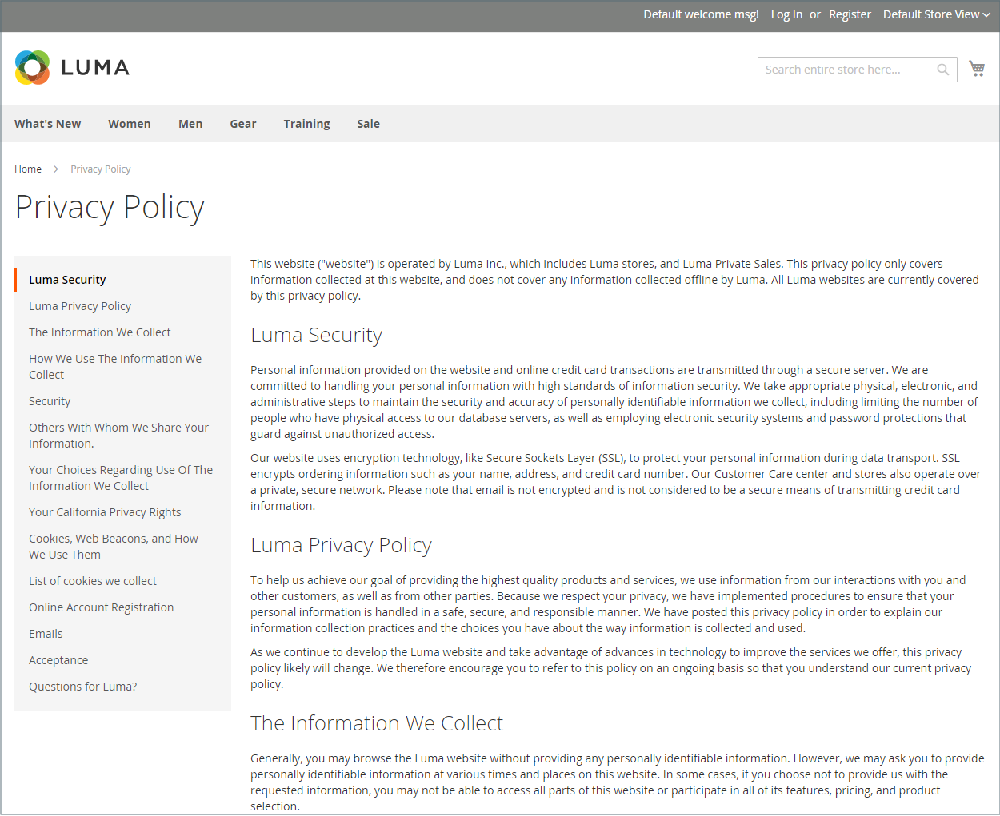

# Hierarquia de página

{{ee-feature}}

O sistema de hierarquia de páginas de armazenamento oferece a capacidade de organizar suas páginas de conteúdo e adicionar paginação, navegação e menus. A página Política de privacidade nos dados de exemplo é um exemplo de página com um menu à esquerda. Se você publicar uma grande quantidade de conteúdo regularmente, poderá usar uma hierarquia de páginas para organizar seu conteúdo e facilitar a localização de artigos de interesse.

O sistema de hierarquia de páginas usa nós para identificar partes de conteúdo relacionadas e para organizar páginas de conteúdo em relacionamentos pai/filho. Um nó principal é como uma pasta que pode conter nós e páginas secundárias. A posição relativa de cada nó e página na hierarquia é mostrada como uma estrutura de _árvore_. Um nó pode conter outros nós e páginas de conteúdo, e uma única página de conteúdo pode ser associada a vários nós e outras páginas de conteúdo em uma relação pai/filho ou vizinho.

{width="600" zoomable="yes"}

## Configurar hierarquia de página

As configurações ativam o sistema de hierarquia de páginas e os metadados e determinam o layout padrão do menu.

{width="600" zoomable="yes"}

1. Na barra lateral _Admin_, vá para **[!UICONTROL Stores]** > _[!UICONTROL Settings]_>**[!UICONTROL Configuration]**.

1. No painel esquerdo, em _[!UICONTROL General]_, escolha **[!UICONTROL Content Management]**.

1. Expanda  **[!UICONTROL CMS Page Hierarchy]** e faça as alterações necessárias.

1. Quando terminar, clique em **[!UICONTROL Save Config]**.

| Campo | Descrição |
|--- |--- |
| [!UICONTROL Enable Hierarchy Functionality] | Ativa o uso da hierarquia de páginas para suas páginas de conteúdo. Opções: `Yes` / `No` |
| [!UICONTROL Enable Hierarchy Metadata] | Quando essa opção é ativada, é possível associar metadados a páginas na hierarquia. Opções: `Yes` / `No` |
| [!UICONTROL Default Layout for Hierarchy Menu] | Determina o estilo de menu padrão. Opções: `Content` / `Left Column` / `Right Column` |

{style="table-layout:auto"}

## Adicionar um nó de hierarquia

O exemplo a seguir mostra como criar um nó com navegação simples para páginas de conteúdo relacionadas. Embora um nó não tenha uma página de conteúdo associada a ele, ele tem uma Chave de URL que pode ser referenciada em outro lugar do site.

Por exemplo, você pode criar um nó chamado _Press Releases_ que tem navegação para press releases individuais. Em seguida, você pode incluir o link na página _Sobre nós_ para o nó. Ou você pode criar um nó para uma coleção de problemas anteriores do seu informativo.

Para vincular a um nó, use a ferramenta [Widget](widgets.md) para criar um link de Nó de Hierarquia do CMS e colocar o widget em um bloco de conteúdo ou página.

{width="600" zoomable="yes"}

### Etapa 1: Criar um nó

1. Na barra lateral _Admin_, vá para **[!UICONTROL Content]** > _[!UICONTROL Elements]_>**[!UICONTROL Hierarchy]**.

   {width="600" zoomable="yes"}

1. Acima da grade, clique em **[!UICONTROL Add Node...]**.

1. Em _[!UICONTROL Page Properties]_, insira um **[!UICONTROL Title]**&#x200B;para o nó e um **[!UICONTROL URL Key]**&#x200B;adequado.

   A chave do URL fornece um endereço da Web exclusivo para o nó. Deve conter somente caracteres minúsculos, usando hifens para separar palavras, em vez de espaços.

   {width="500" zoomable="yes"}

1. Clique em **[!UICONTROL Save]**.

   O nó aparece como uma pasta na árvore à esquerda da página.

### Etapa 2: adicionar páginas ao nó

1. Na árvore hierárquica, clique em para selecionar o nó.

1. Clique em **[!UICONTROL Add Selected Pages(s) to Tree]**.

   Você pode rolar a tela para cima para ver que cada página selecionada aparece na árvore abaixo da pasta do nó.

### Etapa 3: definir a estrutura

1. Se necessário, arraste as páginas para a posição para refletir a ordem em que elas devem aparecer no menu.

   {width="500" zoomable="yes"}

1. Clique no nó na parte superior da hierarquia.

   A seção _[!UICONTROL Page Properties]_&#x200B;agora exibe informações sobre o nó.

1. Em **[!UICONTROL Render Metadata in HTML Head]**, faça o seguinte:

   {width="400" zoomable="yes"}

   - Para identificar o nó como o topo da hierarquia, defina **[!UICONTROL First]** como `Yes`.

   - Para exibir um controle de paginação, defina **[!UICONTROL Next/Previous]** como `Yes`.

   - Para organizar as páginas na hierarquia como um livro, defina **[!UICONTROL Enable Chapter/Section]** como `Yes`.

     Se não quiser incluir o nó como parte do livro, deixe o `No` padrão.

   - Para atribuir o nó a uma parte específica do livro, defina **[!UICONTROL Chapter/Section]** como um dos seguintes:

      - `No` - Não define o nó como capítulo/seção.
      - `Chapter` - Atribui o nó atual como um capítulo.
      - `Section` - Atribui o nó atual como uma seção.
      - `Both` - Atribui o nó atual como um capítulo e uma seção.

### Etapa 4: adicionar controles de paginação

1. Em _Opções de Paginação para Páginas Aninhadas_, defina **[!UICONTROL Enable Pagination]** como `Yes`.

1. Para **[!UICONTROL Frame]**, insira o número de links de página que deseja incluir no controle de paginação.

   Se houver mais páginas na hierarquia que possam ser incluídas no controle de paginação.

1. Para **[!UICONTROL Frame Skip]**, insira o número de páginas que deseja pular adiante (ou voltar) para o próximo conjunto de links de paginação.

### Etapa 5: Escolher o layout do menu

Se quiser que o nó seja exibido no menu, faça o seguinte:

1. Em _Opções do Menu de Navegação da Página_, defina **[!UICONTROL Show in navigation menu]** como `Yes`.

   Esta configuração determina se um menu de navegação é gerado para a hierarquia de páginas.

   {width="300" zoomable="yes"}

1. Para especificar o local do menu em relação ao conteúdo, defina o **[!UICONTROL Menu Layout]**:

   - `Content` - O layout do menu está no conteúdo.
   - `Use Default` - Usa o estilo de menu especificado na [configuração](../configuration-reference/general/content-management.md).
   - `Left Column` - O menu é exibido à esquerda do conteúdo.
   - `Right Column` - O menu é exibido à direita do conteúdo.

1. Para especificar quantos detalhes estão incluídos no menu, defina **[!UICONTROL Menu Detalization]** como um dos seguintes:

   - `Only Children` - Inclui somente subpáginas no menu.
   - `Neighbours and Children` - Inclui subpáginas e outras páginas que estão no mesmo nível na hierarquia.

1. Para determinar a profundidade do menu, insira o **[!UICONTROL Maximal Depth]** para o número máximo de níveis a serem incluídos.

1. Para formatar o menu, escolha uma **[!UICONTROL List Type]**:

   - `Unordered` - As opções de menu não são numeradas e podem ser formatadas com ou sem marcadores. Opções para tipo de lista não ordenada: Padrão / Círculo / Disco / Quadrado
   - `Ordered` - As opções de menu são numeradas e podem ser formatadas como numerais numéricos, alfabéticos ou romanos, em maiúsculas ou minúsculas.

1. Defina **[!UICONTROL List Style]** como um dos seguintes:

   - `Circle`
   - `Disc`
   - `Square`

1. Se você também quiser que o nó fique visível no menu de navegação, role até _Opções do Menu de Navegação Principal_ e defina **[!UICONTROL Show in Navigation menu]** como `Yes`.

   {width="250" zoomable="yes"}

1. Clique em **[!UICONTROL Save]**.
