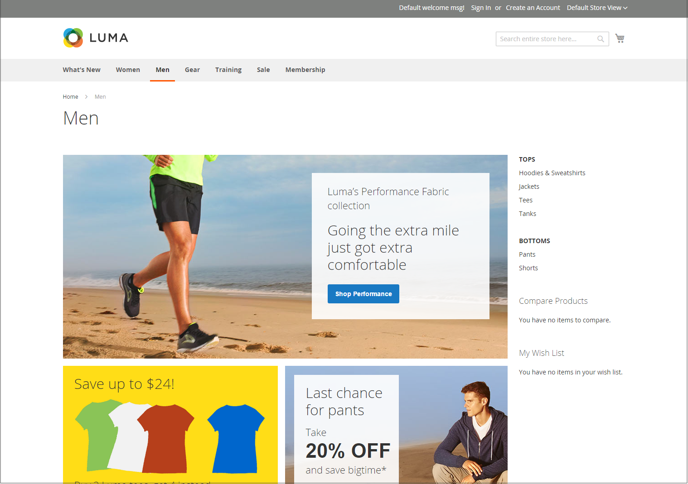
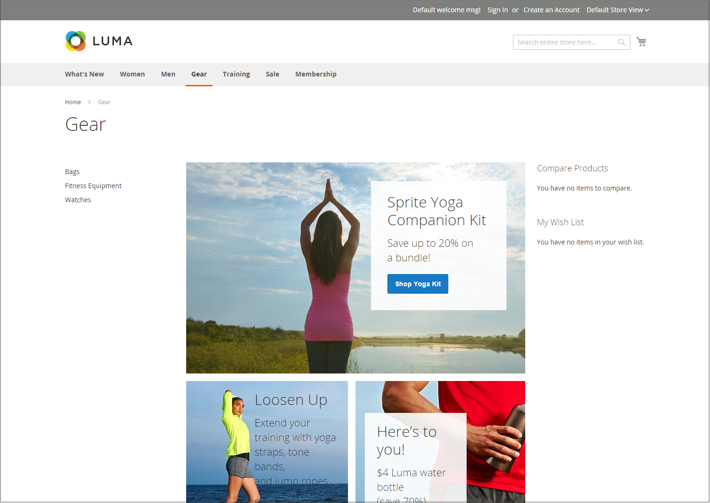

# Exemplos de layout da loja

As dimensões da coluna são determinadas pela folha de estilos do tema. Alguns temas aplicam uma largura fixa em pixels ao layout da página, enquanto outros usam porcentagens para fazer com que a página responda à largura da janela ou do dispositivo.

A maioria dos temas da área de trabalho tem uma largura fixa para a coluna principal e todas as atividades ocorrem dentro dessa área delimitada. Dependendo da resolução da tela, há espaço vazio em cada lado da coluna principal.

## Uma coluna

A área de conteúdo de um layout de uma coluna abrange a largura total da coluna principal. Esse layout é usado com frequência para uma página inicial com um banner ou controle deslizante grande ou para páginas que não exigem navegação, como uma página de logon, página de abertura, vídeo ou anúncio de página inteira.

{width="700" zoomable="yes"}

## Duas colunas com barra esquerda

A área de conteúdo deste layout é dividida em duas colunas. A coluna de conteúdo principal flutua à direita e a barra lateral flutua à esquerda.

{width="700" zoomable="yes"}

## Duas colunas com barra direita

Este layout é uma imagem espelhada do outro layout de duas colunas. Dessa vez, a barra lateral flutua à direita e a coluna de conteúdo principal flutua à esquerda.

{width="700" zoomable="yes"}

## Três colunas

Um layout de três colunas tem uma área de conteúdo principal com duas colunas laterais. A barra lateral esquerda e a coluna de conteúdo principal são colocadas juntas e flutuam como uma unidade à esquerda. A outra barra lateral flutua à direita.

{width="700" zoomable="yes"}
