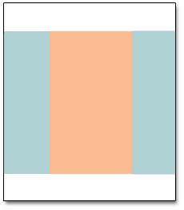

# Layouts de página

O layout de cada página na loja consiste em seções distintas, ou contêineres, que definem as áreas de cabeçalho, rodapé e conteúdo da página. Dependendo do layout, cada página pode ter uma, duas, três colunas ou mais. Pense no layout como a variável _planta baixa_ da página e atribua um layout específico a ser usado como padrão para as páginas CMS, produto e categoria.

Na página, os blocos de conteúdo flutuam para preencher o espaço disponível, de acordo com a seção do [layout de página](layout-updates.md) onde eles devem aparecer. Observe que, se você alterar o layout de três colunas para duas colunas, o conteúdo da área principal se expande para preencher o espaço disponível. Observe também que todos os blocos associados à barra lateral não usada parecem desaparecer. No entanto, se você restaurar o layout de três colunas, os blocos reaparecerão. Esta abordagem fluida, ou _layout de líquido_, possibilita alterar o layout da página sem precisar reprocessar o conteúdo. Se você está acostumado a trabalhar com páginas de HTML individuais, esse módulo, _bloco de construção_ uma forma diferente de pensar.

{width="700" zoomable="yes"}

## Configurar layouts padrão

1. No _Admin_ barra lateral, vá para **[!UICONTROL Stores]** > _[!UICONTROL Settings]_>**[!UICONTROL Configuration]**.

1. No painel esquerdo, em _[!UICONTROL General]_, escolha **[!UICONTROL Web]**.

1. Expandir  o **[!UICONTROL Default Layouts]** seção.

   {width="600" zoomable="yes"}

1. Escolha o **[!UICONTROL Default Product Layout]** que você deseja usar nas páginas de produto.

   Essa configuração determina o layout usado por padrão para páginas de produtos.

   - `No layout updates` - As atualizações de layout não estão disponíveis para páginas de produtos.
   - `Empty` - Usa um layout em branco para páginas de produtos.
   - `1 column` - Usa um layout de coluna única para páginas de produtos.
   - `2 columns with left bar` - Usa um layout de duas colunas com a barra lateral à esquerda para páginas de produtos.
   - `2 columns with right bar` - Usa um layout de duas colunas com a barra lateral à direita para páginas de produtos.
   - `3 columns` - Usa um layout de três colunas com barras laterais à esquerda e à direita para páginas de produtos.

   Quando [Page Builder](../page-builder/introduction.md) estiver ativado, há opções adicionais de largura total disponíveis. Em seguida, você pode usar as ferramentas de conteúdo do Page Builder para criar o layout das páginas de produtos.

   - `Page -- Full Width` - Usa o _Página - Largura total_  layout das páginas de produto.
   - `Category -- Full Width` - Usa o _Categoria - Largura total_ layout das páginas de produto.
   - `Product -- Full Width` - (Recomendado) Usa o _Produto - Largura total_ layout das páginas de produto.

1. Escolha o **[!UICONTROL Default Category Layout]** que você deseja usar para páginas de categoria.

   Essa configuração determina o layout usado por padrão para páginas de categoria.

   - `No layout updates` - Atualizações de layout não estão disponíveis para páginas de categoria.
   - `Empty` - Usa um layout em branco para páginas de categoria.
   - `1 column` - Usa um layout de coluna única para páginas de categoria.
   - `2 columns with left bar` - Usa um layout de duas colunas com a barra lateral à esquerda para páginas de categoria.
   - `2 columns with right bar` - Usa um layout de duas colunas com a barra lateral à direita para páginas de categoria.
   - `3 columns` - Usa um layout de três colunas com barras laterais à esquerda e à direita para páginas de categoria.

   Quando [Page Builder](../page-builder/introduction.md) estiver ativado, há opções adicionais de largura total disponíveis. Em seguida, você pode usar as ferramentas de conteúdo do Page Builder para criar o layout das páginas de categoria.

   - `Page -- Full Width` - Usa o _Página - Largura total_ layout para páginas de categoria.
   - `Category -- Full Width` - (Recomendado) Usa o _Categoria - Largura total_ layout para páginas de categoria.
   - `Product -- Full Width` - Usa o _Produto - Largura total_ layout para páginas de categoria.

1. Escolha o **[!UICONTROL Default Page Layout]** que você deseja usar para páginas CMS.

   Essa configuração determina o layout usado por padrão para páginas CMS.

   - `No layout updates` - Atualizações de layout não estão disponíveis para páginas CMS.
   - `Empty` - Usa um layout em branco para páginas CMS.
   - `1 column` - Usa um layout de coluna única para páginas CMS.
   - `2 columns with left bar` - Usa um layout de duas colunas com a barra lateral à esquerda para páginas CMS.
   - `2 columns with right bar` - Usa um layout de duas colunas com a barra lateral à direita para páginas CMS.
   - `3 columns` - Usa um layout de três colunas com barras laterais à esquerda e à direita para páginas CMS.

   Quando [Page Builder](../page-builder/introduction.md) estiver ativado, há opções adicionais de largura total disponíveis. Em seguida, você pode usar as ferramentas de conteúdo do Page Builder para criar o layout das páginas do CMS.

   - `Page -- Full Width` - (Recomendado) Usa o _Página - Largura total_ layout para páginas CMS.
   - `Category - Full Width` - Usa o _Categoria - Largura total_ layout para páginas CMS.
   - `Product - Full Width` - Usa o _Produto - Largura total_ layout para páginas CMS.

1. Quando terminar, clique em **[!UICONTROL Save Config]**.

## Layouts de página padrão

### Uma coluna

{zoom=&quot;yes&quot;}

A variável _[!UICONTROL 1 Column]_o layout pode ser usado para criar uma página inicial dramática com uma imagem grande ou ponto focal. Também é uma boa opção para uma página de aterrissagem ou qualquer outra página que tenha uma combinação de texto, imagens e vídeo.

### Duas colunas com barra esquerda

{zoom=&quot;yes&quot;}

A variável _[!UICONTROL 2 Columns with Left Bar]_o layout é usado com frequência para páginas com navegação à esquerda, como um catálogo ou páginas de resultados de pesquisa com navegação em camadas. Também é uma excelente opção para páginas iniciais que precisam de navegação adicional ou blocos de conteúdo de suporte à esquerda.

### Duas colunas com barra direita

{zoom=&quot;yes&quot;}

Com um _[!UICONTROL 2 Columns with Right Bar]_, a área de conteúdo principal é grande o suficiente para proporcionar uma imagem ou banner atraente. Esse layout também é usado com frequência para páginas de produto com blocos de conteúdo de suporte à direita.

### Três colunas

{zoom=&quot;yes&quot;}

A variável _[!UICONTROL 3 Column]_O layout tem uma coluna central larga o suficiente para o texto principal da página, com espaço em cada lado para navegação adicional e blocos de conteúdo de suporte.

### Empty

{zoom=&quot;yes&quot;}

A variável _[!UICONTROL Empty]_layout pode ser usado para definir layouts de página personalizados.
