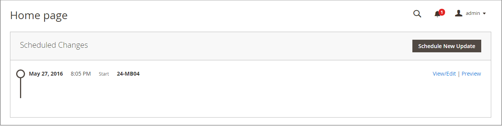

# Controles do espaço de trabalho de página

O espaço de trabalho da página inclui ferramentas que ajudam a localizar rapidamente as páginas necessárias e comandos para executar a manutenção de rotina em páginas individuais ou múltiplas. Você também pode atualizar rapidamente as propriedades de página na grade.

{width="700" zoomable="yes"}

## Atualizar rapidamente as propriedades da página

1. Na barra lateral _Admin_, vá para **[!UICONTROL Content]** > _[!UICONTROL Elements]_>**[!UICONTROL Pages]**.
1. Clique em qualquer linha na grade.

   {width="600" zoomable="yes"}

   Para selecionar vários registros, marque a caixa de seleção de cada linha que deseja atualizar.

1. Atualize qualquer uma das seguintes propriedades:

   - **[!UICONTROL Title]**
   - **[!UICONTROL URL Key]**
   - **[!UICONTROL Status]**
   - **[!UICONTROL Layout]**

1. Quando terminar, clique em **[!UICONTROL Save]**.

## Controles do Workspace

| Controle | Descrição |
|--- |--- |
| [!UICONTROL Add New Page] | Adiciona uma página. |
| [!UICONTROL Search] | Inicia uma pesquisa no catálogo com base nos filtros atuais. |
| [!UICONTROL Actions] | Lista todas as ações que podem ser aplicadas aos itens selecionados na lista. Para aplicar uma ação a uma página ou a várias páginas, marque a caixa de seleção na primeira coluna de cada registro sujeito à ação. Opções: `Delete` / `Disable` / `Enable` / `Edit` |
| [!UICONTROL Select] | O controle no cabeçalho da primeira coluna pode ser usado para selecionar vários registros como o target da ação. Marque a caixa de seleção na primeira coluna de cada registro que deseja selecionar. Opções: `Select All` / `Deselect All` |
| [!UICONTROL Save Edits] | Aplica a ação atual aos registros selecionados. |
| [!UICONTROL Edit] | Abre o registro no modo de edição. Você pode fazer a mesma coisa clicando em qualquer lugar na linha. |

{style="table-layout:auto"}

## Colunas

| Coluna | Descrição |
|--- |--- |
| [!UICONTROL Select] | A caixa de seleção na primeira coluna é usada para selecionar vários registros. Opções: `Select All` / `Deselect All` |
| [!UICONTROL ID] | A ID é um número crescente atribuído a cada página. |
| [!UICONTROL Title] | O título que aparece na parte superior da página. |
| [!UICONTROL URL Key] | A chave do URL é semelhante a um nome de arquivo e identifica a página no URL. |
| [!UICONTROL Layout] | Determina se a página aparece com barras laterais à direita ou à esquerda da área de conteúdo principal. Opções: `1 column` / `2 columns with left bar` / `2 columns with right bar` / `3 columns` / `Empty` |
| [!UICONTROL Store View] | Usado para associar a página a uma exibição de loja específica. |
| [!UICONTROL Status] | Indica se a página está online ou offline. Opções: `Enabled` / `Disabled` |
| [!UICONTROL Created] | A data em que a página foi criada. |
| [!UICONTROL Modified] | A data em que a página foi modificada pela última vez. |
| [!UICONTROL Action] | As ações que podem ser aplicadas a um registro individual incluem: **[!UICONTROL Edit]**- Abre a página no modo de edição. **[!UICONTROL Delete]** - Exclui a página. **[!UICONTROL View]**- Exibe a página no modo de visualização. |

{style="table-layout:auto"}

## Outras colunas

| Coluna | Descrição |
|--- |--- |
| [!UICONTROL Custom design from/to] | Especifica as datas de início e término quando o design selecionado é aplicado à página.  (somente Magento Open Source). |
| [!UICONTROL Custom Theme] | Aplica um tema personalizado à página |
| [!UICONTROL Custom Layout] | Determina o layout personalizado da página |
| [!UICONTROL Meta Title] | Metatítulo da página |
| [!UICONTROL Meta Keywords] | As meta palavras-chave da página |
| [!UICONTROL Meta Description] | A meta descrição da página |

{style="table-layout:auto"}

## Pesquisa de página

A caixa Pesquisar, no canto superior esquerdo da grade _[!UICONTROL Pages]_, pode ser usada para localizar páginas específicas por palavra-chave. Para uma pesquisa mais avançada, você pode [filtrar](../getting-started/admin-grid-controls.md) a pesquisa por vários parâmetros.

### Pesquisar por palavra-chave

1. Insira um termo de pesquisa na caixa de pesquisa da página.

1. Para exibir os resultados, clique no ícone Pesquisar ().

   Os resultados incluem todas as páginas que contêm a palavra-chave.

### Filtrar os resultados da pesquisa

1. Se necessário, clique em **[!UICONTROL Clear All]** para limpar os critérios de pesquisa anteriores.

1. Para exibir a seleção de filtros de pesquisa, clique no **[!UICONTROL Filters]** !Guia ([Ícone de funil](../assets/icon-filter-search.png)).

1. Preencha quantos filtros forem necessários para descrever as páginas que deseja encontrar.

1. Clique em **[!UICONTROL Apply Filters]** para exibir os resultados.

### Filtros de pesquisa

| Filtro | Descrição |
|--- |--- |
| [!UICONTROL ID] | Filtrar a pesquisa por ID de registro de página. |
| [!UICONTROL Title] | Filtre a pesquisa com base no título da página. |
| [!UICONTROL URL Key] | Filtre a pesquisa pela chave do URL. |
| [!UICONTROL Created] | Filtre a pesquisa pela data em que a página foi criada. |
| [!UICONTROL Modified] | Filtre a pesquisa com base na data em que a página foi modificada pela última vez. |
| [!UICONTROL Store View] | Filtrar a pesquisa com base na exibição de loja. Opções: `All available` / `Store Views` |
| [!UICONTROL Layout] | Filtrar a pesquisa com base no layout da página. Opções: `1 column` / `2 columns with left bar` / `2 columns with right bar` / `3 columns` / `Empty` |
| [!UICONTROL Status] | Filtre a pesquisa no status da página. Opções: `Disabled` / `Published` |
| [!UICONTROL Custom design from / to] | Filtre a pesquisa pelas datas inicial e final quando o design selecionado for aplicado à página.  (somente Magento Open Source). |
| [!UICONTROL Asset] | Filtrar a pesquisa por ativos de título da página |
| [!UICONTROL Custom Layout] | Filtre a pesquisa com base em um layout personalizado. Opções: `1 column` / `2 columns with left bar` / `2 columns with right bar` / `3 columns` / `Empty` / `Page -- Full Width` / `Category -- Full Width` / `Product -- Full Width` |
| [!UICONTROL Custom Theme] | Filtrar a pesquisa com base em um tema personalizado. Opções padrão: `Magento Blank` / `Magento Luma` |
| [!UICONTROL Meta Keywords] | Filtre a pesquisa com base nas meta palavras-chave da página. |
| [!UICONTROL Meta Title] | Filtre a pesquisa com base no metatítulo da página. |
| [!UICONTROL Meta Description] | Filtre a pesquisa com base na meta descrição da página. |

{style="table-layout:auto"}

### Ferramentas de pesquisa

| Ferramenta | Descrição |
|--- |--- |
| [!UICONTROL Apply Filters] | Aplica todos os filtros aos resultados da pesquisa. |
| [!UICONTROL Cancel] | Cancela a pesquisa atual. |
| [!UICONTROL Clear All] | Limpa todos os filtros de pesquisa. |

{style="table-layout:auto"}

## Ações da página

As páginas podem ser editadas, desativadas, ativadas e excluídas. Para aplicar uma ação a uma página individual, marque a caixa de seleção na primeira coluna. Para selecionar ou desmarcar todas as páginas, use o controle de seleção na parte superior da coluna.

{width="400" zoomable="yes"}

### Ação única

Use a coluna _[!UICONTROL Action]_na extremidade direita para aplicar qualquer uma das seguintes ações à página individual:

- [!UICONTROL Edit] - abre a página no modo de edição
- [!UICONTROL Delete] - exclui a página (requer confirmação)
- [!UICONTROL View] - abre uma página diretamente na loja

{width="600" zoomable="yes"}

### Ações em massa

Aplique qualquer uma das seguintes ações a várias páginas selecionadas ao mesmo tempo usando o seletor _[!UICONTROL Action]_no canto superior esquerdo:

- [!UICONTROL Delete] - exclui as páginas (requer confirmação)
- [!UICONTROL Disable] - desabilita as páginas na loja
- [!UICONTROL Enable] - habilita as páginas na loja
- [!UICONTROL Edit] - abre colunas na grade no modo de edição (**[!UICONTROL Title]**, **[!UICONTROL URL Key]**, **[!UICONTROL Layout]** e **[!UICONTROL Status]**)

## Layout da grade de páginas

A seleção de colunas e sua ordem na grade podem ser alteradas de acordo com sua preferência. Para manter a organização da nova coluna, é possível salvá-la como uma exibição.

### Alterar a seleção de colunas

No canto superior direito, clique no controle _Colunas_ () e faça o seguinte:

- Marque a caixa de seleção de qualquer coluna que deseja adicionar à grade.

- Desmarque a caixa de seleção de qualquer coluna que você deseja remover da grade.

### Mover uma coluna

1. Clique no cabeçalho da coluna e mantenha pressionado.

1. Arraste a coluna para a nova posição e solte-a.

### Salvar uma exibição

1. Clique no controle _Exibir_ () e clique em **[!UICONTROL Save View As]**.

1. Insira um nome para a exibição.

1. Para salvar a exibição, clique em _Seta_ ().

   O nome da exibição agora aparece como a exibição atual.

### Alterar a exibição

Clique no controle _Exibir_ () e siga um destes procedimentos:

- Escolha a exibição que deseja usar.

- Altere o nome de um modo de exibição clicando no ícone Editar () e atualizando o nome.

  {width="600" zoomable="yes"}

## Alterações Agendadas

{{ee-feature}}

As alterações na página podem ser aplicadas de acordo com o agendamento e agrupadas com outras alterações de conteúdo. Você pode criar uma campanha com base em alterações agendadas em uma página ou aplicar as alterações a uma campanha existente. Para obter mais informações, consulte [Preparo de conteúdo](content-staging.md).

Ao configurar agendas para alterações de página e editar campanhas, lembre-se do seguinte:

- Todas as atualizações agendadas são aplicadas consecutivamente, o que significa que qualquer entidade pode ter apenas uma atualização agendada em um ponto. Qualquer atualização agendada é aplicada a todas as exibições de loja dentro de seu período de tempo. Como resultado, uma entidade não pode ter uma atualização agendada diferente para diferentes exibições de loja ao mesmo tempo. Todos os valores de atributo de entidade em todas as exibições de armazenamento, que não são afetados pela atualização agendada atual, são obtidos dos valores padrão, e não da atualização agendada anterior.

- Se uma campanha estiver vinculada a mais de uma página, ela só poderá ser editada no [Painel de preparação de conteúdo](content-staging-dashboard.md).

- Se uma campanha ativa for criada inicialmente sem uma data de término, a campanha não poderá ser editada posteriormente para incluir uma data de término. Nesse caso, é necessário criar uma campanha duplicada e inserir a data final necessária.

- A data de início e a data de término da campanha devem ser definidas usando o fuso horário padrão **_1} do administrador, que é convertido do fuso horário local de cada site._** Considere um exemplo em que você tem vários sites em fusos horários diferentes, mas deseja iniciar uma campanha com base em um fuso horário dos EUA. Nesse caso, você deve agendar uma atualização separada para cada fuso horário local e definir **[!UICONTROL Start Date]** e **[!UICONTROL End Date]** como convertidos de cada fuso horário de site local para o fuso horário padrão do Administrador.

- Você pode agendar e visualizar alterações para atualizações de produtos. Para obter mais informações, consulte [Agendando uma Atualização](content-staging-scheduled-update.md).

>[!NOTE]
>
>A guia [!UICONTROL Custom Design Update] foi removida no Adobe Commerce  e não pode ser modificada diretamente na página. Você deve criar uma atualização agendada para essas ativações.

{width="600" zoomable="yes"}

