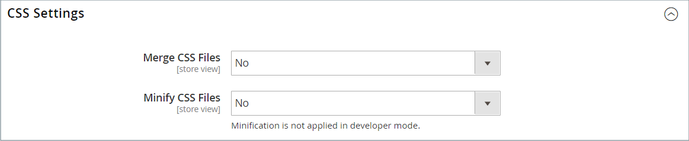

# Ativos de tema

A variável _arquivos estáticos_ são a coleção de ativos, como CSS, fontes, imagens e JavaScript, usada por um tema. O local dos arquivos estáticos é especificado no campo [URL base](../stores-purchase/store-urls.md) configuração. Você pode adicionar uma assinatura digital ao URL de cada arquivo estático para permitir que os navegadores detectem quando uma versão mais recente estiver disponível. A versão mais recente do arquivo é usada se a assinatura for diferente do que está armazenado no cache do navegador.

Para uma instalação padrão, os ativos associados a um tema são organizados na variável `web` pasta no seguinte local abaixo do [!DNL Commerce] raiz.

`[commerce_root]/app/design/frontend/Magento/[theme_name]/web`

## Adicionar uma assinatura digital a URLs de arquivo estático

1. No _Admin_ barra lateral, vá para **[!UICONTROL Stores]** > _[!UICONTROL Settings]_>**[!UICONTROL Configuration]**.

1. No painel esquerdo, expanda **[!UICONTROL Advanced]** e escolha **[!UICONTROL Developer]**.

1. Expandir  o **[!UICONTROL Static Files Settings]** seção.

   {width="500" zoomable="yes"}

1. Definir **[!UICONTROL Sign Static Files]** para `Yes`.

1. Quando terminar, clique em **[!UICONTROL Save Config]**.

| Tipo de arquivo | Descrição |
|--- |--- |
| CSS | Controla o estilo visual associado à capa. Exemplo de local no servidor: `[commerce]/app/design/frontend/Magento/[theme]/web/css` |
| Fontes | Forneça as fontes disponíveis para serem usadas pelo tema. Local no servidor: `[commerce]/app/design/frontend/Magento/[theme]/web/fonts` |
| Imagens | Forneça os ativos gráficos usados pelo tema, incluindo botões, texturas de plano de fundo e assim por diante. Exemplo de local no servidor: `[commerce]/app/design/frontend/Magento/[theme]/web/images` |
| JS | Rotinas JavaScript específicas do tema e funções que podem ser chamadas. Exemplo de local no servidor: `[commerce]/app/design/frontend/Magento/[theme]/web/js` |

{style="table-layout:auto"}

## Mesclar arquivos CSS

Como parte de um esforço para otimizar seu site e reduzir o tempo de carregamento de página, você pode reduzir o número de arquivos CSS separados mesclando-os em um único arquivo condensado. Se você abrir um arquivo CSS mesclado, verá um fluxo contínuo de texto, com quebras de linha removidas. Não é possível editar o arquivo mesclado, portanto, é melhor aguardar até que você saia do modo de desenvolvimento e não faça mais alterações frequentes no CSS.

>[!NOTE]
>
>Os arquivos CSS podem ser mesclados do _Admin_ somente ao trabalhar no [modo de desenvolvedor](../systems/developer-tools.md#operation-modes).

1. No _Admin_ barra lateral, vá para **[!UICONTROL Stores]** > _[!UICONTROL Settings]_>**[!UICONTROL Configuration]**.

1. No painel esquerdo, **[!UICONTROL Advanced]** e escolha **[!UICONTROL Developer]**.

1. Expandir  o **[!UICONTROL CSS Settings]** seção.

   {width="500" zoomable="yes"}

   Para obter descrições detalhadas dessas opções de configuração, consulte [Configurações de CSS](../configuration-reference/advanced/developer.md#css-settings) no _Referência de configuração_.

1. Definir **[!UICONTROL Merge CSS Files]** para `Yes`.

1. Quando terminar, clique em **[!UICONTROL Save Config]**.

## Mesclar arquivos JavaScript

Vários arquivos JavaScript podem ser mesclados em um único arquivo condensado para reduzir o tempo de carregamento da página. Se você abrir um arquivo JavaScript mesclado, verá um fluxo contínuo de texto, com quebras de linha removidas. Se você tiver concluído o processo de desenvolvimento e o código não contiver erros, considere mesclar os arquivos.

>[!NOTE]
>
>Os arquivos JavaScript podem ser mesclados do _Admin_ somente ao trabalhar no [Modo de desenvolvedor](../systems/developer-tools.md#operation-modes).

1. No _Admin_ barra lateral, vá para **[!UICONTROL Stores]** > _[!UICONTROL Settings]_>**[!UICONTROL Configuration]**.

1. No painel esquerdo, **[!UICONTROL Advanced]** e escolha **[!UICONTROL Developer]**.

1. Expandir  o **[!UICONTROL JavaScript Settings]** seção.

   {width="600" zoomable="yes"}

   Para obter descrições detalhadas dessas opções de configuração, consulte [Configurações do JavaScript](../configuration-reference/advanced/developer.md#javascript-settings) no _Referência de configuração_.

1. Definir **[!UICONTROL Merge JavaScript Files]** para `Yes`.

1. Quando terminar, clique em **[!UICONTROL Save Config]**.
