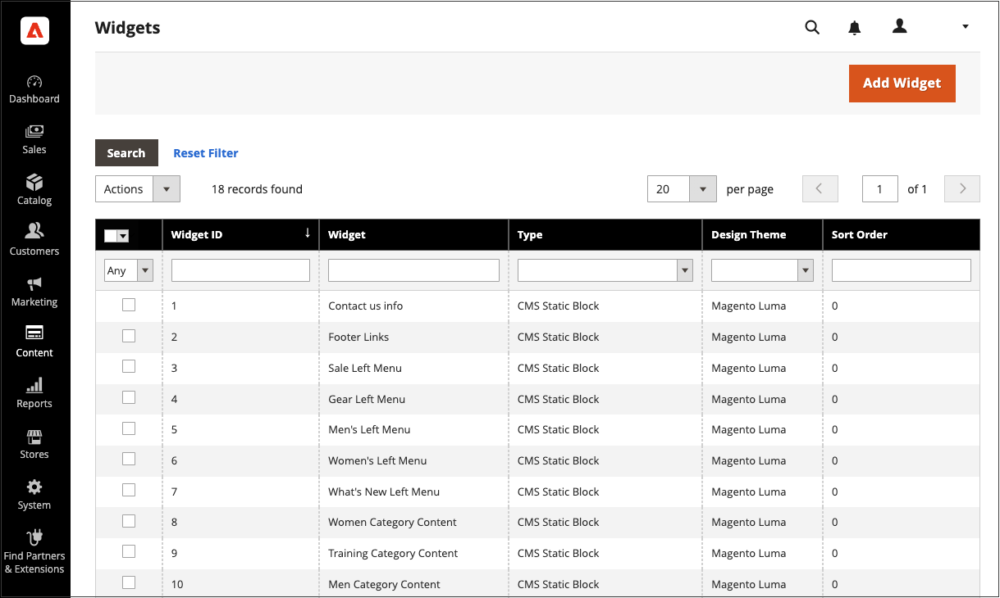

# Criar e gerenciar widgets

Os widgets são componentes reutilizáveis. Você pode criar widgets facilmente e modificar widgets existentes para atualizar automaticamente o conteúdo em toda a loja. Também é possível excluir widgets que não estão mais em uso.

{width="700" zoomable="yes"}

## Criar um dispositivo

O processo de criação de um widget é quase o mesmo para cada [tipo de widget](widgets.md#widget-types). Você pode seguir a primeira parte das instruções e então concluir a última parte para o tipo específico de widget desejado.

### Etapa 1: Escolher o tipo

1. No _Admin_ barra lateral, vá para **[!UICONTROL Content]** > _[!UICONTROL Elements]_>**[!UICONTROL Widgets]**.

1. Clique em **[!UICONTROL Add Widget]**.

1. No _[!UICONTROL Settings]_seção:

   - Definir **[!UICONTROL Type]** ao tipo de widget que deseja criar.

   - Verifique se **[!UICONTROL Design Theme]** está definido com o tema atual.

     {width="600" zoomable="yes"}

1. Clique em **[!UICONTROL Continue]**.

### Etapa 2: especificar as propriedades e o layout da loja

1. No _[!UICONTROL Storefront Properties]_seção:

   - Para **[!UICONTROL Widget Title]**, insira um título descritivo para o widget.

     Este título é visível somente do Administrador.

   - Para **[!UICONTROL Assign to Store Views]**, selecione as exibições de loja onde deseja que o widget fique visível.

     Você pode selecionar uma visualização de loja específica, ou `All Store Views`. Para selecionar várias exibições, mantenha pressionada a tecla Ctrl (PC) ou a tecla Command (Mac) e clique em cada opção.

   - (Opcional) Para **[!UICONTROL Sort Order]**, insira um número para determinar a ordem em que esse item aparece com outros na mesma parte da página. (`0` = primeiro, `1` = segundo, `3` = terceiro e assim por diante.)

     {width="600" zoomable="yes"}

1. No _[!UICONTROL Layout Updates]_clique em **[!UICONTROL Add Layout Update]**.

1. Definir **[!UICONTROL Display On]** ao tipo de página onde ela deve aparecer.

1. No **[!UICONTROL Container]** escolha a área do layout da página onde ele será colocado.

   {width="600" zoomable="yes"}

1. Se o widget for um link, defina **[!UICONTROL Template]** a um dos seguintes:

   - `Block Template` - Formata o conteúdo para que ele possa ser colocado como uma unidade independente na página.
   - `Inline Template` - Formata o conteúdo para que ele possa ser colocado dentro de outro conteúdo. Por exemplo, um link que vai dentro de um parágrafo de texto.

### Etapa 3: completar as opções do widget

As opções para cada tipo de widget variam um pouco, mas o processo é essencialmente o mesmo. O exemplo a seguir exibe a lista de produtos de uma categoria específica, com controles de paginação.

1. No painel esquerdo, escolha **[!UICONTROL Widget Options]**.

1. Clique em **[!UICONTROL Select Block]**.

1. Insira um **[!UICONTROL Title]** para aparecer acima da lista, como `Featured Products`.

1. Para controles de paginação, defina **[!UICONTROL Display Page Control]** para `Yes`  e faça o seguinte:

   - Insira o **[!UICONTROL Number of Products per Page]**.

   - Insira o total **[!UICONTROL Number of Products to Display]**.

   - Definir **[!UICONTROL Condition]** à categoria de produtos a incluir.

     O processo é o mesmo que definir uma condição para um [regra de preço](../merchandising-promotions/price-rules-catalog.md).

### Etapa 4: salvar e verificar o resultado

1. Quando terminar, clique em **[!UICONTROL Save]**.

1. Quando solicitado, siga as instruções na parte superior do espaço de trabalho para atualizar o cache conforme necessário.

1. Volte à loja para verificar se o widget está funcionando corretamente.

   Para movê-lo para um local diferente, você pode reabrir o widget e tentar uma página diferente ou referência de bloco.

## Demonstração de criação de dispositivo

Para saber mais sobre como criar widgets, assista a este vídeo:

>[!VIDEO](https://video.tv.adobe.com/v/343786?quality=12)

## Editar um widget

1. No _Admin_ barra lateral, vá para **[!UICONTROL Content]** > _[!UICONTROL Elements]_>**[!UICONTROL Widgets]**.

1. Localize o widget usando os filtros acima da grade e clique no nome do widget.

1. Faça as alterações necessárias.

   Revise as etapas para criar um widget para obter informações sobre as opções do widget.

1. Clique em **[!UICONTROL Save]**.

## Excluir um widget

1. No _Admin_ barra lateral, vá para **[!UICONTROL Content]** > _[!UICONTROL Elements]_>**[!UICONTROL Widgets]**.

1. Localize os widgets usando os filtros acima da grade e, em seguida, marque a caixa de seleção dos widgets a serem excluídos.

1. No canto superior esquerdo da lista, defina **[!UICONTROL Actions]** para `Delete`.

1. Quando terminar, clique em **[!UICONTROL Submit]**.

1. Para confirmar a ação, clique em **[!UICONTROL OK]**.
