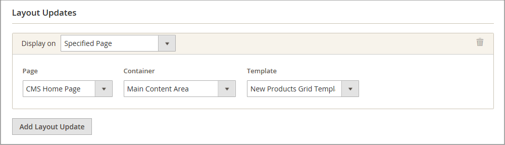

# Novo widget da lista de produtos

A lista de novos produtos é um exemplo de conteúdo dinâmico e consiste em dados em tempo real extraídos do catálogo de produtos. Por padrão, a variável _Novos produtos_ A lista inclui os oito primeiros produtos adicionados mais recentemente. No entanto, também pode ser configurado para incluir apenas produtos em um intervalo de datas especificado.

{width="700" zoomable="yes"}

## Etapa 1: definir cada produto como novo

 Esta etapa se aplica somente ao Magento Open Source.

 Para lojas Adobe Commerce, consulte [Agendando uma atualização](content-staging-scheduled-update.md) e prossiga para a Etapa 2 nesta página.

_[!UICONTROL Set Product as New]_a configuração de intervalo de datas pode ser definida somente em atualizações programadas.

Configurar um produto como novo adiciona o produto à _Novos produtos_ lista. Você pode alterar a configuração de volta a qualquer momento quando não quiser mais incluí-la na lista.

1. No _Admin_ barra lateral, vá para **[!UICONTROL Catalog]** > **[!UICONTROL Products]**.

1. Encontre cada produto que deseja incluir no recurso e abra-o no modo de edição.

1. Para **[!UICONTROL Set Product as New]**, alterne a opção para definir o produto como um novo produto ou não.

   {width="400" zoomable="yes"}

1. Quando terminar, clique em **[!UICONTROL Save]**.

1. Quando for solicitado que você reindexe e atualize o cache da página, clique nos links na parte superior da página e siga as instruções.

## Etapa 2: criar o widget

O código que determina o conteúdo da lista Novos produtos e sua colocação na loja é gerado pela ferramenta Widget.

1. No _Admin_ barra lateral, vá para **[!UICONTROL Content]** > _[!UICONTROL Elements]_>**[!UICONTROL Widgets]**.

1. No canto superior direito, clique em **[!UICONTROL Add Widget]**.

1. No _[!UICONTROL Settings]_faça o seguinte:

   - Definir **[!UICONTROL Type]** para `Catalog New Products List`.

   - Escolha o **[!UICONTROL Design Theme]** que é usado pela loja.

1. Clique em **[!UICONTROL Continue]**.

   {width="600" zoomable="yes"}

1. No _[!UICONTROL Storefront Properties]_faça o seguinte:

   - Para **[!UICONTROL Widget Title]**, insira um título descritivo para o widget. (Este título é visível somente no _Admin_.)

   - Para **[!UICONTROL Assign to Store Views]**, selecione as exibições de loja onde o widget está visível.

     Você pode selecionar uma visualização de loja específica, ou `All Store Views`. Para selecionar várias exibições, mantenha pressionada a tecla Ctrl (PC) ou a tecla Command (Mac) e clique em cada opção.

   - (Opcional) Para **[!UICONTROL Sort Order]**, insira um número para determinar a ordem em que esse item aparece com outros na mesma parte da página. (`0` = primeiro, `1` = segundo, `3` = terceiro e assim por diante.)

   {width="600" zoomable="yes"}

## Etapa 3: Escolher o local

1. No _[!UICONTROL Layout Updates]_clique em **[!UICONTROL Add Layout Update]**.

1. Definir **[!UICONTROL Display On]** para `Specified Page.`

1. Definir **[!UICONTROL Page]** para `CMS Home Page`.

1. Definir **[!UICONTROL Block Reference]** para `Main Content Area`.

1. Definir **[!UICONTROL Template]** a um dos seguintes:

   - `New Product List Template`
   - `New Products Grid Template`

     {width="600" zoomable="yes"}

1. Clique em **[!UICONTROL Save and Continue Edit]**.

   Por enquanto, você pode ignorar a mensagem para atualizar o cache.

## Etapa 4: configurar a lista

1. No painel esquerdo, escolha **[!UICONTROL Widget Options]**.

1. Definir **[!UICONTROL Display Products]** a um dos seguintes:

   - `All Products` - Lista os produtos em sequência, começando com os adicionados mais recentemente.
   - `New Products` - Lista apenas os produtos identificados como _novo_. Um produto é considerado novo durante o intervalo de datas especificado em _[!UICONTROL Set Product As New From/To]_. A lista fica vazia se o intervalo de datas expirar sem nenhum produto novo definido.

1. Para fornecer controle de navegação para listas com várias páginas, defina **[!UICONTROL Display Page Control]** para `Yes`.

   Para **[!UICONTROL Number of Products per Page]**, digite o número de produtos que deseja exibir em cada página.

1. Defina o **[!UICONTROL Number of Products to Display]** ao número de novos produtos que deseja incluir na lista.

   A configuração padrão é `10`.

1. Para **[!UICONTROL Cache Lifetime (Seconds)]**, escolha a frequência com que deseja atualizar a lista de novos produtos.

   Por padrão, o cache é definido como 86.400 segundos (24 horas).

   {width="600" zoomable="yes"}

1. Quando terminar, clique em **[!UICONTROL Save]**.

1. Quando solicitado a atualizar o cache, clique no link na mensagem na parte superior da página e siga as instruções.

## Etapa 5: visualizar seu trabalho

1. No _Admin_ barra lateral, vá para **[!UICONTROL Content]** > _[!UICONTROL Elements]_>**[!UICONTROL Pages]**.

1. Localize a página na grade em que _Novos produtos_ é exibida e clique no link **[!UICONTROL Preview]** no _[!UICONTROL Action]_coluna.
