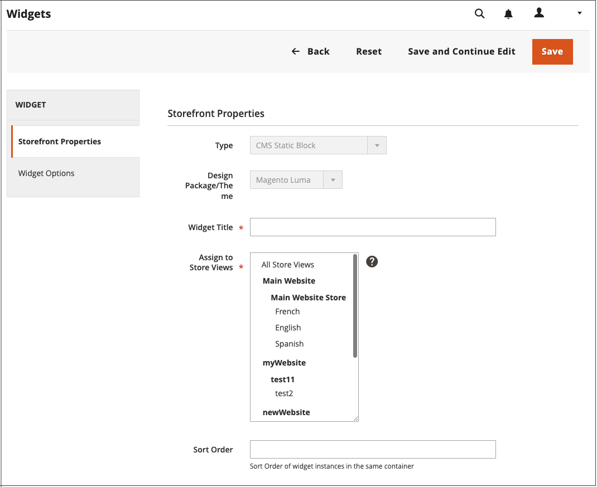

# Usar um widget para posicionar um bloco

O _Bloco Estático do CMS_ [widget](widgets.md) oferece a capacidade de colocar um [bloco de conteúdo](blocks.md) existente em qualquer lugar da sua loja.

{width="700" zoomable="yes"}

## Etapa 1: Escolher o tipo de widget

1. Na barra lateral _Admin_, vá para **[!UICONTROL Content]** > _[!UICONTROL Elements]_>**[!UICONTROL Widgets]**.

1. No canto superior direito, clique em **[!UICONTROL Add Widget]**.

1. Na seção _Configurações_, defina **[!UICONTROL Type]** como `CMS Static Block` e clique em **[!UICONTROL Continue]**.

1. Verifique se **[!UICONTROL Design Theme]** está definido como o tema atual e clique em **[!UICONTROL Continue]**.

   {width="600" zoomable="yes"}

1. Na seção _[!UICONTROL Storefront Properties]_, faça o seguinte:

   - Para **[!UICONTROL Widget Title]**, insira um título descritivo para o widget.

     Este título é visível somente do _Administrador_.

   - Para **[!UICONTROL Assign to Store Views]**, selecione as exibições de loja nas quais o widget está visível.

     Você pode selecionar um modo de exibição de loja específico ou `All Store Views`. Para selecionar várias exibições, mantenha pressionada a tecla Ctrl (PC) ou a tecla Command (Mac) e clique em cada opção.

   - (Opcional) Para **[!UICONTROL Sort Order]**, insira um número para determinar a ordem de exibição deste item com outros na mesma parte da página. (`0` = primeiro, `1` = segundo, `3` = terceiro e assim por diante.)

     {width="600" zoomable="yes"}

## Etapa 2: completar as atualizações de layout do widget

1. Na seção _[!UICONTROL Layout Updates]_, clique em **[!UICONTROL Add Layout Update]**.

1. Defina **[!UICONTROL Display On]** como a categoria, o produto ou a página em que deseja que o bloco apareça.

1. Para colocar o bloco em uma página específica, faça o seguinte:

   - Escolha o **[!UICONTROL Page]** onde deseja que o bloco apareça.

   - Escolha o **[!UICONTROL Block Reference]** que identifica o local onde o bloco é exibido na página.

   - Aceite a configuração padrão para **[!UICONTROL Template]**, que é definida como `CMS Static Block Default Template`.

     {width="600" zoomable="yes"}

### Opções de atualização de layout

| Campo | Descrição |
|--- |--- |
| **_[!UICONTROL Categories]_** |  |
| [!UICONTROL Anchor Categories] | Exibe o widget na página de categoria de âncora. **[!UICONTROL Categories]**- Categorias em que a âncora é exibida. Opções: `All` /`Specific Categories` **[!UICONTROL Container]** - Define o contêiner como a parte do layout da página onde você deseja exibir o widget. **[!UICONTROL Template]**- Determina o tema do layout. |
| [!UICONTROL Non-Anchor Categories] | Exibe o widget na página de categoria sem âncora. **[!UICONTROL Categories]**- Categorias em que a âncora é exibida. Opções: `All` /`Specific Categories` **[!UICONTROL Container]** - Define o contêiner como a parte do layout da página onde você deseja exibir o widget. **[!UICONTROL Template]**- Determina o tema do layout. |
| **_[!UICONTROL Products]_** |  |
| Todos os tipos de produto | Exibe o widget em um tipo específico de página de produto ou em todas as páginas de produto.  **[!UICONTROL Products]**- Produtos para os quais o widget é exibido. Opções: `All` /` Specific Products` **[!UICONTROL Container]** - Define o contêiner como a parte do layout da página onde você deseja exibir o widget. **[!UICONTROL Template]**- Determina o tema do layout. |
| **_[!UICONTROL Generic Pages]_** |  |
| [!UICONTROL All Pages] | Exibe o widget em todas as páginas.  **[!UICONTROL Container]**- Defina o contêiner como a parte do layout da página onde você deseja exibir o widget. **[!UICONTROL Template]** - Determina o tema do layout. |
| [!UICONTROL Specified Page] | Exibe o widget em uma página específica. Opções: **[!UICONTROL Page]**- Páginas para as quais o widget é exibido. **[!UICONTROL Container]** - Defina o contêiner como a parte do layout da página onde você deseja exibir o widget. **Modelo** - Determina o tema do layout. |
| [!UICONTROL Page Layouts] | Exibe o widget em páginas com um determinado layout.  **[!UICONTROL Page]**- Páginas para as quais o widget é exibido. **[!UICONTROL Container]** - Defina o contêiner como a parte do layout da página onde você deseja exibir o widget. **[!UICONTROL Template]**- Determina o tema do layout. |

{style="table-layout:auto"}

## Etapa 3: Colocar o bloco

1. No painel esquerdo, selecione **[!UICONTROL Widget Options]**.

1. Clique em **[!UICONTROL Select Block…]** e escolha na lista o bloco que deseja colocar.

1. Quando terminar, clique em **[!UICONTROL Save]**.

   O aplicativo agora aparece na lista.

1. Quando solicitado, siga as instruções na parte superior da página para atualizar o índice e o cache da página.

1. Volte para a loja para verificar se o bloco aparece no local correto.

   Para mover o bloco, você pode reabrir o widget ou tentar uma página ou referência de bloco diferente.
