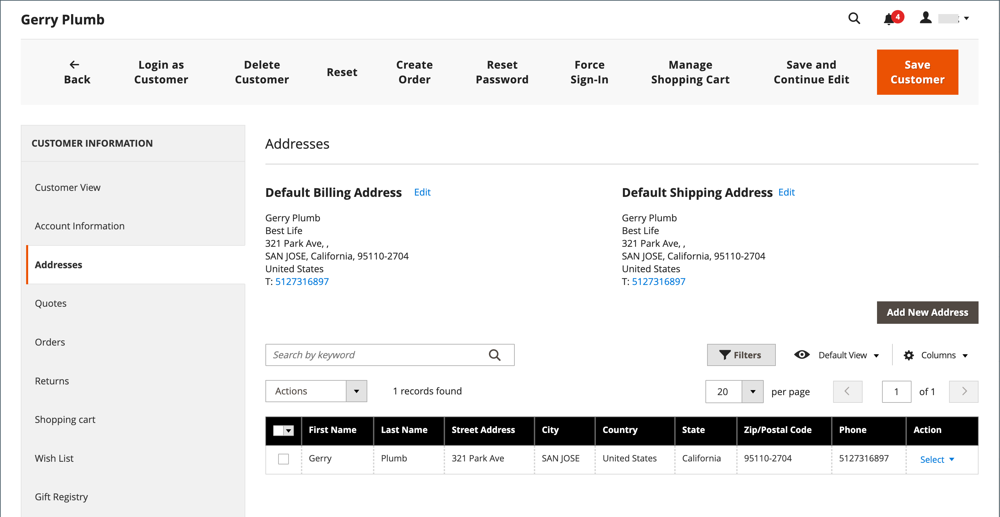

# Criar uma conta de cliente individual

Os visitantes da sua loja podem abrir uma conta para gerenciar suas compras e atividades. Os clientes geralmente criam suas próprias contas na loja. No entanto, você também pode criar contas de clientes diretamente do Administrador, o que é útil para ajudar os clientes por telefone.

As instruções a seguir representam a configuração padrão da conta do cliente. Para alterar a seleção e o comportamento de alguns campos no formulário, consulte [Configuração de contas de cliente](../customers/customer-account-scope.md).

Como administrador de loja, você também pode definir a variável [novas opções de conta](../customers/account-options-new.md) para enviar um email de confirmação para novos clientes registrados, o que ajuda a garantir que as contas registradas sejam válidas.

{{beta-updates}}

## Criar conta da loja

Um cliente da loja cria uma conta na loja.

1. Na loja, cliques em **[!UICONTROL Create an Account]** no canto superior direito do cabeçalho.

   {width="700" zoomable="yes"}

1. Em **[!UICONTROL Personal Information]**, insere seus **[!UICONTROL First Name]** e **[!UICONTROL Last Name]**.

   {width="600" zoomable="yes"}

1. Se quiser adicionar seu nome e endereço de email à lista de assinantes do boletim informativo, o cliente selecionará a variável **[!UICONTROL Sign Up for Newsletter]** caixa de seleção

   >[!INFO]
   >
   > Essa opção será exibida mesmo se a loja não publicar um boletim informativo.

1. Se eles quiserem armazenar a equipe de suporte para [veja o que eles veem](../customers/login-as-customer.md) e fornecer assistência remota, o cliente seleciona o **[!UICONTROL Allow remote shopping assistance]** caixa de seleção

1. Em **[!UICONTROL Sign-in Information]**, insere seus **[!UICONTROL Email]** endereço.

   >[!INFO]
   >
   > Este endereço de email se torna parte de suas credenciais de logon e não pode ser associado a nenhuma outra conta de cliente.

   {width="600" zoomable="yes"}

1. Insere um **[!UICONTROL Password]** que inclui três dos seguintes tipos de informações:

   - Caracteres em minúsculas
   - Caracteres em maiúsculas
   - Números
   - Caracteres especiais

   Depois que eles pressionarem **[!UICONTROL Enter]**, a força da senha é avaliada e aparece abaixo do campo. Se a senha for considerada _Fraco_, tente outro até que seja avaliado como _Forte_.

   {width="600" zoomable="yes"}

1. Em seguida, o cliente a insere novamente para **[!UICONTROL Confirm Password]**.

1. Se necessário, cliques **[!UICONTROL Show Password]** para exibir a senha digitada.

1. Ao concluir, clique em **Criar uma conta**.

O cliente pode então usar seu endereço de e-mail e senha para [fazer logon](../customers/customer-sign-in.md) à sua conta e preencha as informações de endereço.

## Criar uma conta do Administrador

Como comerciante, você pode criar uma conta de cliente no Administrador.

1. No _Admin_ barra lateral, vá para **[!UICONTROL Customers]** > **[!UICONTROL All Customers]**.

1. Clique em **[!UICONTROL Add New Customer]**.

### Etapa 1: Preencher as informações da conta

{width="700" zoomable="yes"}

1. No **[!UICONTROL Account Information]** faça o seguinte:

   - Para uma instalação multissite, defina **[!UICONTROL Associate to Website]** ao site onde a conta do cliente se aplica.
   - Se aplicável, atribua o cliente a outro **[!UICONTROL Customer Group]**.
   - Se você estiver usando [Validação de ID de IVA](../stores-purchase/vat.md) e deseja **[!UICONTROL Disable Automatic Group Change Based on VAT ID]**, marque a caixa de seleção.

1. Preencha os campos obrigatórios:

   - **[!UICONTROL First Name]**
   - **[!UICONTROL Last Name]**
   - **[!UICONTROL Email]**

1. Preencha os campos opcionais conforme necessário:

   - **[!UICONTROL Name Prefix]**
   - **[!UICONTROL Middle Name/Initial]**
   - **[!UICONTROL Name Suffix]**
   - **[!UICONTROL Date of Birth]**
   - **[!UICONTROL Tax/VAT Number]**
   - **[!UICONTROL Gender]**

   >[!WARNING]
   >
   >De acordo com as práticas recomendadas atuais de segurança e privacidade, esteja ciente de possíveis riscos legais e de segurança associados ao armazenamento da data de nascimento completa do cliente (mês, dia, ano) com outros identificadores pessoais. É recomendável limitar o armazenamento das datas de nascimento completas dos clientes e sugerir que você use o ano de nascimento do cliente como alternativa.

1. Definir **[!UICONTROL Send Welcome Email From]** para a exibição de loja a partir da qual _Bem-vindo_ email a ser enviado.

   >[!INFO]
   >
   > Se a loja tiver exibições para diferentes [idiomas](../stores-purchase/store-localize.md), essa configuração determina o idioma do email de boas-vindas.

1. Clique em **[!UICONTROL Save and Continue Edit]** na parte superior da página.

   >[!INFO]
   >
   >Depois que a conta do cliente é salva, o conjunto completo de opções é exibido no painel esquerdo e no menu na parte superior da página. A variável _[!UICONTROL Customer View]_exibe um resumo da conta.

   {width="600" zoomable="yes"}

### Etapa 2: completar as informações de endereço

1. No painel esquerdo, escolha **[!UICONTROL Addresses]** e clique em **[!UICONTROL Add New Addresses]**.

1. Se o mesmo endereço for usado para faturamento e envio, alterne ambas as opções.

   - **[!UICONTROL Default Billing Address]**
   - **[!UICONTROL Default Shipping Address]**

   {width="600" zoomable="yes"}

1. Role para baixo e preencha os campos de endereço necessários na segunda coluna.

   - **[!UICONTROL Street Address]**
   - **[!UICONTROL City]**
   - **[!UICONTROL Country]**
   - **[!UICONTROL State/Province]**
   - **[!UICONTROL ZIP/Postal Code]**

1. Insira o **[!UICONTROL Phone Number]** para este endereço.

1. Se aplicável, insira o **[!UICONTROL VAT Number]** associada ao cliente.

1. Se esse for o único endereço necessário para a conta, clique em **[!UICONTROL Save]**.

   Caso contrário, clique **[!UICONTROL Save and Continue Edit]** e repita as etapas anteriores para adicionar mais endereços.

   O novo endereço é exibido no campo [!UICONTROL Addresses] página com a selecionada _[!UICONTROL Default Billing]_e_[!UICONTROL Default Shipping]_ endereços acima da lista completa.

   {width="600" zoomable="yes"}

### Etapa 3: redefinir a senha

Inicialmente, as contas de cliente criadas com base no Administrador não têm senhas atribuídas.

1. Localize a nova conta de cliente na grade.

1. Clique em **[!UICONTROL Edit]** no _[!UICONTROL Action]_coluna.

1. Na barra de menus na parte superior da página, clique em **[!UICONTROL Reset Password]**.

1. Uma notificação é enviada ao proprietário da conta, com instruções para definir a senha.

## Barra de botões

Botões adicionais ficam disponíveis quando o perfil é salvo pela primeira vez. Para saber mais, consulte [Atualizar um perfil de cliente](../customers/update-account.md).

| Botão | Descrição |
|--- |--- |
| **[!UICONTROL Back]** | Retorna para a _[!UICONTROL Customers]_página sem salvar as alterações. |
| **[!UICONTROL Delete Customer]** | Exclui o cliente atual. Os pedidos concluídos associados ao cliente não são removidos. |
| **[!UICONTROL Reset]** | Redefine quaisquer alterações não salvas no formulário do cliente para seus valores anteriores. |
| **[!UICONTROL Create Order]** | Cria um pedido para o cliente. |
| **[!UICONTROL Reset Password]** | Envia um [redefinir senha](../customers/password-reset.md) para o cliente por e-mail. |
| **[!UICONTROL Force Sign-in]** | Revoga os tokens de acesso OAuth associados à conta do cliente. Essa função pode ser usada somente com contas de clientes que receberam tokens OAuth como parte de uma API da Web [integração](../systems/integrations.md). Para saber mais, consulte [Autenticação baseada em OAuth](https://developer.adobe.com/commerce/webapi/get-started/authentication/gs-authentication-oauth/) na documentação do desenvolvedor. |
| **[!UICONTROL Manage Shopping Cart]** | Permite que o administrador gerencie o carrinho de compras do cliente. |
| **[!UICONTROL Save and Continue Edit]** | Salva as alterações e mantém o perfil do cliente aberto. |
| **[!UICONTROL Save Customer]** | Salva alterações e fecha o perfil do cliente. |

{style="table-layout:auto"}

## Descrições dos campos

### [!UICONTROL Account Information]

| Campo | Descrição |
|--- |--- |
| **[!UICONTROL Associate to Website]** | Identifica o site associado à conta do cliente. |
| **[!UICONTROL Group]** | Identifica o [grupo de clientes](../customers/customer-groups.md) em que o cliente é um membro. Se aplicável, marque a caixa de seleção para desativar a alteração automática do grupo com base no IVA. |
| **[!UICONTROL Name Prefix]** | Se usado, o prefixo associado ao nome do cliente (como Sr., Sra. ou Dr.). Os valores de prefixo são determinados pelo parâmetro [configuração](../configuration-reference/customers/customer-configuration.md). Dependendo da configuração, o controle de entrada pode ser um campo de texto ou uma lista de opções. |
| **[!UICONTROL First Name]** | O nome do cliente. |
| **[!UICONTROL Middle Name / Initial]** | O nome do meio ou a inicial do cliente. Este campo é incluído somente se especificado na variável [configuração](../configuration-reference/customers/customer-configuration.md) tópico. |
| **[!UICONTROL Last Name]** | O sobrenome do cliente. |
| **[!UICONTROL Name Suffix]** | Se usado, o sufixo associado ao nome do cliente (como Jr., Sr. ou III). Os valores de sufixo são determinados pela variável [configuração](../configuration-reference/customers/customer-configuration.md). Dependendo da configuração, o controle de entrada pode ser um campo de texto ou uma lista suspensa de opções. |
| **[!UICONTROL Email]** | O endereço de email do cliente. |
| **[!UICONTROL Date of Birth]** | A data de nascimento do cliente. A data de nascimento é incluída se especificada no [configuração](../configuration-reference/customers/customer-configuration.md) tópico.   De acordo com as práticas recomendadas atuais de segurança e privacidade, esteja ciente de possíveis riscos legais e de segurança associados ao armazenamento da data de nascimento completa do cliente (mês, dia, ano) com outros identificadores pessoais. É recomendável limitar o armazenamento das datas de nascimento completas dos clientes e sugerir o uso do ano de nascimento do cliente como alternativa. |
| **[!UICONTROL Tax / VAT Number]** | O número do Imposto ou do Imposto sobre Valor Agregado do cliente, se aplicável. |
| **[!UICONTROL Gender]** | Identifica o sexo do cliente. O sexo é incluído se especificado na variável [configuração](../configuration-reference/customers/customer-configuration.md). Opções: `Male` / `Female` / `Not Specified` |
| **[!UICONTROL Send Welcome Email From]** | Se você tiver várias exibições de loja, essa configuração identifica a exibição de loja da qual a mensagem de boas-vindas é enviada. Se as exibições de loja forem usadas para idiomas diferentes, essa configuração determinará o idioma do email de boas-vindas. |

### [!UICONTROL Addresses]

| Campo | Descrição |
|--- |--- |
| **[!UICONTROL New Addresses]** | Identifica o tipo do novo endereço. Opções: `Default Billing Address` / `Default Shipping Address` |
| **[!UICONTROL Add New Addresses]** | Exibe outra seção Novo Endereço para identificar o tipo do endereço a ser inserido. |
| **[!UICONTROL Company]** | O nome da empresa, se aplicável para este endereço. |
| **[!UICONTROL Street Address]** | O endereço do cliente. Uma segunda linha do endereço está disponível, se especificada na [configuração](../configuration-reference/customers/customer-configuration.md) tópico. |
| **[!UICONTROL City]** | A cidade onde o endereço do cliente está localizado. |
| **[!UICONTROL Country]** | O país onde o endereço do cliente está localizado. |
| **[!UICONTROL State/Province]** | O estado ou província onde o endereço do cliente está localizado. |
| **[!UICONTROL Zip/Postal Code]** | O CEP onde o endereço do cliente está localizado. |
| **[!UICONTROL Phone Number]** | O número de telefone do cliente associado ao endereço. |
| **[!UICONTROL VAT Number]** | Se aplicável, o número de imposto sobre o valor agregado que se aplica ao cliente neste endereço. |
