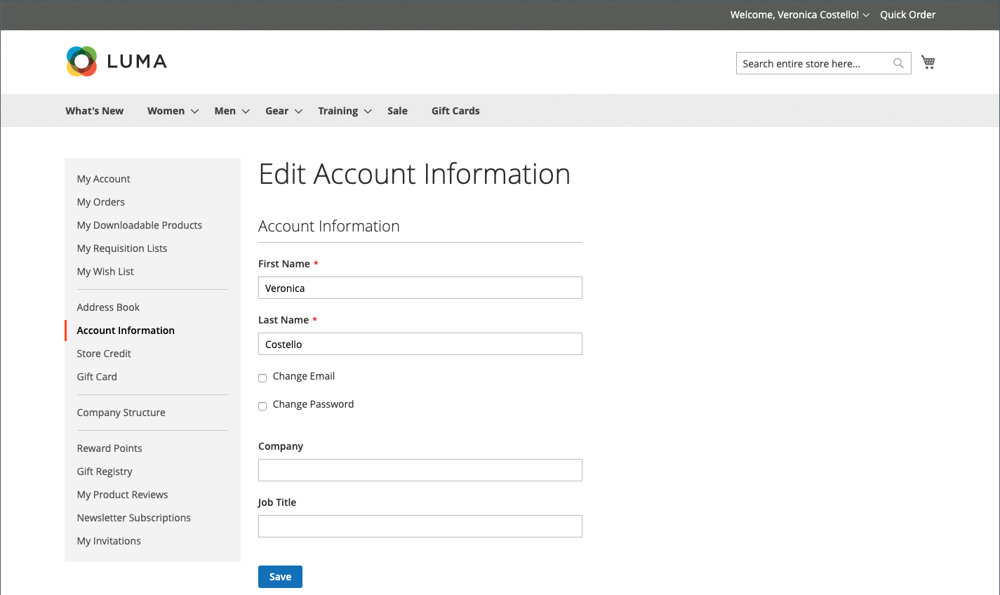
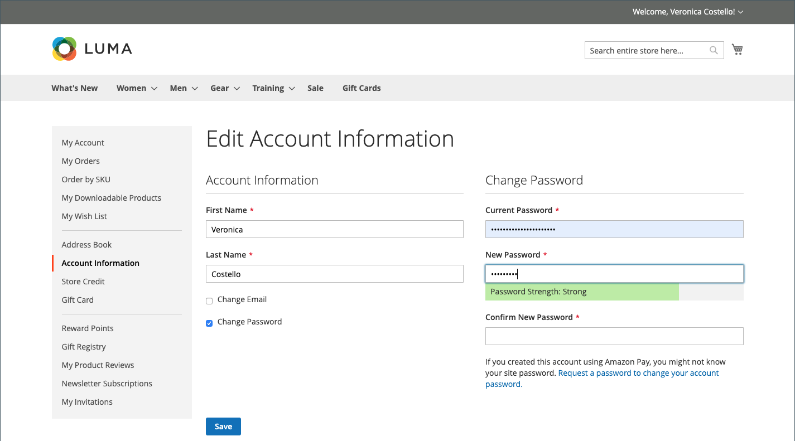

# Informações da conta do cliente

As informações básicas da conta do cliente incluem seu nome, endereço de email e senha, e podem ser mantidas no painel de conta do cliente na loja.

{width="700" zoomable="yes"}

Na barra lateral da sua conta, o cliente pode escolher **[!UICONTROL Account Information]** e executar qualquer um dos procedimentos a seguir para atualizar as informações da conta.

## Atualizar o nome da conta

Para atualizar o nome da conta, o cliente altera os valores nos campos **[!UICONTROL First Name]** e **[!UICONTROL Last Name]** conforme necessário.

>[!INFO]
>
>Campos adicionais aparecerão como parte do nome se a [configuração do cliente](../configuration-reference/customers/customer-configuration.md) incluir um prefixo, uma inicial do meio e um sufixo.

## Alterar endereço de email

1. O cliente marca a caixa de seleção **[!UICONTROL Change Email]**.

1. Digite o novo endereço **[!UICONTROL Email]**.

1. Inserir o **[!UICONTROL Current Password]**.

   {width="700" zoomable="yes"}

1. Cliques **[!UICONTROL Save]**.

## Alterar senha

1. O cliente marca a caixa de seleção **[!UICONTROL Change Password]**.

1. Inserir o **[!UICONTROL Current Password]**.

1. Inserir o **[!UICONTROL New Password]**.

   >[!INFO]
   >
   >A senha deve ter pelo menos oito caracteres e pode incluir uma combinação de letras maiúsculas e minúsculas, números e símbolos. O indicador de força da senha ajuda o cliente a escolher a melhor senha.

   {width="700" zoomable="yes"}

1. Insira-o novamente para confirmar.
