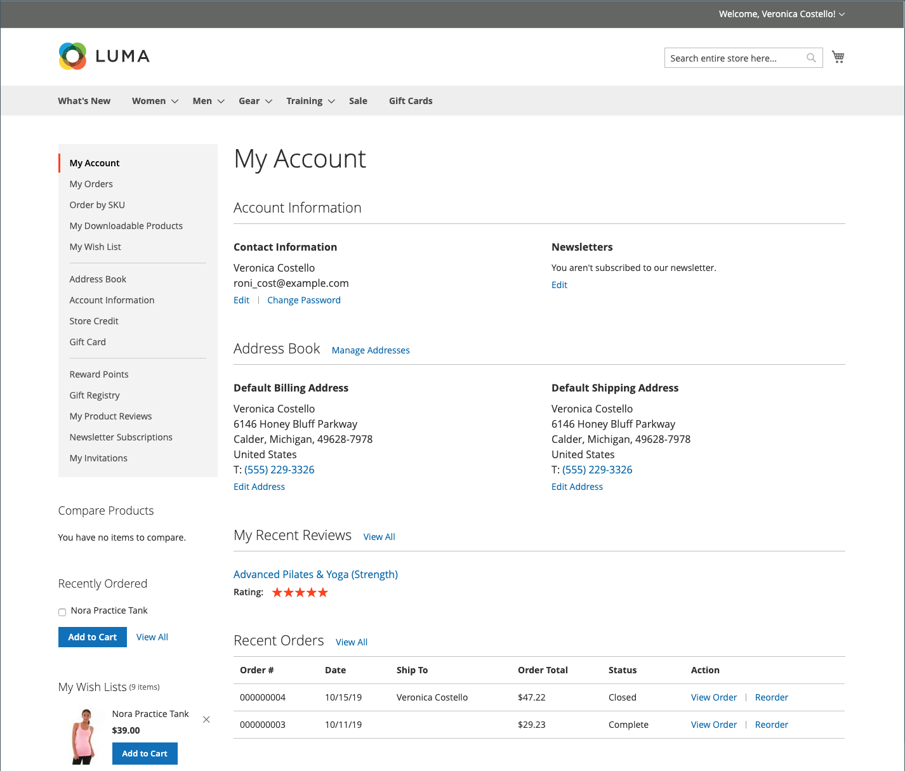

# Painel da conta do cliente

Os clientes podem gerenciar e monitorar suas próprias informações e atividades no painel de contas. Os clientes podem reordenar, rastrear pedidos, gerenciar endereços de envio e métodos de pagamento, análises de produtos, assinaturas de boletins informativos e muito mais.

{width="700" zoomable="yes"}

>[!NOTE]
>
> Com a instalação e a habilitação do Adobe Commerce B2B, a experiência de compra pode ser personalizada com recursos específicos da empresa. A gama completa de opções do painel de contas B2B (ordens de compra, listas de requisição e cotas negociadas) pode ser ativada para clientes que estão associados a uma empresa. Para obter mais informações sobre os recursos B2B, consulte o [Guia do Usuário B2B do Adobe Commerce](../b2b/introduction.md).

{width="700" zoomable="yes"}

## Navegação lateral do painel da conta

A tabela a seguir contém informações sobre todas as seções disponíveis na navegação à esquerda do painel da conta do cliente.

| Seção | Descrição |
|------------------------------------------------------------------------------------------------------------------------------------------------------|----------------------------------------------------------------------------------------------------------------------------------------------------------------------------------------------------------------------------------------------------------------------------------------------------------------------------------------------------------------|
| [**[!UICONTROL My Account]**](../customers/account-dashboard-my-account.md) | Exibe informações de resumo da sua conta, incluindo informações de contato, endereços padrão do catálogo de endereços e pedidos recentes. |
| [**[!UICONTROL My Orders]**](../stores-purchase/orders-storefront.md#view-recently-ordered-products) | Exibe uma lista de todos os pedidos do cliente, com um link para cada um. Se ativado na configuração, qualquer pedido pode ser reordenado clicando no link Reordenar. |
| [**[!UICONTROL My Downloadable Products]**](../catalog/product-create-downloadable.md#storefront-experience) | Lista todos os produtos para download que o cliente adquiriu, com um link para cada um. |
| [**[!UICONTROL My Wish List]**](../stores-purchase/wishlist-storefront.md) | Gerencie suas listas de desejos e faça pedidos a partir dos itens da lista de desejos. |
| [**[!UICONTROL Address Book]**](../customers/account-dashboard-address-book.md) | O catálogo de endereços do cliente inclui o endereço de entrega e cobrança padrão e entradas de endereço adicionais. |
| [**[!UICONTROL Account Information]**](../customers/account-dashboard-account-information.md) | Os clientes podem atualizar as informações da conta e alterar a senha conforme necessário. O administrador da loja também pode atualizar as contas do cliente e acessar as informações para oferecer assistência às compras. |
| [**[!UICONTROL Billing Agreements]**](../stores-purchase/paypal-billing-agreements.md#storefront-experience) | Exibe uma lista de todos os contratos de faturamento do cliente. |
| [**[!UICONTROL My Product Reviews]**](../merchandising-promotions/product-reviews.md#product-reviews-on-the-storefront) | Exibe uma lista de todas as análises de produtos enviadas pelo cliente, com um link para cada uma. |
| [**[!UICONTROL Newsletter Subscriptions]**](../merchandising-promotions/newsletters.md) | Lista todos os boletins informativos disponíveis, com uma marca de seleção ao lado dos itens que o cliente assinou. |
|  [**[!UICONTROL Order by SKU]**](../stores-purchase/order-by-sku.md#order-by-sku-from-a-customer-account) | Permite adicionar itens individuais ao carrinho por SKU ou importar uma lista de produtos a serem solicitados de um arquivo CSV. |
|  [**[!UICONTROL Store Credit]**](../customers/account-dashboard-store-credit.md) | Exibe a quantidade atual de crédito de armazenamento de devoluções, reembolsos e cartão-presente resgatado que pode ser aplicada às compras. |
| [**[!UICONTROL Stored Payment Methods]**](../stores-purchase/stored-payment-methods.md) | Lista todos os métodos de pagamento com cofres seguros usados pelo cliente para armazenar informações de cartão de crédito. |
|  [**[!UICONTROL Gift Card]**](../catalog/product-gift-card-create.md) | Permite que os clientes verifiquem o saldo atual em cartões-presente disponíveis e resgatem cartões-presente para crédito da loja. |
|  [**[!UICONTROL Reward Points]**](../merchandising-promotions/rewards-loyalty.md) | Lista todos os pontos de premiação que o cliente ganhou que podem ser aplicados às compras. |
|  [**[!UICONTROL Gift Registry]**](../merchandising-promotions/gift-registries.md) | Usado para listar e manter registros de presentes e adicionar novos. |
|  [**[!UICONTROL My Invitations]**](../merchandising-promotions/invitations.md) | Lista todos os convites criados e enviados pelo cliente para eventos agendados. |
|  [**[!UICONTROL My Purchase Orders]**](../b2b/account-dashboard-my-purchase-orders.md) | (Somente empresas) Lista todas as ordens de compra enviadas ou controladas pelo cliente, com um link para informações detalhadas. |
|  [**[!UICONTROL My Quotes]**](../b2b/account-dashboard-my-quotes.md) | (Somente empresas) Lista todas as cotações enviadas pelo cliente, com um link para informações detalhadas. |
|  [**[!UICONTROL My Requisition Lists]**](../b2b/account-dashboard-requisition-lists-manage.md) | (Somente Empresas) Mantém todas as listas de requisições criadas pelo cliente. |
|  [**[!UICONTROL Company Profile]**](../b2b/account-company-manage.md#update-a-company-profile) | (Somente Empresas) Um administrador de empresa designado pode gerenciar informações da empresa, incluindo nome e endereço da empresa, informações de contato do administrador da empresa e informações de pagamento. |
|  [**[!UICONTROL Company Credit]**](../b2b/credit-company.md#storefront-credit-information) | (Somente Empresas) Mostra o saldo pendente atual, o crédito disponível e o limite de crédito alocado para a conta, seguido por uma lista de faturas pendentes. A seção Crédito da Empresa aparece no painel somente quando [Pagamento na Conta](../b2b/enable-basic-features.md#configure-payment-on-account) está habilitado na configuração. |
|  [**[!UICONTROL Company Structure]**](../b2b/account-company-structure.md) | (Somente empresas) Usado pelo administrador da empresa para definir a estrutura de negócios da empresa. |
|  [**[!UICONTROL Company Users]**](../b2b/account-company-users.md) | (Somente empresas) Usado pelo administrador da empresa para criar contas de usuário para compradores da empresa. |
|  [**[!UICONTROL Roles and Permissions]**](../b2b/account-company-roles-permissions.md) | (Somente empresas) Usado pelo administrador da empresa para definir funções para usuários da empresa com vários níveis de permissão. |
|  [**[!UICONTROL Approval Rules]**](../b2b/account-dashboard-approval-rules.md) | (Somente empresas) Usado para definir regras de aprovação para ordens de compra. |

{style="table-layout:auto"}
