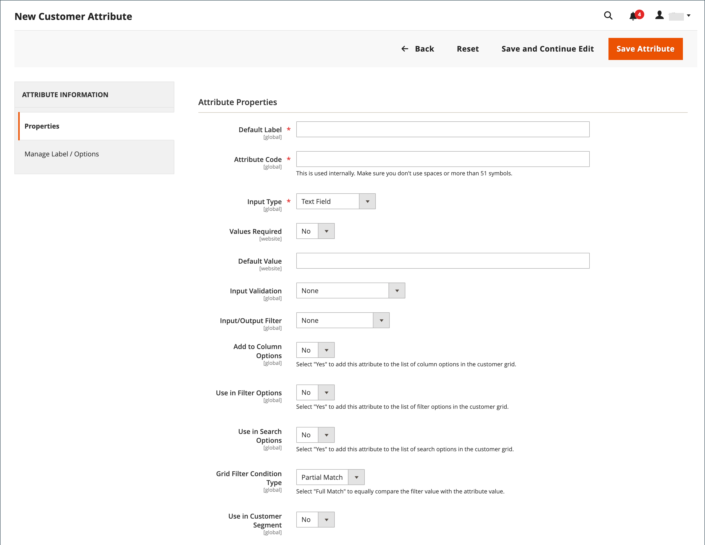

# Propriedades do atributo do cliente

{{ee-feature}}

Os atributos do cliente fornecem as informações necessárias para dar suporte aos processos de pedido, atendimento e gerenciamento de clientes. Como sua empresa é exclusiva, você pode precisar de campos, além dos itens padrão fornecidos pelo sistema. Você pode adicionar atributos personalizados às seções Informações da conta, Catálogo de endereços e Informações de faturamento da conta do cliente. Os [atributos de endereço](address-attributes.md) do cliente também podem ser usados na seção _Informações de Cobrança_ durante o check-out ou quando os convidados se registram em uma conta.

{width="700" zoomable="yes"}

## Etapa 1: Complete as Propriedades do Atributo

1. Na barra lateral _Admin_, vá para **[!UICONTROL Stores]** > _[!UICONTROL Attributes]_>**[!UICONTROL Customer]**.

1. No canto superior direito, clique em **[!UICONTROL Add New Attribute]**.

   {width="600" zoomable="yes"}

1. Na seção **[!UICONTROL Attribute Properties]**, faça o seguinte:

   - Digite um **[!UICONTROL Default Label]** que identifique o atributo durante a entrada de dados.

   - Digite um **[!UICONTROL Attribute Code]** que identifique o atributo no sistema.

   O código do atributo deve começar com uma letra e pode incluir qualquer combinação de letras minúsculas (a-z) e números (0-9). O código deve ter menos de 30 caracteres e não pode incluir caracteres especiais ou espaços. O caractere de sublinhado (`_`) pode ser usado para indicar um espaço.

   >[!TIP]
   >
   >**Atalho:** Para preencher apenas os campos obrigatórios, role até _[!UICONTROL Storefront Properties]_, digite o&#x200B;_[!UICONTROL Sort Order]_ e salve.

1. Complete as propriedades de entrada de dados:

   - Para determinar o tipo de controle de entrada usado para entrada de dados, defina **[!UICONTROL Input Type]** como um dos seguintes:

     | Tipo | Descrição |
     |----|-----------|
     | `Text Field` | Um campo de texto de linha única. |
     | `Text Area` | Um campo de entrada de várias linhas para inserir parágrafos de texto, como uma descrição do produto. Você pode usar o editor WYSIWYG para formatar o texto com tags HTML ou inserir as tags diretamente no texto. |
     | `Multiple Line` | Cria várias linhas de texto para o atributo, de modo semelhante a um endereço de várias linhas. O número de linhas de entrada de dados separadas pode ser de dois a 20. Use o `Default Value` para especificar o valor inicial do campo. |
     | `Date` | Exibe um valor de data no formato de data e fuso horário preferidos. Os valores de data podem ser selecionados de uma lista ou de um calendário (  ).   **_Observação:_**&#x200B;Dependendo da configuração do seu sistema, os usuários do_Administrador _podem inserir datas diretamente em um campo ou selecionar uma data no calendário ou na lista. Para obter informações sobre como especificar valores de data e hora, consulte [Opções de data e hora](../catalog/attributes-input-types.md#date-and-time-options). |
     | `Yes/No` | Exibe uma lista suspensa com opções predefinidas de `Yes` e `No`. |
     | `Dropdown` | Exibe uma lista suspensa de valores que aceitam apenas uma única seleção. O tipo de entrada suspensa é um componente chave de [produtos configuráveis](../catalog/product-create-configurable.md). |
     | `Multiple Select` | Uma lista suspensa que aceita vários valores a serem selecionados. |
     | `File (attachment)` | Um campo que permite que um arquivo seja carregado e associado ao atributo do cliente como um anexo. |
     | `Image File` | Um campo que permite que uma imagem seja carregada na galeria e associada ao atributo do cliente. |

   - Se o cliente precisar inserir um valor no campo, defina **[!UICONTROL Values Required]** como `Yes`.

   - Para atribuir um valor inicial ao campo, insira um **[!UICONTROL Default Value]**.

   - Para verificar a precisão dos dados inseridos no campo antes que o registro seja salvo, defina **[!UICONTROL Input Validation]** como o tipo de dados que será permitido no campo. Os valores disponíveis dependem do [!UICONTROL Input Type] especificado.

     | Valor | Descrição |
     |-----|-----------|
     | `None` | O campo não tem validação de entrada durante a entrada de dados. |
     | `Alphanumeric` | Aceita qualquer combinação de números (0-9) e caracteres alfabéticos (a-z, A-Z) durante a entrada dos dados. Para incluir caracteres especiais, consulte _Entidades HTML de escape_. |
     | `Alphanumeric with Space` | Aceita qualquer combinação de números (0-9), caracteres alfabéticos (a-z, A-Z) e espaços durante a entrada de dados. |
     | `Numeric Only` | Aceita apenas números (0-9) durante a entrada de dados. |
     | `Alpha Only` | Aceita somente caracteres alfabéticos (a-z, A-Z) durante a entrada de dados. |
     | `URL` | Aceita apenas um URL durante a entrada de dados. |
     | `Email` | Aceita apenas um endereço de email durante a entrada de dados. |
     | `Length Only` | Valida a entrada com base no comprimento dos dados inseridos no campo. |

   - Para limitar o tamanho dos tipos de entrada Campo de Texto e Área de Texto, insira o **[!UICONTROL Minimum Text Length]** e **[!UICONTROL Maximum Text Length]**.

   - Para aplicar um filtro de pré-processamento a valores inseridos em um campo de texto, área de texto ou tipo de entrada de várias linhas, defina **[!UICONTROL Input/Output Filter]** como um dos seguintes:

     | Valor | Descrição |
     |-----|-----------|
     | `None` | Não aplica um filtro ao texto inserido no campo. |
     | `Strip HTML Tags` | Remove tags HTML do texto. Esse filtro pode ajudar a limpar dados que estão colados em um campo de outra fonte que inclui tags HTML. |
     | `Escape  HTML Entities` | Converte caracteres especiais encontrados no texto em uma sequência de HTML de escape válida, como `&;`. As sequências de escape são delimitadas entre um E comercial e um ponto e vírgula, e são frequentemente usadas para aspas inteligentes, direitos autorais e símbolos de marca comercial do tipógrafo. As sequências de escape também são usadas para identificar caracteres como os símbolos menor que (`<`) e maior que (`>`) e o caractere E comercial (&amp;) que também são usados no código. Este filtro pode ajudar a limpar os caracteres especiais que às vezes são colados nos campos do banco de dados a partir de processadores de texto. |

1. Complete as propriedades da grade e do segmento do cliente:

   - Para poder incluir a coluna na grade Clientes, defina **[!UICONTROL Add to Column Options]** como `Yes`.

   - Para filtrar a grade Clientes por este atributo, defina **[!UICONTROL Use in Filter Options]** como `Yes`.

   - Para filtrar a grade Clientes por atributo de texto com condições de correspondência de filtros diferentes, defina **[!UICONTROL Grid Filter Condition Type]** como `Partial Match`, `Prefix Match` ou `Full Match`. Isso não afeta o campo _Pesquisar por palavra-chave_ da grade.

   - Para pesquisar a grade Clientes por esse atributo, defina **[!UICONTROL Use in Search Options]** como `Yes`.

   - Para disponibilizar este atributo para [segmentos de clientes](customer-segments.md), defina **[!UICONTROL Use in Customer Segment]** como `Yes`.

## Etapa 2: concluir as propriedades da loja

1. Role até a seção **[!UICONTROL Storefront Properties]**.

   {width="600" zoomable="yes"}

1. Para tornar o atributo visível para os clientes, defina **[!UICONTROL Show on Storefront]** como `Yes`.

1. Insira um número no campo **[!UICONTROL Sort Order]**, que determina sua ordem de aparência quando listado com outros atributos.

1. Defina **[!UICONTROL Forms to Use]** para cada formulário que deverá incluir o atributo. Para escolher várias opções, mantenha pressionada a tecla Ctrl e clique em cada formulário.

   - [&quot;Registro do cliente&quot;](customer-sign-in.md)
   - [&quot;Customer Account Edit&quot;](account-create.md)
   - [&quot;Check-out do administrador&quot;](../stores-purchase/checkout-process.md)

## Etapa 3: preencha o rótulo e salve

1. No painel esquerdo, escolha **[!UICONTROL Manage Labels/Options]**.

1. Em **[!UICONTROL Manage Titles]**, insira um rótulo para identificar o atributo para cada [exibição de armazenamento](../getting-started/websites-stores-views.md).

1. Quando terminar, clique em **[!UICONTROL Save Attribute]**.

   {width="600" zoomable="yes"}

## Descrições dos campos

### [!UICONTROL Attribute Properties]

| Campo | Descrição |
|--- |--- |
| [!UICONTROL Default Label] | O rótulo padrão que identifica o atributo no Admin e na loja. |
| [!UICONTROL Attribute Code] | Um código exclusivo que identifica o atributo no sistema. O código pode ter até 60 caracteres e não pode incluir espaços ou caracteres especiais. O símbolo de sublinhado pode ser usado em vez de um espaço. |
| [!UICONTROL Input Type] | Determina o controle de entrada usado para entrada de dados. Opções:  **`Text Field`**- Um campo de texto de linha única. **`Text Area`** - Uma área de texto multilinha.  **`Multiple Line`**- Cria várias linhas de texto para o atributo, semelhantes a um endereço de várias linhas. O número de linhas de entrada de dados separadas pode ser de 2 a 20. **`Date`** - Exibe um campo de data com um calendário pop-up. **`Dropdown`**- Uma lista suspensa que aceita apenas um valor a ser selecionado. **`Multiple Select`** - Uma lista suspensa que aceita vários valores a serem selecionados.  **`Yes/No`**- Um campo que oferece apenas uma opção de `Yes` ou `No` valores. **`File (attachment)`** - Um campo que permite que um arquivo seja carregado e associado ao atributo do cliente como um anexo.  **`Image File`**- Um campo que permite que uma imagem seja carregada na galeria e associada ao atributo do cliente. |
| [!UICONTROL Values Required] | Determina se um valor deve ser inserido no campo. Opções: `Yes` / `No` |
| [!UICONTROL Default Value] | Especifica o valor inicial do atributo. |
| [!UICONTROL Input Validation] | A seleção de opções é determinada pelo tipo de entrada. Opções:  **`None`**- O campo não tem validação de entrada durante a entrada de dados. **`Alphanumeric`** - Aceita qualquer combinação de números (0-9) e caracteres alfabéticos (a-z, A-Z) durante a entrada de dados.  **`Alphanumeric with Space`**- Permite que espaços no endereço cumpram com os requisitos de comprimento máximo da transportadora. Durante a finalização da compra, o cliente pode inserir qualquer combinação de números (0-9), caracteres alfabéticos (a-z, A-Z) e espaços no endereço do recipient e do remetente. Quaisquer espaços extras são cortados quando o endereço é salvo. **`Numeric Only`** - Aceita somente números (0-9) durante a entrada de dados.  **`Alpha Only`**- Aceita somente caracteres alfabéticos (a-z, A-Z) durante a entrada de dados. **`URL`** - Aceita apenas uma URL durante a entrada de dados.  **`Email`**- Aceita apenas um endereço de email durante a entrada de dados. **`Length Only`** - Valida a entrada com base no comprimento dos dados inseridos no campo. |
| [!UICONTROL Input/Output Filter] | Aplica um filtro de pré-processamento aos valores inseridos em um campo de texto, área de texto ou tipo de entrada de várias linhas antes de o registro ser salvo. Opções:  **`None`**- Não aplica um filtro ao texto inserido no campo. **`Strip HTML Tags`** - Remove marcas de HTML do texto. Esse filtro pode ajudar a limpar dados que estão colados em um campo de outra fonte que inclui tags HTML.  **`Escape HTML Entities`**- Converte caracteres especiais encontrados no texto em uma sequência de HTML de escape válida, como `amp;`. As sequências de escape são delimitadas entre um E comercial e um ponto e vírgula, e são frequentemente usadas para aspas inteligentes do tipógrafo, símbolos de direitos autorais e símbolos de marca comercial. As sequências de escape também são usadas para identificar caracteres como os símbolos menor que (`<`) e maior que (`>`) e o caractere E comercial (&amp;) que também são usados no código. Este filtro pode ajudar a limpar os caracteres especiais que às vezes são colados nos campos do banco de dados a partir de processadores de texto. |
| [!UICONTROL Add to Column Options] | Especifica se o atributo está incluído como uma coluna na grade [Clientes](customers-all.md). Opções: `Yes` / `No` |
| [!UICONTROL Use in Filter Options] | Especifica se o atributo pode ser usado como filtro para operações de pesquisa na grade. Opções: `Yes` / `No` |
| [!UICONTROL Grid Filter Condition Type] | Especifica as condições de correspondência de filtro para atributos para operações de pesquisa da grade. Isso não afeta o campo _Pesquisar por palavra-chave_ da grade. Opções: `Partial Match` / `Prefix Match` / `Full Match` |
| [!UICONTROL Use in Search Options] | Especifica se o valor do atributo pode ser usado como uma palavra-chave em operações de pesquisa. Opções: `Yes` / `No` |
| [!UICONTROL Use in Customer Segment] | Determina se o atributo está incluído nas condições do [segmento de cliente](customer-segments.md). Opções: `Yes` / `No` |

### [!UICONTROL Storefront Properties]

| Campo | Descrição |
|--- |--- |
| [!UICONTROL Show on Storefront] | Determina se o atributo aparece como um campo nas informações do cliente na loja. Opções: `Yes` / `No` |
| [!UICONTROL Sort Order] | Especifica a ordem de classificação deste atributo em relação a outros atributos do cliente. A ordem de classificação determina a sequência em que os campos recebem foco durante a entrada de dados ao usar a navegação pelo teclado. |
| [!UICONTROL Forms to Use in] | Determina as páginas com formulários de entrada de dados em que o atributo aparece. Opções:  [`Customer Registration`](account-dashboard-account-information.md)  [`Customer Account Edit`](account-create.md)  [`Admin Checkout`](../stores-purchase/checkout-process.md) |

## Atributos padrão do cliente

| Código do atributo | Descrição |
| --------------- | ------------------ |
| `created_at` | A data em que a conta do cliente foi criada. |
| `updated_at` | A data em que a conta do cliente foi atualizada pela última vez. |
| `website_id` | A ID do site onde a conta do cliente foi criada. |
| `store_id` | A ID da loja do site onde a conta do cliente foi criada. |
| `created_in` | A exibição de loja onde a conta foi criada. |
| `group_id` | A ID do grupo de clientes ao qual o cliente está atribuído. |
| `disable_auto_group_change` | Determina se os grupos de clientes podem ser atribuídos dinamicamente durante a [validação da ID de IVA](../stores-purchase/vat.md#configure-vat-id-validation). |
| `prefix` | Qualquer prefixo usado com o nome do cliente (como Sr., Sra. ou Dr.). |
| `firstname` | O nome do cliente. |
| `middlename` | O nome do meio ou a inicial do meio do cliente. |
| `lastname` | O sobrenome do cliente. |
| `suffix` | Qualquer sufixo usado com o nome do cliente. (como Jr., Sr. ou Esquire) |
| `email` | O endereço de email do cliente. |
| `dob` | A data de nascimento do cliente.    **_Importante:_**&#x200B;de acordo com as práticas recomendadas atuais de segurança e privacidade, esteja ciente de todos os possíveis riscos legais e de segurança associados ao armazenamento da data de nascimento completa do cliente (mês, dia, ano) com outros identificadores pessoais. É recomendável limitar o armazenamento das datas de nascimento completas dos clientes e sugerir o uso do ano de nascimento do cliente como alternativa. |
| `taxvat` | A ID do IVA (Imposto sobre Valor Agregado) atribuída ao cliente. O rótulo padrão deste atributo é `VAT Number`. O campo VAT number está sempre presente em todos os endereços de cliente de remessa e faturamento quando visualizado do administrador, mas não é um campo obrigatório. |
| `gender` | O sexo do cliente. |

## Demonstração dos atributos do cliente

Para obter uma demonstração sobre como criar atributos do cliente, assista a este vídeo:

>[!VIDEO](https://video.tv.adobe.com/v/3411970?quality=12&learn=on&captions=por_br)
