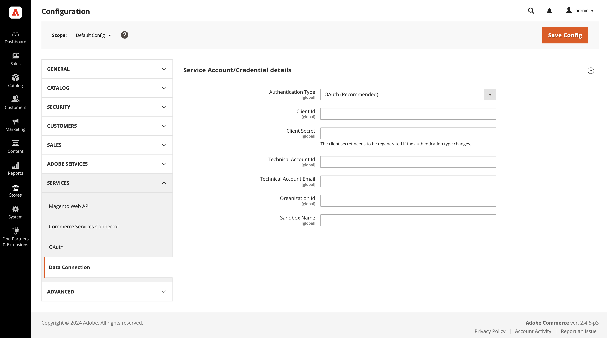

# [!DNL Audience Activation]

A variável [!DNL Audience Activation] A extensão permite ativar os públicos da Real-Time CDP no Adobe Commerce para criar ofertas exclusivas no carrinho. Essas ofertas e incentivos incluem técnicas comuns de comercialização por comércio eletrônico, como _comprar 2 obter 1 grátis_, banners ilustrativos direcionados a esse cliente e preços de produtos modificados por meio de várias ofertas. Os públicos-alvo criados no Real-Time CDP são baseados em dados de vários sistemas corporativos, como ERP (Enterprise Resource Planning, planejamento de recursos corporativos), CRM (Customer Relationship Management, gerenciamento de relacionamento com o cliente), ponto de venda e sistemas de marketing. Como as informações de segmento do cliente são constantemente atualizadas, os clientes podem se tornar associados e desassociados de um segmento à medida que fazem compras em sua loja.

Você pode ativar públicos-alvo em uma loja Luma ou [headless](#headless-support) vitrine eletrônica. Em uma loja Luma, as informações do público-alvo (associação de segmento) são armazenadas em um cookie no lado do Commerce. Em uma loja headless, as informações do público-alvo são passadas no cabeçalho da API do GraphQL como um parâmetro chamado: `aep-segments-membership`.

## Notas de versão

Esta seção contém informações sobre atualizações na extensão Audience Activation e inclui:

 - Novos recursos
 - Correções e aprimoramentos
 - Problemas conhecidos

Consulte [Versões futuras](https://experienceleague.adobe.com/docs/commerce-operations/release/planning/schedule.html) para saber mais sobre as programações de lançamento e o suporte.

Consulte a documentação do desenvolvedor para [saiba mais sobre a compatibilidade do produto](https://experienceleague.adobe.com/docs/commerce-operations/release/product-availability.html).

## Atualizações de serviço compatíveis

Essas notas de versão descrevem alterações de recursos e correções relacionadas a extensões usadas pelo Audience Activation.

+++Atualizações de serviço com suporte

_15 de agosto de 2023_

 - Atualização do [Painel de públicos da Real-Time CDP](#real-time-cdp-audiences-dashboard) para simplificar a filtragem.

_27 de junho de 2023_

 - Adição de suporte para o PHP 8.2 no `magento/module-data-services-graphql` pacote.

_30 de maio de 2023_

 - Atualização do [Painel de públicos da Real-Time CDP](#real-time-cdp-audiences-dashboard) para incluir a capacidade de classificar, pesquisar e filtrar os públicos-alvo ativos na sua instância do Adobe Commerce.

+++

### 2.0.0

[!BADGE Compatibilidade]{type=Informative tooltip="Compatibilidade"}

_10 de outubro de 2023_

 - Adição de suporte para OAuth 2.0 ao [configurar](#configure-the-extension) a extensão Audience Activation.
 - Maior estabilidade.

### 1.2.0

[!BADGE Compatibilidade]{type=Informative tooltip="Compatibilidade"}

_15 de agosto de 2023_

 - Atualização da versão dos componentes da interface do usuário.

### 1.1.0

_30 de maio de 2023_

[!BADGE Compatibilidade]{type=Informative tooltip="Compatibilidade"}

 - Suporte adicionado para [blocos dinâmicos](#headless-support) em uma loja headless.

### 1.0.1

_11 de maio de 2023_

[!BADGE Compatibilidade]{type=Informative tooltip="Compatibilidade"}

 - Correção de um problema em que uma regra de preço de carrinho ou bloco dinâmico não era aplicada à loja.
 - Correção de um problema em que uma instalação não configurada da extensão Audience Activation causava um erro quando um comerciante tentava criar ou atualizar um bloco dinâmico.

### 1.0.0

_31 de março de 2023_

[!BADGE Compatibilidade]{type=Informative tooltip="Compatibilidade"}

 - Versão de disponibilidade geral

## Implementação

As tarefas a seguir se aplicam às implementações do Luma e da loja headless. Para ativar públicos no Adobe Commerce, você deve:

- Instalar o Adobe Commerce versão 2.4.4 ou superior
- [Ativar](https://experienceleague.adobe.com/docs/experience-platform/destinations/catalog/personalization/adobe-commerce.html) Adobe Commerce como destino no Real-Time CDP
- [Instalar](#install-the-extension) o [!DNL Audience Activation] extensão no Administrador
- [Configurar](#configure-the-extension) o [!DNL Audience Activation] extensão no Administrador

### Instalar a extensão

Instale o [!DNL Audience Activation] extensão do [marketplace](https://commercemarketplace.adobe.com/magento-audiences.html)ou execute o seguinte comando:

```bash
composer require magento/audiences
```

### Configurar a extensão

Depois de instalar o [!DNL Audience Activation] você deve fazer logon no Administrador do Commerce e concluir o seguinte:

1. No _Admin_ barra lateral, vá para **[!UICONTROL System]** > _[!UICONTROL Services]_>**[!UICONTROL Commerce Services Connector]**.

1. [Fazer logon](https://experienceleague.adobe.com/docs/commerce-merchant-services/user-guides/integration-services/saas.html#organizationid) para sua conta Adobe e selecione a ID da organização.

1. No _Admin_ barra lateral, vá para **[!UICONTROL System]** > _[!UICONTROL Services]_>**[!UICONTROL [!DNL Data Connection]]**.

1. No **[!UICONTROL Datastream ID]** cole a ID do fluxo de dados que você criou ao [ativado](https://experienceleague.adobe.com/docs/experience-platform/destinations/catalog/personalization/adobe-commerce.html#parameters) Adobe Commerce como destino no Real-Time CDP.

   Essa sequência de dados envia dados do seu site do Commerce para a Real-Time CDP a fim de determinar se um comprador pertence a um público-alvo. Se você ainda não criou um fluxo de dados, [criar](https://experienceleague.adobe.com/docs/experience-platform/datastreams/configure.html#create) um em Experience Platform, [adicionar](https://experienceleague.adobe.com/docs/experience-platform/destinations/catalog/personalization/adobe-commerce.html) para o destino do Commerce no Real-Time CDP e para o [[!DNL Data Connection]](https://experienceleague.adobe.com/docs/commerce-merchant-services/data-connection/fundamentals/connect-data.html#data-collection) no Administrador.

   >[!NOTE]
   >
   >Ao especificar uma ID de fluxo de dados, você [associá-lo a um site específico](https://experienceleague.adobe.com/docs/commerce-merchant-services/data-connection/fundamentals/connect-data.html#data-collection) no [!DNL Data Connection] extensão. Se sua loja do Commerce tiver vários sites, [criar um destino](https://experienceleague.adobe.com/docs/experience-platform/destinations/ui/connect-destination.html) para cada site na Real-Time CDP e usar uma ID de fluxo de dados diferente para cada um.

1. No _Admin_ barra lateral, vá para **[!UICONTROL Stores]** > _[!UICONTROL Settings]_>**[!UICONTROL Configuration]**.

1. Expandir **[!UICONTROL Services]** e selecione **[!UICONTROL [!DNL Data Connection]]**.

1. No [[!DNL Data Connection]](https://experienceleague.adobe.com/docs/commerce-merchant-services/data-connection/fundamentals/connect-data.html#send-historical-order-data) siga as etapas 1: **Criar um projeto no Console do Adobe Developer** e 2: **Baixar arquivo de configuração**. O resultado é um arquivo que você copia e cola na variável **[!UICONTROL [!DNL Data Connection]]** página de configuração:

   {width="700" zoomable="yes"}

1. Clique em **Salvar configuração**.

Com públicos ativados para sua instância do Adobe Commerce, você pode:

- [Criar uma regra de preço de carrinho](../merchandising-promotions/price-rules-cart-create.md#set-a-condition-using-real-time-cdp-audiences) informado por públicos
- [Criar um bloco dinâmico](../content-design/dynamic-blocks.md#use-real-time-cdp-audiences-in-dynamic-blocks) informado por públicos

## painel de públicos-alvo da Real-Time CDP

Você pode exibir todos os públicos-alvo ativos disponíveis para personalização na sua instância do Adobe Commerce usando o **Públicos da Real-Time CDP** painel. Qualquer público-alvo [ativado](https://experienceleague.adobe.com/docs/experience-platform/destinations/ui/activate/activate-edge-personalization-destinations.html) no destino do Adobe Commerce no Real-Time CDP aparecem neste painel.

Para acessar o **Públicos da Real-Time CDP** painel, vá para a página _Admin_ barra lateral e vá para **[!UICONTROL Customers]** > **[!UICONTROL Real-time CDP Audience]**.

O painel contém os seguintes campos:

| Coluna | Descrição |
|--- |--- |
| `Hide filters` | Permite mostrar ou ocultar os filtros que podem ser aplicados ao painel. Atualmente, o único filtro que você pode aplicar é `Last updated`. Esse filtro permite selecionar um intervalo de datas para públicos com base em quando foram atualizados pela última vez. |
| `Search` | Permite pesquisar por públicos-alvo ativos na instância do Commerce. |
| `Name` | Nome dado ao público no Real-Time CDP. |
| `Origin` | Indica a origem do público-alvo, como `Experience Platform`. |
| `Last updated` | Indica quando o público-alvo foi modificado no Real-Time CDP. |
| `Sync now` | Recupera públicos novos ou atualizados da Real-Time CDP. |
| `Customize table` | Permite mostrar ou ocultar as `Origin` e `Last updated` colunas. |

{style="table-layout:auto"}

## Suporte a headless

Você pode ativar públicos-alvo em uma instância do Adobe Commerce headless, como AEM e PWA, para exibir regras de preço do carrinho ou blocos dinâmicos com base nos públicos-alvo.

### Regras de preço do carrinho

Para regras de preço do carrinho, uma loja headless se comunica com o Experience Platform através do [Commerce integration framework (CIF)](https://experienceleague.adobe.com/docs/experience-manager-cloud-service/content/content-and-commerce/integrations/magento.html). A estrutura fornece uma API do lado do servidor que é implementada usando o GraphQL. As informações do público-alvo, como o segmento de um comprador, são transmitidas para o Commerce por meio de um parâmetro de cabeçalho do GraphQL chamado: `aep-segments-membership`.

A arquitetura geral é a seguinte:

{width="700" zoomable="yes"}

Depois que você [instalar](#install-the-extension) e [configurar](#configure-the-extension) Na extensão, o SDK da Web do Experience Platform contém as informações do público-alvo na forma de associação de segmento.

Para capturar essas associações de segmento do SDK, consulte esta [trecho de código](https://experienceleague.adobe.com/docs/experience-platform/destinations/catalog/personalization/custom-personalization.html#example-response-for-custom-personalization-with-attributes).

Após recuperá-los, você pode passar esses segmentos para o Commerce dentro do cabeçalho do GraphQL. Por exemplo:

```bash
curl 'http://magento.config/graphql' -H 'Authorization: Bearer abc123' -H 'aep-segments-membership: urlencoded_list_of_segments' -H 'Content-Type: application/json' --data-binary '{"query":"query {\ncustomer {\nfirstname\nlastname\nemail\n}\n}"}'
```

### Blocos dinâmicos

Para blocos dinâmicos, GraphQL `dynamicBlocks` as consultas podem conter a variável `audience_id` atributo de entrada. Se você especificar um ou mais `audience_id` valores em uma `dynamicBlocks` , ele retorna uma lista de blocos dinâmicos atribuídos a esses públicos.

#### Exemplo de uso

A consulta a seguir retorna todos os blocos dinâmicos associados a várias IDs de público-alvo.

**Solicitação:**

```graphql
{
  dynamicBlocks(input:
  {
    type: SPECIFIED
    audience_id: {
      in: [
        "cd29a789-9be8-40ad-a1ef-640c33b3742e"
        "92c3e14d-c72b-40d0-96b7-b96801dcc135"
      ]
    }
  })
  {
    items {
      uid
      audience_id
      content {
        html
      }
    }
    page_info {
      current_page
      page_size
      total_pages
    }
    total_count
  }
}
```

**Resposta:**

```json
{
  "data": {
    "dynamicBlocks": {
      "items": [
        {
          "uid": "MQ==",
          "audience_id": [
            "cd29a789-9be8-40ad-a1ef-640c33b3742e"
          ],
          "content": {
            "html": "<h2><strong>SAVE 20%</strong></h2>\r\n<p>(some restrictions apply)</p>\r\n<p>&nbsp;</p>"
          }
        },
        {
          "uid": "Mg==",
          "audience_id": [
            "cd29a789-9be8-40ad-a1ef-640c33b3742e",
            "92c3e14d-c72b-40d0-96b7-b96801dcc135"
          ],
          "content": {
            "html": "<p></p>"
          }
        }
      ],
      "page_info": {
        "current_page": 1,
        "page_size": 20,
        "total_pages": 1
      },
      "total_count": 2
    }
  }
}
```

Saiba mais sobre o `dynamicBlocks` consulta do GraphQL no [documentação do desenvolvedor](https://developer.adobe.com/commerce/webapi/graphql/schema/store/queries/dynamic-blocks/).

## Recuperar públicos-alvo usando o SDK do Adobe Experience Platform Mobile

Antes de recuperar públicos-alvo da Real-Time CDP usando o Adobe Experience Platform Mobile SDK, é necessário [instalar e configurar o SDK para seu site do Commerce móvel](https://experienceleague.adobe.com/docs/commerce-merchant-services/data-connection/fundamentals/mobile-sdk-epc.html).

>[!IMPORTANT]
>
>O SDK do Adobe Experience Platform Mobile para iOS é compatível com o iOS 11 ou posterior.

Após concluir a configuração, use as operações do SDK móvel para recuperar os dados do público-alvo. Por exemplo:

```swift
Edge.sendEvent(experienceEvent: experienceEvent) { (handles: [EdgeEventHandle]) in
    for handle in handles {
        if handle.type == "activation:pull" {
        let payloadItems = handle.payload ?? []
            for payloadItem in payloadItems {
                if let segments = payloadItem["segments"] as? any Sequence {
                    var segmentsArr = [Any]()
                    for segment in segments {
                        let response = segment as AnyObject?
                        segmentsArr.append(response?.object(forKey: "id")! ?? "")
                    }
                    print("Saving segments ->  \(segments)")
                    storage.set(segmentsArr, forKey: "segments")
                    print("End saving segments")
                }
         
                // Show segments
                let rSegments = storage.object(forKey: "segments") ?? nil;
                print("Retrieving segments -> \(rSegments)")
            }
        }
    }
}
```

Depois que os dados do forem recuperados, você poderá usá-los para criar conjuntos de relatórios [regras de preço do carrinho](../merchandising-promotions/price-rules-cart-create.md#set-a-condition-using-real-time-cdp-audiences) e [blocos dinâmicos](../content-design/dynamic-blocks.md#use-real-time-cdp-audiences-in-dynamic-blocks) no aplicativo Commerce.
