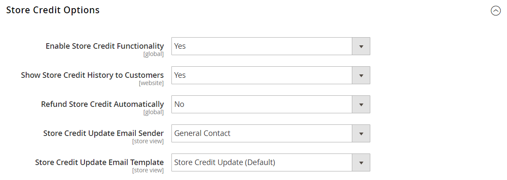

# Configurar crédito da loja

{{ee-feature}}

A configuração de crédito de armazenamento controla reembolsos automáticos, a exibição de crédito disponível nas contas do cliente e o modelo de email usado para notificações enviadas aos clientes.

1. Na barra lateral _Admin_, vá para **[!UICONTROL Stores]** > _[!UICONTROL Settings]_>**[!UICONTROL Configuration]**.

1. No painel esquerdo, expanda **[!UICONTROL Customers]** e escolha **[!UICONTROL Customer Configuration]**.

1. Expanda a seção **[!UICONTROL Store Credit Options]**.

   {width="600" zoomable="yes"}

1. Defina **[!UICONTROL Enable Store Credit Functionality]** como `Yes`.

1. Defina o seguinte de acordo com sua preferência:

   * **[!UICONTROL Show Store Credit History to Customers]**
   * **[!UICONTROL Refund Store Credit Automatically]**

1. Defina **[!UICONTROL Store Credit Update Email Sender]** para a identidade da loja que aparece como remetente das notificações de email enviadas aos clientes.

1. Defina **[!UICONTROL Store Credit Update Email Template]** com o modelo que é usado para notificações por email enviadas aos clientes.

1. Quando terminar, clique em **[!UICONTROL Save Config]**.
