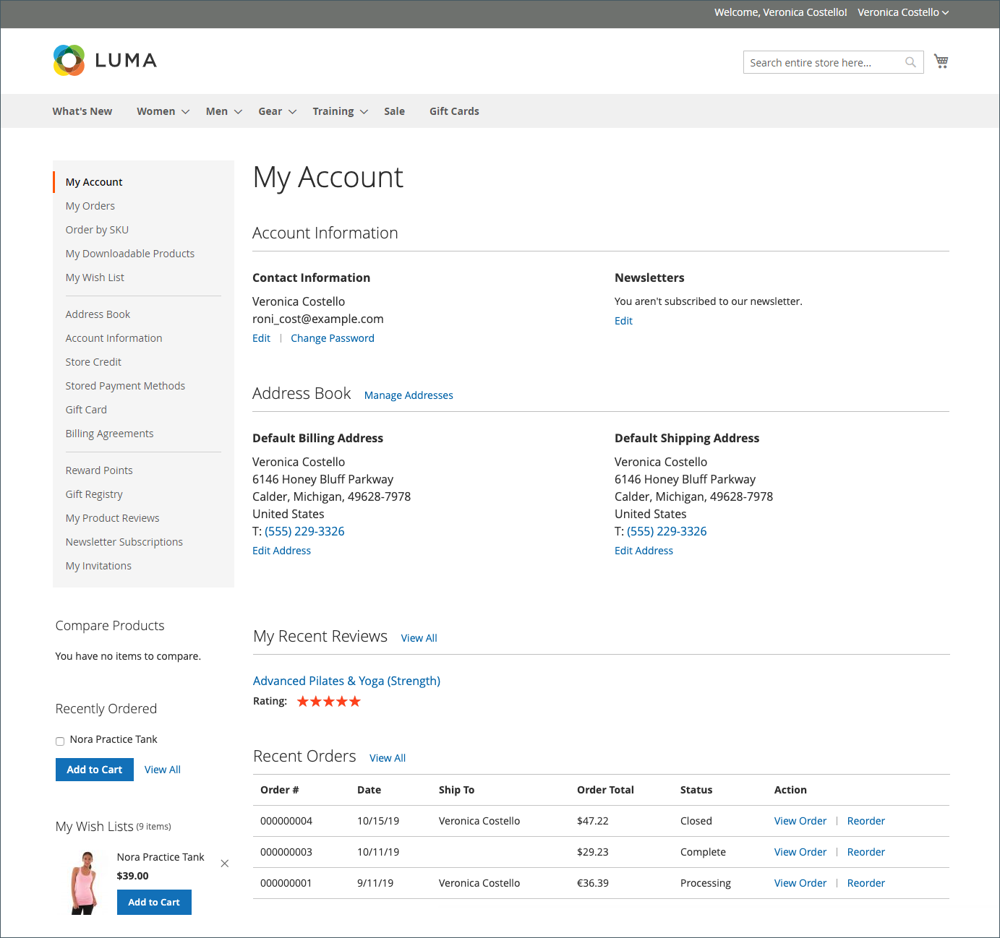

# Escopo da conta do cliente

O cabeçalho de cada página da sua loja estende um convite para que os compradores _façam logon ou se registrem_ em uma conta da sua loja. Os clientes que abrem uma conta desfrutam de uma variedade de benefícios, incluindo:

* **Criar conta de cliente** - Os visitantes podem criar uma conta de cliente para que possam usar a vitrine como um cliente registrado.
* **Criar uma conta da empresa** Dependendo da configuração, um visitante do seu armazenamento pode optar por criar uma conta da empresa. Para obter mais informações, consulte [Adobe Commerce B2B](../b2b/introduction.md).
* **Check-out mais rápido** — Os clientes registrados passam pelo check-out mais rapidamente porque muitas das informações já estão em suas contas.
* **Autoatendimento** — Os clientes registrados podem atualizar suas informações, verificar o status dos pedidos e até mesmo reordenar de suas contas.

Os clientes podem acessar suas contas clicando no link **[!UICONTROL My Account]** no cabeçalho da loja. Em suas contas, os clientes podem visualizar e modificar informações, incluindo endereços antigos e atuais, preferências de faturamento e de envio, assinaturas de boletim informativo, lista de desejos e muito mais.

{width="600" zoomable="yes"}

## Definir o escopo das contas do cliente

O escopo das contas do cliente pode ser limitado ao site onde a conta foi criada ou compartilhado com todos os sites e lojas na hierarquia da loja.

>[!NOTE]
>
>Se o site for excluído do grupo de clientes, o cliente não poderá fazer logon no site quando o escopo das contas do cliente for limitado ao site ou compartilhado com todos os sites. Consulte [Criar um grupo de clientes](customer-groups.md#create-a-customer-group) para obter mais informações sobre como excluir sites de grupos.

1. Na barra lateral _Admin_, vá para **[!UICONTROL Stores]** > [!UICONTROL _[!UICONTROL Settings]_] > **[!UICONTROL Configuration]**.

1. No painel esquerdo, expanda **[!UICONTROL Customers]** e escolha **[!UICONTROL Customer Configuration]**.

1. Expanda a seção **[!UICONTROL Account Sharing Options]**.

   {width="600" zoomable="yes"}

1. Defina **[!UICONTROL Share Customer Accounts]** como um dos seguintes:

   | Opção | Descrição |
   | --- | --- |
   | `Global` | Compartilha informações de conta do cliente com cada site e loja na instalação. |
   | `Per Website` | Limita as informações da conta do cliente ao site onde a conta foi criada. |

   {style="table-layout:auto"}

   >[!INFO]
   >
   > Se necessário, desmarque a caixa de seleção **[!UICONTROL User system value]** para fazer a alteração.

1. Quando terminar, clique em **[!UICONTROL Save Config]**.

   >[!NOTE]
   >
   >Quando `Global` é selecionado, as informações do cliente em **Minha Conta** (endereços e informações da conta, como detalhes de contato) são compartilhadas.
