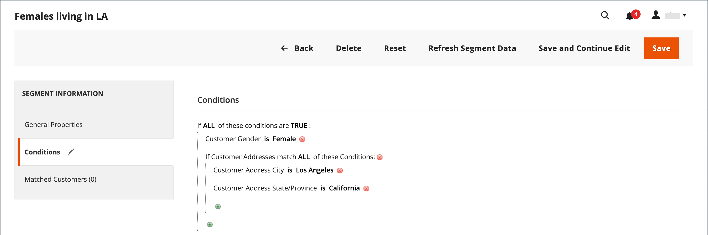
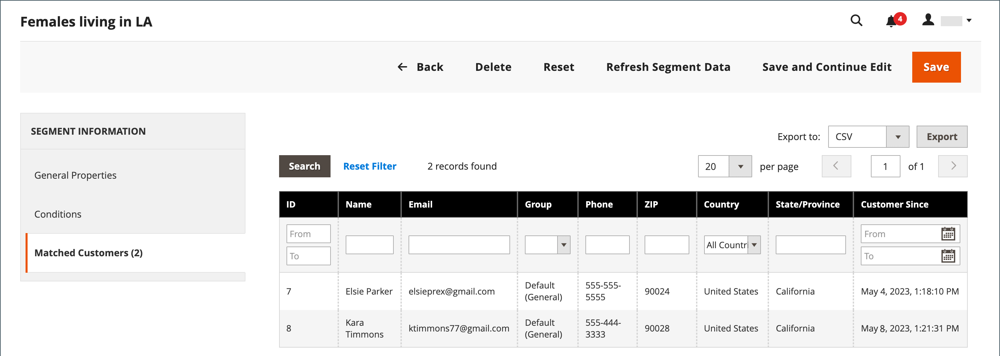

# Criar e excluir segmentos de clientes

{{ee-feature}}

A criação de um segmento de cliente é semelhante à criação de uma [regra de preço do carrinho](../merchandising-promotions/price-rules-cart.md), exceto que as opções incluem [atributos específicos de segmento de cliente](../customers/customer-segments.md).

{width="700" zoomable="yes"}

Grade _&#x200B;**[!UICONTROL Customer Segments]**&#x200B;_

| Coluna | Descrição |
|--- |--- |
| **[!UICONTROL ID]** | A ID exclusiva do segmento do cliente. |
| **[!UICONTROL Segment]** | O nome do segmento do cliente. |
| **[!UICONTROL Status]** | Indica se o segmento de cliente é _[!UICONTROL Active]_&#x200B;ou&#x200B;_[!UICONTROL Inactive]_. |
| **[!UICONTROL Website]** | Indica o site ao qual o segmento do cliente pertence. |

{style="table-layout:auto"}

## Pré-requisito: ativar segmentos de clientes

1. Na barra lateral _Admin_, vá para **[!UICONTROL Stores]** > _[!UICONTROL Settings]_>**[!UICONTROL Configuration]**.

1. No painel esquerdo, expanda **[!UICONTROL Customers]** e escolha **[!UICONTROL Customer Configuration]**.

1. Expanda a seção **[!UICONTROL Customer Segments]**.

1. Verifique se **[!UICONTROL Enable Customer Segment Functionality]** está definido como `Yes`.

   {width="600" zoomable="yes"}

1. (Opcional) Para desativar a validação em tempo real para segmentos de clientes, defina **[!UICONTROL Real-time Check if Customer is Matched by Segment]** como `No`.

   Quando você desativa a validação em tempo real, os segmentos do cliente são validados por uma única consulta SQL de condição combinada. Desativar essa função melhora o desempenho da validação de segmentos se houver muitos segmentos de clientes no sistema. No entanto, a validação não funciona com um banco de dados dividido ou quando não há clientes registrados.

1. Quando terminar, clique em **[!UICONTROL Save Config]**.

## Criar um segmento

As etapas a seguir usam um exemplo para criar um segmento de cliente que segmenta clientes do sexo feminino em Los Angeles.

### Etapa 1: Adicionar um segmento de cliente

1. Na barra lateral _Admin_, vá para **[!UICONTROL Customers]** > **[!UICONTROL Segments]**.

1. No canto superior direito, clique em **[!UICONTROL Add Segment]**.

1. Digite um **[!UICONTROL Segment Name]** que identifique o segmento do cliente ao trabalhar no Administrador.

1. Digite um breve **[!UICONTROL Description]** que explique a finalidade do segmento.

1. Defina **[!UICONTROL Assigned to Website]** como o site onde o segmento de cliente pode ser usado.

1. Defina o **[!UICONTROL Status]** como _Ativo_ ou _Inativo_.

1. Para identificar os tipos de clientes que você deseja usar para aplicar o segmento, defina **[!UICONTROL Apply to]** como um dos seguintes:

   - `Visitors and Registered Customers` - Inclui todos os compradores, independentemente de eles estarem conectados a uma conta.
   - `Registered Customers` - Inclui somente compradores que estão conectados a uma conta.
   - `Visitors` - Inclui somente compradores que não estão conectados a uma conta.

   >[!TIP]
   >
   >Se você estiver criando um segmento com base nos atributos do cliente armazenados em uma conta de cliente, é uma prática recomendada aplicar o segmento somente aos clientes registrados.

   >[!NOTE]
   >
   > Se um segmento se aplicar a `Visitors and Registered Customers`, [!UICONTROL Matched Customers] exibirá somente `Registered Customers`. Esse é o caso mesmo se os visitantes puderem ser direcionados com base nas condições que se aplicam a eles. Somente para `Visitors` segmentos, nenhuma guia `Matched Customers` é exibida.

1. Clique em **[!UICONTROL Save and Continue Edit]**.

   Depois de salvar o segmento _[!UICONTROL General Properties]_, opções adicionais ficam disponíveis no painel esquerdo.

   {width="600" zoomable="yes"}

**_[!UICONTROL General Properties]_**

| Campo | Descrição |
|--- |---|
| **[!UICONTROL Segment Name]** | Um nome que identifica o segmento para referência interna. |
| **[!UICONTROL Description]** | Uma breve descrição que explica a finalidade do segmento para referência interna. |
| **[!UICONTROL Assigned to Website]** | O único site onde o segmento pode ser usado. |
| **[!UICONTROL Status]** | Ativa e desativa o segmento. Quaisquer regras de preço e banners associados são desativados quando o segmento é desativado. Opções: `Active` / `Inactive` |
| **[!UICONTROL Apply to]** | Define os tipos de clientes aos quais o segmento é aplicado. A seleção influencia o conjunto de condições disponíveis para criar o segmento. Não é possível alterar a configuração depois que o segmento é salvo. |

{style="table-layout:auto"}

### Etapa 2: definir as condições

>[!NOTE]
>
> Para visitantes, somente as seguintes condições são aplicáveis: Condições do carrinho de compras (valor do subtotal do carrinho, itens de linha do carrinho e quantidade dos produtos do carrinho), Regras de produto (produtos encontrados no carrinho de compras e no histórico do produto) e combinações desses itens. Se um segmento deve se aplicar tanto a visitantes quanto a clientes registrados, os visitantes serão rastreados somente com base nas condições listadas.

1. No painel esquerdo, clique em **[!UICONTROL Conditions]**.

   A condição padrão começa com _[!UICONTROL If ALL of these conditions are TRUE:]_&#x200B;na página.

   {width="600" zoomable="yes"}

1. Crie uma condição que tenha como alvo clientes do sexo feminino:

   - Clique no ícone **[!UICONTROL Add]** para exibir a lista de condições e selecione `Gender`.

   - Deixe a opção de controle de condição **is** padrão.

   - Clique em **...** e selecione `female`.

   {width="600" zoomable="yes"}

1. Crie outra condição que seja direcionada aos moradores de Los Angeles:

   - Na próxima linha, clique no ícone **[!UICONTROL Add]** e selecione `Customer Address`.

     Essa ação cria uma condição pai em que você pode definir um ou mais campos de endereço para correspondência.

   - Clique no ícone **[!UICONTROL Add]** para exibir a lista de campos de endereço e selecione `City`.

   - Clique em **is** para exibir as opções de controle de condição e selecione `contains`.

   - Clique em **...** e digite `Los Angeles`.

   - Na próxima linha, clique no ícone **[!UICONTROL Add]** e selecione `State/Province`.

   - Deixe a opção de controle de condição **is** padrão.

   - Clique em **...** e selecione `United States > California`.

   {width="600" zoomable="yes"}

1. Clique em **[!UICONTROL Save and Continue Edit]**.

### Etapa 3: revisar a lista de clientes correspondentes

1. No painel esquerdo, clique em **[!UICONTROL Matched Customers]** para exibir todos os clientes que correspondem à condição.

   {width="600" zoomable="yes"}

1. Se a lista de clientes atingir sua meta, clique em **[!UICONTROL Save]** para concluir o segmento de clientes.

1. O segmento de cliente agora pode ser usado para direcionar promoções, conteúdo e correspondências.

Grade _&#x200B;**[!UICONTROL Matched Customers]**&#x200B;_

| Coluna | Descrição |
|--- |--- |
| **[!UICONTROL ID]** | A ID de um cliente registrado. |
| **[!UICONTROL Name]** | O nome de um cliente registrado. |
| **[!UICONTROL Email]** | O endereço de email de um cliente registrado. |
| **[!UICONTROL Group]** | O grupo de clientes ao qual o cliente está atribuído. |
| **[!UICONTROL Phone]** | O telefone do cliente. |
| **[!UICONTROL ZIP]** | O CEP do cliente. |
| **[!UICONTROL Country]** | O país onde o cliente está localizado. |
| **[!UICONTROL State / Province]** | O estado ou província onde o cliente está localizado. |
| **[!UICONTROL Customer Since]** | A data e a hora em que a conta do cliente foi criada. |

{style="table-layout:auto"}

## Remover um segmento de cliente

1. Na barra lateral _Admin_, vá para **[!UICONTROL Customers]** > **[!UICONTROL Segments]**.

1. Localize o segmento a ser excluído e selecione-o.

1. Na barra de menus, clique no botão **[!UICONTROL Delete]**.

1. Para confirmar a ação, clique em **[!UICONTROL OK]**.

## Barra de botões

| Botão | Descrição |
|--- |--- |
| **[!UICONTROL Back]** | Retorna à página _[!UICONTROL Customer Segments]_&#x200B;sem salvar as alterações. |
| **[!UICONTROL Delete]** | Exclui o segmento de cliente atual. Os clientes ou ordens concluídas associadas ao cliente no segmento não são removidos. |
| **[!UICONTROL Reset]** | Redefine quaisquer alterações não salvas no formulário de segmento do cliente para seus valores anteriores. |
| **[!UICONTROL Refresh Segment Data]** | Atualiza os dados do segmento para os valores salvos mais recentemente. Relevante se algum dado de segmento estiver indisponível ou desatualizado. |
| **[!UICONTROL Save and Continue Edit]** | Salva as alterações e mantém o segmento do cliente aberto. |
| **[!UICONTROL Save]** | Salva alterações e fecha o segmento do cliente. |

{style="table-layout:auto"}

## Demonstração de segmentos de clientes

Assista a este vídeo para obter uma demonstração da criação de segmentos de clientes:

>[!VIDEO](https://video.tv.adobe.com/v/3411975/?quality=12&learn=on&captions=por_br)
