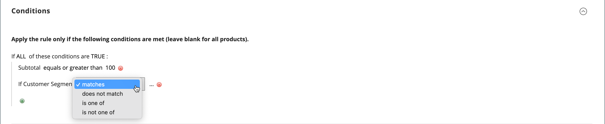

# Segmentos do cliente em regras de preço

{{ee-feature}}

Um segmento de cliente pode ser usado para promoções segmentadas, associando-o a uma [regra de preço do carrinho](../merchandising-promotions/price-rules-cart.md).

{width="700" zoomable="yes"}

_&#x200B;**Para associar um segmento a uma regra de preço de carrinho:**&#x200B;_

1. Na barra lateral _Admin_, vá para **[!UICONTROL Marketing]** > _Promoções_ > **[!UICONTROL Cart Price Rules]**.

1. Abrir uma regra nova ou existente:

   * Para usar uma nova regra, clique em **[!UICONTROL Add New Rule]** no canto superior direito.
   * Para usar uma regra existente, clique na regra na lista para abri-la no modo de edição.

1. Role para baixo e expanda a seção **[!UICONTROL Conditions]**.

1. Adicione a condição.

   * Clique no ícone _Adicionar_ (), que exibe a lista de condições. Em seguida, escolha **[!UICONTROL Customer Segment]**.

   {width="600" zoomable="yes"}

   Por padrão, a condição é definida para encontrar uma condição correspondente. Se necessário, clique no link **[!UICONTROL matches]** e altere o operador para um dos seguintes:

   * `does not match`
   * `is one of`
   * `is not one of`

   {width="600" zoomable="yes"}

1. Para direcionar um segmento específico, clique no link Mais **...** para exibir opções adicionais. Em seguida, clique no ícone _Seletor_ () para exibir a lista de segmentos de clientes.

1. Na lista, marque a caixa de seleção de cada segmento que você deseja direcionar com a condição.

   {width="600" zoomable="yes"}

1. Clique em **[!UICONTROL Select]** para colocar os segmentos de clientes selecionados na condição.

1. Complete o restante da regra de preço, conforme necessário.

1. Quando terminar, clique em **[!UICONTROL Save]**.
