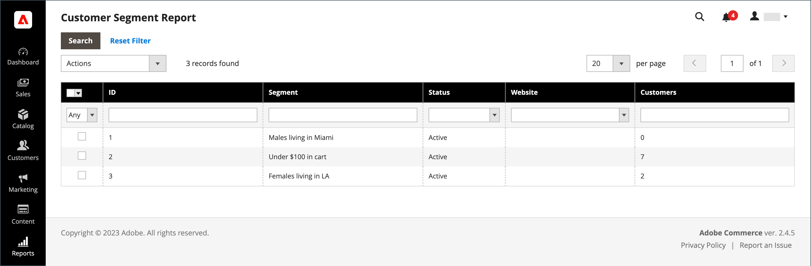

# Relatório de Segmento do cliente

{{ee-feature}}

O relatório de Segmento do cliente fornece informações sobre o número de clientes em cada segmento.

{width="700" zoomable="yes"}

| Coluna | Descrição |
|--- |--- |
| **[!UICONTROL Select]** | Marque a caixa de seleção de cada segmento a ser sujeito a uma ação ou use o controle de seleção no cabeçalho da coluna. Opções: `Select All` / `Deselect All` / `Select Visible` / `Unselect Visible` |
| **[!UICONTROL ID]** | Um identificador numérico exclusivo atribuído a cada segmento |
| **[!UICONTROL Segment]** | Nome do segmento |
| **[!UICONTROL Status]** | Status do segmento. Opções: `Active` / `Inactive` |
| **[!UICONTROL Website]** | Site ao qual o segmento é atribuído |
| **[!UICONTROL Customers]** | Número de clientes atribuídos a um segmento |

{style="table-layout:auto"}

Você pode detalhar uma lista de clientes no segmento e exportar os dados.

{width="600" zoomable="yes"}

Para garantir que você tenha os dados mais recentes, os dados do segmento devem ser atualizados. Se os dados do segmento não estiverem disponíveis ou estiverem desatualizados, clique em **[!UICONTROL Refresh Segment Data]** na barra de botões para atualizar.

1. Para **[!UICONTROL Export to]**, escolha um formato de exportação:

   * CSV - Um arquivo de valores separados por vírgulas contendo dados de texto simples.
   * Excel XML - Um formato de dados de planilha baseado em XML.

1. Clique em **[!UICONTROL Export]**.

   | Coluna | Descrição |
   |--- |--- |
   | **[!UICONTROL ID]** | Um identificador numérico exclusivo atribuído a cada usuário |
   | **[!UICONTROL Name]** | Nome do cliente |
   | **[!UICONTROL Email]** | O endereço de email de um cliente registrado |
   | **[!UICONTROL Group]** | O grupo de clientes ao qual o cliente está atribuído |
   | **[!UICONTROL Phone]** | O telefone do cliente |
   | **[!UICONTROL ZIP]** | O CEP onde o cliente está localizado |
   | **[!UICONTROL Country]** | O país onde o cliente está localizado |
   | **[!UICONTROL State/Province]** | O estado onde o cliente está localizado |
   | **[!UICONTROL Customer Since]** | A data e a hora em que a conta do cliente foi criada |

   {style="table-layout:auto"}

1. O arquivo gerado é salvo automaticamente no computador local.
