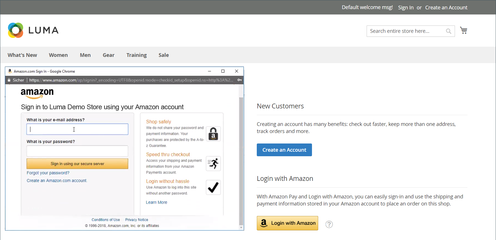

# Logon do cliente

Os clientes têm acesso fácil às suas contas de todas as páginas da loja. Dependendo da [configuração](../customers/account-options-new.md), os clientes podem ser redirecionados para o painel de contas ou continuar comprando depois de fazer logon em suas contas.

Se o [CAPTCHA](../systems/security-captcha.md) estiver habilitado na configuração, a pessoa deverá concluir corretamente um teste que verifique se ela é humana antes de obter acesso às suas contas.

Quando os clientes esquecem suas senhas, um link de redefinição é enviado para o endereço de email associado à conta. A configuração [Opções de Senha](../customers/password-options.md) controla a experiência do cliente para tentativas de logon:

- O número de vezes que um cliente pode tentar digitar uma senha
- O número de minutos entre tentativas
- O número total de tentativas antes de a conta ser bloqueada
- A duração do bloqueio

{width="700" zoomable="yes"}

## Fazer logon em uma conta de cliente

1. No cabeçalho da loja, o cliente clica em **[!UICONTROL Sign in]**.

   {width="700" zoomable="yes"}

1. Digite o endereço **[!UICONTROL Email]** e **[!UICONTROL Password]**.

1. Cliques **[!UICONTROL Sign in]**.

   >[!IMPORTANT]
   >
   >Se ele não conseguir lembrar a senha, o cliente poderá clicar em **[!UICONTROL Forgot Your Password?]** e seguir as [instruções](../customers/password-reset.md) para redefini-la.

## Defina o redirecionamento para o painel da conta após o logon do cliente

Você pode configurar a loja para redirecionar os clientes para o painel de conta depois que eles entrarem ou permitirem que continuem comprando.

1. Na barra lateral _Admin_, vá para **[!UICONTROL Stores]** > _[!UICONTROL Settings]_>**[!UICONTROL Configuration]**.

1. No painel esquerdo, expanda **[!UICONTROL Customers]** e escolha **[!UICONTROL Customer Configuration]**.

1. Expanda a seção **[!UICONTROL Login Options]**.

1. Defina **[!UICONTROL Redirect Customer to Account Dashboard after Logging in]** como um dos seguintes:

   - `Yes` - O painel de conta é exibido quando os clientes fazem logon em suas contas.
   - `No` - Os clientes podem continuar comprando depois de fazer logon em suas contas.

1. Quando terminar, clique em **[!UICONTROL Save Config]**.

## Fazer logon com a Amazon

Para lojas com uma integração do [!DNL Amazon Pay] e do [!DNL Login with Amazon] configurada, os clientes podem fazer logon em sua conta de comprador da Amazon.

1. No cabeçalho da loja, o cliente clica em **[!UICONTROL Sign in]**.

1. Cliques **[!UICONTROL Login with Amazon]**.

   {width="700" zoomable="yes"}

1. Quando solicitado a fazer logon, o cliente insere **[!UICONTROL email address]** e **[!UICONTROL password]** para sua conta de comprador da Amazon.

   {width="700" zoomable="yes"}

1. Para conceder permissão à Amazon para compartilhar as seguintes informações de sua conta com a loja ao processar compras, clique em **OK**.

   - Nome
   - Endereço de e-mail
   - Endereços de Entrega

   {width="700" zoomable="yes"}

## Sair de uma conta de cliente

1. No canto superior direito próximo a _[!UICONTROL Welcome, Customer Name!]_, o cliente clica no seletor de menu **[!UICONTROL v]**.

1. Escolha **[!UICONTROL Sign Out]**.

Após a saída, o cliente é redirecionado para a página inicial.
