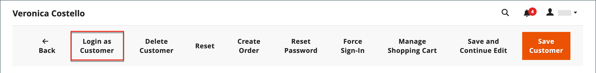
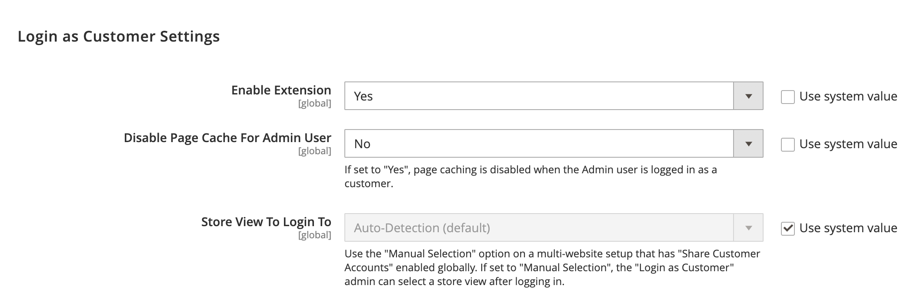
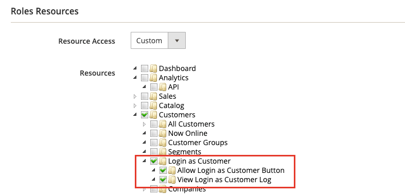
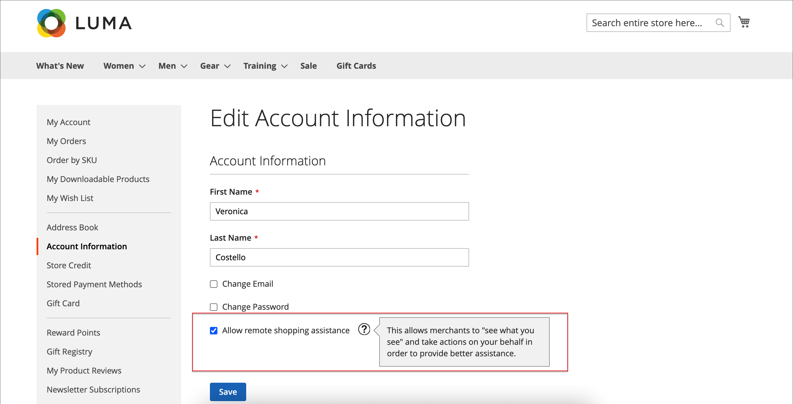

# Fornecer assistência ao comprador

Às vezes, os clientes precisam de ajuda com seu pedido. Os administradores de loja podem usar o _Logon como Cliente_, o que permite que eles vejam o que o cliente vê e façam atualizações para ajudá-los.

Quaisquer ações executadas durante o logon como cliente são aplicadas à conta do cliente real.

>[!BEGINTABS]

>[!TAB Adobe Commerce]

[!BADGE Somente PaaS]{type=Informative url="https://experienceleague.adobe.com/pt-br/docs/commerce/user-guides/product-solutions" tooltip="Aplica-se somente a projetos do Adobe Commerce na nuvem (infraestrutura do PaaS gerenciada pela Adobe) e a projetos locais."}

Quando habilitado para um usuário _Administrador_, o botão _[!UICONTROL Login as Customer]_&#x200B;aparece em várias páginas:

* [Página Customer Edit](../customers/update-account.md)
* [Página de exibição de pedidos](../stores-purchase/order-processing.md)
* [Página de Exibição da Fatura](../stores-purchase/invoices.md)
* [Página de Exibição da Remessa](../stores-purchase/shipments.md)
* [Página View de Aviso de Crédito](../stores-purchase/credit-memo-create.md)

{width="600" zoomable="yes"}

>[!TAB Adobe Commerce as a Cloud Service]

[!BADGE Somente SaaS]{type=Positive url="https://experienceleague.adobe.com/pt-br/docs/commerce/user-guides/product-solutions" tooltip="Aplicável somente a projetos do Adobe Commerce as a Cloud Service e do Adobe Commerce Optimizer (infraestrutura SaaS gerenciada pela Adobe)."}

No Adobe Commerce as a Cloud Service, o recurso Fazer logon como cliente usa um fluxo de trabalho **Código único (OTC)** em vez de um logon direto. Os administradores geram um código de curta duração e de uso único para um cliente. Esse código pode ser trocado por um token de acesso do cliente por meio do GraphQL, permitindo fluxos de trabalho de logon sem senha como clientes para cenários de compras assistidas por vendedores.

O recurso inclui os seguintes componentes:

* **Interface do administrador** - Na página de edição do cliente, os administradores podem solicitar um código único (OTC) em vez de fazer logon diretamente como cliente.
* **[API REST](https://developer.adobe.com/commerce/webapi/rest/saas-integrations/login-as-customer/)** - Um ponto de extremidade programático para geração OTC, útil para scripts de administrador e integrações de terceiros.
* **API do GraphQL** - Mutações que trocam um OTC por um token de acesso do cliente para fluxos comerciais headless ou de vitrine.

>[!ENDTABS]

## Ativar o login como cliente

Habilitar o _Logon como Cliente_ exige que você habilite o recurso em sua instância do Commerce e, em seguida, habilite o acesso para usuários Administradores nas permissões de função de usuário.

### Ativar o recurso

1. Na barra lateral Admin, vá para **[!UICONTROL Stores]** > _[!UICONTROL Settings]_>**[!UICONTROL Configuration]**.

1. No painel esquerdo, expanda **[!UICONTROL Customers]** e escolha **[!UICONTROL Login as Customer]**.

   {width="600" zoomable="yes"}

1. Defina **[!UICONTROL Enable Login as Customer]** como `Yes`.

1. _(Opcional)_ Defina **[!UICONTROL Disable Page Cache for Admin User]** como `No` para habilitar o cache de páginas quando o usuário Administrador fizer logon como cliente.

   >[!WARNING]
   >
   > Desabilitar o cache de página (`Yes` - padrão) garante que o usuário que está fazendo logon como Cliente obtenha dados novos e não armazenados em cache.

1. _(Opcional)_ Defina **[!UICONTROL Store View to Log in]** como `Manual Selection` se você tiver uma configuração de vários sites e/ou de várias lojas e quiser que o usuário Administrador selecione a exibição de loja ao fazer logon como cliente.

1. Quando terminar, clique em **[!UICONTROL Save Config]**.

### Habilitar o acesso para usuários administradores

1. Na barra lateral _Admin_, vá para **[!UICONTROL System]** > _Permissões_ > **[!UICONTROL User Roles]**.

1. Clique na função na lista.

1. No painel esquerdo [!UICONTROL _Informações da função_], clique em **[!UICONTROL Role Resources]**.

1. Alterar **[!UICONTROL Role Resources]** na página para `Custom`.

   >[!INFO]
   >
   > Com essa opção selecionada, a hierarquia de recursos é exibida na página.

1. Role até o item pai **[!UICONTROL Customers]** e o item **[!UICONTROL Login as Customer]** abaixo. Em seguida, selecione os recursos que deseja habilitar para a função:

   * **[!UICONTROL Allow Login as Customer]** - Permite que o usuário Administrador use o recurso _Fazer logon como Cliente_.
   * **[!UICONTROL View Login as Customer Log]** - Permite que o usuário Administrador veja o Log de _Logon como Cliente_.

   {width="400" zoomable="yes"}

1. Clique em **[!UICONTROL Save Role]**.

## Permissão de conta do cliente para assistência remota a compras

Para habilitar o acesso à conta para a equipe de suporte da loja do Administrador, um cliente deve habilitar o recurso para sua conta:

>[!BEGINTABS]

>[!TAB Adobe Commerce]

[!BADGE Somente PaaS]{type=Informative url="https://experienceleague.adobe.com/pt-br/docs/commerce/user-guides/product-solutions" tooltip="Aplica-se somente a projetos do Adobe Commerce na nuvem (infraestrutura do PaaS gerenciada pela Adobe) e a projetos locais."}

1. O cliente acessa a página **[!UICONTROL Account Information]**.

1. Marca a caixa de seleção **[!UICONTROL Allow remote shopping assistance]**.

1. O cliente clica em **[!UICONTROL Save]**.

{width="700" zoomable="yes"}

>[!TAB Adobe Commerce as a Cloud Service]

[!BADGE Somente SaaS]{type=Positive url="https://experienceleague.adobe.com/pt-br/docs/commerce/user-guides/product-solutions" tooltip="Aplicável somente a projetos do Adobe Commerce as a Cloud Service e do Adobe Commerce Optimizer (infraestrutura SaaS gerenciada pela Adobe)."}

O cliente deve ter o atributo de extensão `login_as_customer_assistance_allowed` definido como **2**. Isso pode ser configurado na página **Editar Cliente** do Administrador ou por meio da GraphQL ao criar ou editar um cliente.

>[!WARNING]
>
>Sem essa permissão, um usuário administrador não pode fazer logon como esse cliente.

{width="600" zoomable="yes"}

Para definir essa permissão com o GraphQL para uma conta de cliente existente, defina a entrada `allow_remote_shopping_assistance` como `true` usando as mutações [`updateCustomerV2`](https://developer.adobe.com/commerce/webapi/graphql/schema/customer/mutations/update-v2/) ou [`createCustomerV2`](https://developer.adobe.com/commerce/webapi/graphql/schema/customer/mutations/create-v2/).

>[!ENDTABS]

## Faça logon como cliente no Administrador

>[!BEGINTABS]

>[!TAB Adobe Commerce]

[!BADGE Somente PaaS]{type=Informative url="https://experienceleague.adobe.com/pt-br/docs/commerce/user-guides/product-solutions" tooltip="Aplica-se somente a projetos do Adobe Commerce na nuvem (infraestrutura do PaaS gerenciada pela Adobe) e a projetos locais."}

1. Na barra lateral _Administrador_, vá para **[!UICONTROL Customers]** > [!UICONTROL _Todos os Clientes_].

1. Abra um usuário no modo de edição.

1. No painel **[!UICONTROL Customer Information]**, escolha a seção **[!UICONTROL Account Information]**.

1. Defina o **[!UICONTROL Allow remote shopping assistance]** como `Yes`.

   >[!INFO]
   >
   >O administrador agora pode fazer logon como usuário sem a permissão da loja.

>[!TAB Adobe Commerce as a Cloud Service]

[!BADGE Somente SaaS]{type=Positive url="https://experienceleague.adobe.com/pt-br/docs/commerce/user-guides/product-solutions" tooltip="Aplicável somente a projetos do Adobe Commerce as a Cloud Service e do Adobe Commerce Optimizer (infraestrutura SaaS gerenciada pela Adobe)."}

>[!NOTE]
>
>Para obter orientação sobre como implementar esse recurso usando REST, consulte a documentação da API REST do [Logon como cliente](https://developer.adobe.com/commerce/webapi/rest/saas-integrations/login-as-customer/).

### Solicitar um código de ocorrência única (OTC) do administrador

1. Navegue até **[!UICONTROL Customers]** e selecione um cliente para abrir a página de edição.

1. Na página Editar Cliente, clique em **[!UICONTROL Get Customer Login OTC]**.

   {width="600" zoomable="yes"}

1. Insira um **[!UICONTROL Reason]** (obrigatório) e clique em **[!UICONTROL Request]**.

   {width="600" zoomable="yes"}

   >[!NOTE]
   >
   >O campo **Motivo** é obrigatório. Ele é passado para o fluxo de geração de OTP e é reservado para uso em recursos futuros de auditoria e registro de eventos.

1. O OTC gerado é exibido na modal. Use este código com a mutação do GraphQL `generateCustomerToken` ou `exchangeOtpForCustomerToken` para autorização do cliente.

   {width="300" zoomable="yes"}

>[!IMPORTANT]
>
>O OTC de código único gerado é válido por 30 segundos por padrão e é invalidado após um único uso. O TTL pode ser configurado enviando um [tíquete de suporte](https://experienceleague.adobe.com/home?lang=pt-BR&support-tab=home#support).

Depois que o código único é gerado, é possível usá-lo navegando até a loja e fazendo logon com as seguintes credenciais:

* **Email**: o endereço de email do cliente
* **Senha**: o OTC (One-Time Code) gerado

>[!ENDTABS]

## Usar o login como cliente

>[!INFO]
>
>Para usar o _Logon como Cliente_, verifique se seu Administrador está configurado conforme descrito anteriormente.

_Fazer logon como Cliente_ permite que você veja o site da mesma maneira que o cliente, e permite que você solucione problemas e execute outras ações para o cliente. Se você tiver uma função de usuário atribuída com as permissões necessárias:

1. Você pode clicar em **[!UICONTROL Login as Customer]** nas páginas listadas na seção anterior.
1. As ações Fazer logon como cliente estão disponíveis no Relatório de ações.

>[!WARNING]
>
>Todas as ações executadas durante o logon em [!UICONTROL _como Cliente_] (como adicionar/remover produtos) são aplicadas ao pedido real do cliente. Na loja, um banner é exibido quando você está `logged in as customer_name` para fornecer um lembrete do estado especial.

## Fazer logon como Registro do cliente

{{ee-feature}}

A Adobe Commerce fornece um log para as ações _Fazer Logon como Cliente_. Ela lista todas as sessões em que um usuário administrador acessa o recurso. Para acessar as ações registradas, vá para o [Relatório de Ações do Administrador](../systems/action-log-report.md).

Você pode filtrar a configuração do relatório **[!UICONTROL Action Group]** para `Login As Customer` na parte superior da página e clicar em **[!UICONTROL Search]**.

{width="700" zoomable="yes"}
