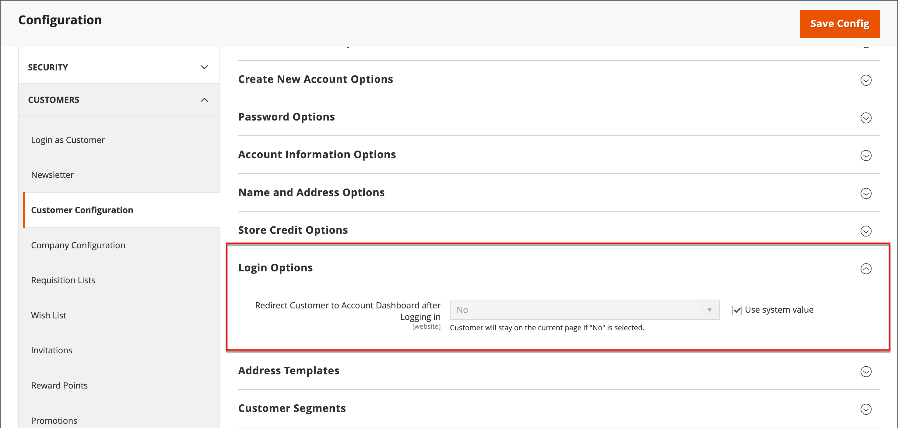

# Página de aterrissagem de logon do cliente

Você pode configurar sua loja para redirecionar os clientes para o painel de conta depois que eles entrarem ou permitirem que continuem comprando.

1. Na barra lateral _Admin_, vá para **[!UICONTROL Stores]** > _[!UICONTROL Settings]_>**[!UICONTROL Configuration]**.

1. No painel esquerdo, expanda **[!UICONTROL Customers]** e escolha **[!UICONTROL Customer Configuration]**.

1. Expanda a seção **[!UICONTROL Login Options]**.

   {width="600" zoomable="yes"}

1. Defina **[!UICONTROL Redirect Customer to Account Dashboard after Logging in]** como um dos seguintes:

   - `Yes` - O painel de conta é exibido quando os clientes fazem logon em suas contas.
   - `No` - Os clientes podem continuar comprando depois de fazer logon em suas contas.

   >[!INFO]
   >
   >Se necessário, desmarque a caixa de seleção **[!UICONTROL User system value]** para fazer a alteração.

1. Quando terminar, clique em **[!UICONTROL Save Config]**.
