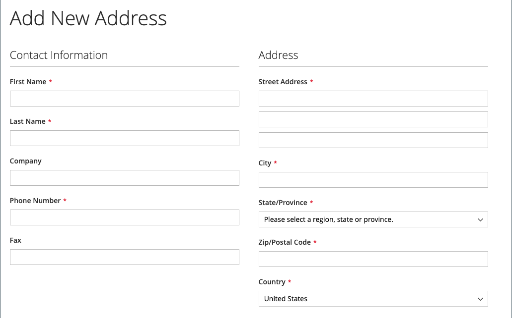
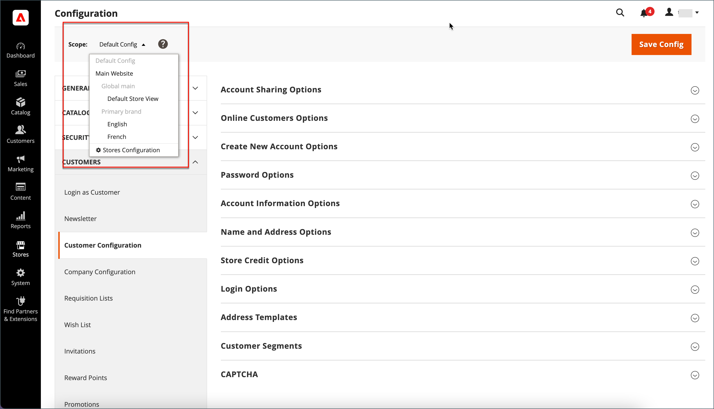
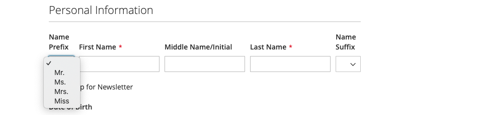
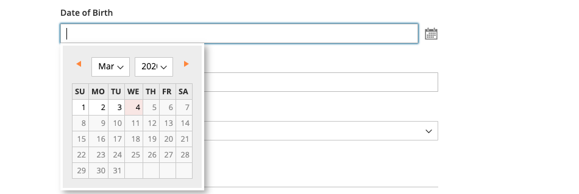

# Opções de nome e endereço do cliente

As _Opções de Nome e Endereço_ determinam quais campos são incluídos nos formulários de nome e endereço quando os clientes criam uma [conta](../customers/account-create.md) com seu armazenamento.

{width="500" zoomable="yes"}

As etapas para configurar as opções de nome e endereço são diferentes para o Adobe Commerce e o Magento Open Source.

## Configurar opções de nome e endereço para o Adobe Commerce

Você pode configurar as opções de nome e endereço que são apresentadas aos clientes na loja quando eles criam sua conta.

### Etapa 1: definir o escopo da configuração

1. Na barra lateral _Admin_, vá para **[!UICONTROL Stores]** > _[!UICONTROL Settings]_>**[!UICONTROL Configuration]**.

1. No painel esquerdo, expanda **[!UICONTROL Customers]** e escolha **[!UICONTROL Customer Configuration]**.

1. Expanda a seção **[!UICONTROL Name and Address Options]**.

   >[!INFO]
   >
   >Observe que o escopo das opções de nome e endereço se aplica no nível `website`.

1. Role para cima até a parte superior da página e defina o escopo da configuração como um dos seguintes:

   - `Default Config`
   - `Main Website` (ou site específico para instalações de vários sites)

   >[!INFO]
   >
   >A seção _[!UICONTROL Name and Address Options]_não aparece quando o escopo está definido como `Default Store View`.

   {width="700" zoomable="yes"}

### Etapa 2: configurar as opções de nome e endereço

1. Retorne à seção [!UICONTROL _Opções de Nome e Endereço_] da página Configuração do Cliente.

   >[!INFO]
   >
   > Se você não estiver usando a configuração de escopo `Default config`, desmarque a caixa de seleção `Use Default` para cada campo antes de alterar o valor.

   {width="600" zoomable="yes"}

1. Para **[!UICONTROL Prefix Dropdown Options]**, insira cada prefixo que você deseja que apareça na lista, separado por ponto-e-vírgula.

   >[!IMPORTANT]
   >
   >Coloque um ponto e vírgula antes do primeiro valor para exibir um valor em branco na parte superior da lista.

1. Para **[!UICONTROL Suffix Dropdown Options]**, insira cada sufixo que você deseja que apareça na lista, separado por ponto-e-vírgula.

1. Para incluir os seguintes campos em formulários de clientes, defina o valor de cada um para `Optional` ou `Required`, conforme necessário.

   - **[!UICONTROL Show Telephone]**
   - **[!UICONTROL Show Company]**
   - **[!UICONTROL Show Fax]**

### Etapa 3: Salvar e atualizar

1. Quando terminar, clique em **[!UICONTROL Save Config]**.

1. Na mensagem na parte superior da página, clique em **[!UICONTROL Cache Management]** e [atualizar](../systems/cache-management.md) cada cache inválido.

## Configurar opções de nome e endereço para o Magento Open Source

Configure as opções de nome e endereço que são apresentadas aos clientes na loja quando eles criam sua conta.

{width="500" zoomable="yes"}

### Etapa 1: definir o escopo da configuração

1. Na barra lateral _Admin_, vá para **[!UICONTROL Stores]** > _[!UICONTROL Settings]_>**[!UICONTROL Configuration]**.

1. No painel esquerdo, expanda **[!UICONTROL Customers]** e escolha **[!UICONTROL Customer Configuration]**.

1. Expanda a seção **[!UICONTROL Name and Address Options]**.

   >[!IMPORTANT]
   >
   > Observe que o escopo das opções de nome e endereço se aplica no nível `website`.

   {width="600" zoomable="yes"}

1. Role para trás até a parte superior da página e defina o escopo da configuração como um dos seguintes:

   - `Default Config`
   - `Main Website` (ou site específico para instalações de vários sites)

   >[!NOTE]
   >
   >A seção _Opções de Nome e Endereço_ não aparece quando o escopo é definido como `Default Store View`.

   {width="600" zoomable="yes"}

### Etapa 2: configurar as opções de nome e endereço

1. Retorne à seção [!UICONTROL _Opções de Nome e Endereço_] da página Configuração do Cliente.

   >[!INFO]
   >
   >Se você não estiver usando a configuração de escopo `Default config`, desmarque a caixa de seleção `Use Default` para cada campo antes de alterar o valor.

1. Para **Número de Linhas em um Endereço**, insira um número de 1 a 4.

   >[!WARNING]
   >
   >Por padrão, o endereço é de três linhas.

1. Para incluir um prefixo (como Sr. ou Sra.) como parte do nome, defina **Mostrar Prefixo** como `Yes`.

   {width="600" zoomable="yes"}

   >[!INFO]
   >
   >Para as **Opções da Lista Suspensa de Prefixos**, insira cada prefixo que você deseja que apareça na lista, separado por ponto-e-vírgula. Você pode colocar um ponto e vírgula antes do primeiro valor para exibir um valor em branco na parte superior da lista.

1. Para incluir um campo opcional para o nome do meio ou a inicial do cliente, defina **[!UICONTROL Show Middle Name (initial)]** como `Yes`.

1. Para incluir um sufixo (como Jr. ou Sr.) após o nome do cliente, defina **[!UICONTROL Show Suffix]** como um dos seguintes:

   - `Optional`
   - `Required`

   >[!INFO]
   >
   >Para as **Opções da Lista Suspensa de Sufixos**, insira cada sufixo que você deseja que apareça na lista, separado por ponto-e-vírgula. Você pode colocar um ponto e vírgula antes do primeiro valor para exibir um valor em branco na parte superior da lista.

1. Para incluir a data de nascimento, defina **[!UICONTROL Show Date of Birth]** como uma das seguintes opções:

   - `Optional`
   - `Required`

   >[!INFO]
   >
   >De acordo com as práticas recomendadas atuais de segurança e privacidade, esteja ciente de possíveis riscos legais e de segurança associados ao armazenamento da data de nascimento completa do cliente (mês, dia, ano) com outros identificadores pessoais. É recomendável limitar o armazenamento das datas de nascimento completas dos clientes e sugerir o uso do ano de nascimento do cliente como alternativa.

   Os clientes podem usar o ícone Calendário depois do campo para escolher a data de nascimento de um calendário pop-up.

   {width="600" zoomable="yes"}

1. Para permitir que os clientes insiram seus números de imposto ou [IVA](../stores-purchase/vat.md), defina **[!UICONTROL Show Tax/VAT Number]** como um dos seguintes:

   - `Optional`
   - `Required`

1. Para incluir um campo para gênero no formulário do cliente, defina **[!UICONTROL Show Gender]** como um dos seguintes:

   - `Optional`
   - `Required`

   {width="600" zoomable="yes"}

1. Para incluir os seguintes campos em formulários de clientes, defina o valor de cada um para `Optional` ou `Required`, conforme necessário.

   - **[!UICONTROL Show Telephone]**
   - **[!UICONTROL Show Company]**
   - **[!UICONTROL Show Fax]**

### Etapa 3: Salvar e atualizar

1. Quando terminar, clique em **[!UICONTROL Save Config]**.

1. Na mensagem na parte superior da página, clique em **[!UICONTROL Cache Management]** e [atualizar](../systems/cache-management.md) cada cache inválido.
