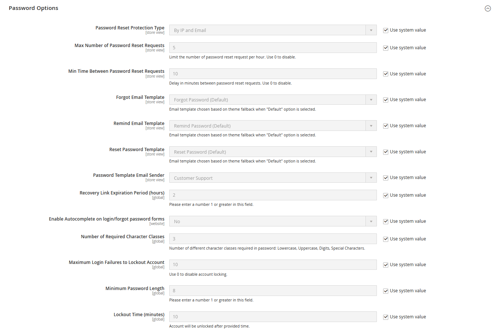

# Opções de senha do cliente

As opções de senha do cliente determinam o nível de segurança usado para solicitações de redefinição de senha, os modelos de email usados para notificação do cliente e o tempo de vida do link de recuperação de senha. Você pode permitir que os clientes alterem suas próprias senhas ou exigir que somente os administradores de armazenamento possam fazer isso.

## Configurar opções de senha do cliente

1. Na barra lateral _Admin_, vá para **[!UICONTROL Stores]** > _[!UICONTROL Settings]_>**[!UICONTROL Configuration]**.

1. No painel esquerdo, expanda **[!UICONTROL Customers]** e escolha **[!UICONTROL Customer Configuration]**.

1. Expanda a seção **[!UICONTROL Password Options]**.

   {width="600" zoomable="yes"}

1. Defina o **[!UICONTROL Password Reset Protection Type]** com o método que deseja usar para verificar solicitações de redefinição de senha:

   - `By IP and Email` - Verifique se houve tentativas anteriores de redefinir a senha para um email específico ou de um IP específico.
   - `By IP` - Verifique se houve tentativas anteriores de redefinir a senha de um IP específico.
   - `By Email` - Verifique se houve tentativas anteriores de redefinir a senha de um email específico.
   - `None` - Proteção desabilitada (sem limites para redefinir a senha).

   O **[!UICONTROL Max Number of Password Reset Requests]** e o **[!UICONTROL Min Time Between Password Reset Requests]** são calculados com base nessa configuração.

1. Para limitar o número de solicitações de redefinição de senha enviadas por hora, faça o seguinte:

   - Para **[!UICONTROL Max Number of Password Reset Requests]**, insira o número máximo de solicitações de redefinição de senha que podem ser enviadas por hora.

   - Para **[!UICONTROL Min Time Between Password Reset Requests]**, insira o número mínimo de minutos entre solicitações.

1. Para configurar a notificação por email de redefinição de senha, faça o seguinte:

   - Defina **[!UICONTROL Forgot Email Template]** com o modelo que é usado para o email enviado aos clientes que esqueceram suas senhas.

   - Defina **[!UICONTROL Remind Email Template]** com o modelo que é usado quando a senha de um cliente é redefinida por um usuário administrador.

   - Defina **[!UICONTROL Reset Password Template]** com o modelo que é usado quando os clientes alteram suas senhas.

   - Defina **[!UICONTROL Password Template Email Sender]** como o [contato de armazenamento](../getting-started/store-details.md) que aparece como remetente de notificações relacionadas a senha.

1. Complete as seguintes opções de segurança de redefinição de senha:

   - Para **[!UICONTROL Recovery Link Expiration Period (hours)]**, insira o número de horas antes do link de recuperação de senha expirar.

   - Se quiser que os campos nos formulários de logon do cliente e senha esquecida sejam preenchidos automaticamente a partir de entradas anteriores, defina **[!UICONTROL Enable Autocomplete on login/forgot password forms]** como `Yes`.

   - Para **[!UICONTROL Number of Required Character Classes]**, insira o número de tipos de caracteres diferentes que devem ser incluídos em uma senha com base nas seguintes classes de caracteres:

      - `Lowercase`
      - `Uppercase`
      - `Numeric`
      - `Special Characters`

   - Para **[!UICONTROL Maximum Login Failures to Lockout Account]**, insira o número de tentativas de logon com falha até que a conta do cliente seja bloqueada. Para tentativas ilimitadas, insira zero (`0`).

   - Para **[!UICONTROL Minimum Password Length]**, insira o número mínimo de caracteres que podem ser usados em uma senha. O número deve ser maior que zero.

   - Para **[!UICONTROL Lockout Time (minutes)]**, insira o número de minutos durante os quais uma conta de cliente é bloqueada depois de muitas tentativas de logon com falha.

1. Quando terminar, clique em **[!UICONTROL Save Config]**.
