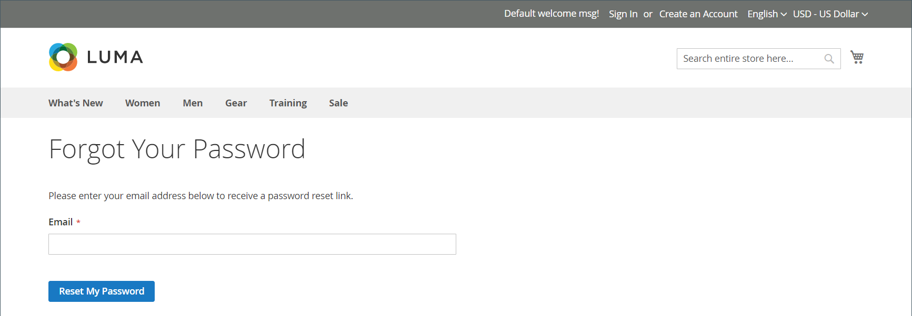

# Redefinir senhas do cliente

Os clientes geralmente redefinem suas senhas da loja clicando em _[!UICONTROL Forgot Your Password?]_. No entanto, o administrador de armazenamento pode iniciar uma redefinição de senha ou um logon forçado pelo Administrador.

| Função | Descrição |
| --- | --- |
| Redefinir senha | Um email de redefinição de senha é enviado diretamente para a conta de email do cliente. O administrador da loja não pode obter acesso à senha do cliente. |
| Forçar Entrada | Revoga os tokens de acesso OAuth associados à conta do cliente. Isso pode ser usado somente com contas de clientes que receberam tokens OAuth, como parte de uma [integração](../systems/integrations.md) da API da Web. Para saber mais, consulte [autenticação baseada em OAuth](https://developer.adobe.com/commerce/webapi/get-started/authentication/gs-authentication-oauth/) na documentação do desenvolvedor.   As contas de clientes padrão criadas na loja ou do Administrador não têm tokens OAuth. |

{style="table-layout:auto"}

## Redefinir uma senha da loja

1. Na página de login, o cliente clica em **[!UICONTROL Forgot Your Password?]**.

1. Quando solicitado, insere o **[!UICONTROL Email Address]** que está associado à sua conta e clica em **[!UICONTROL Reset My Password]**.

   {width="600" zoomable="yes"}

   >[!INFO]
   >
   >Se o endereço de email inserido corresponder ao que está associado à conta, o cliente receberá um email de Confirmação de redefinição de senha com um link para redefinir sua senha.

1. Quando o email chegar, o cliente clica no link _redefinir senha_ e insere sua **[!UICONTROL New Password]** quando solicitado.

1. Insira-o novamente para confirmar e clica em **[!UICONTROL Reset Password]**.

   >[!IMPORTANT]
   >
   >A nova senha deve ter seis ou mais caracteres sem espaços. Ao receberem a confirmação de que a senha foi atualizada, eles poderão usar a nova senha para entrar em suas contas. Por padrão, o link _redefinir senha_ é válido por 24 horas.

## Redefinir uma senha do Administrador

1. Na barra lateral _Admin_, vá para **[!UICONTROL Customers]** > **[!UICONTROL All Customers]**.

1. Localize a conta do cliente na grade e clique em **[!UICONTROL Edit]** na coluna _Ação_.

1. No conjunto de opções na parte superior da página, clique em **[!UICONTROL Reset Password]**.

   O número de solicitações de redefinição de senha permitidas em uma hora está definido no tópico [configuração](../configuration-reference/customers/customer-configuration.md).

## Revogar tokens OAuth de um cliente

>[!IMPORTANT]
>
>Não prossiga, a menos que você tenha um entendimento completo da Autenticação de API.

1. Na barra lateral _Admin_, vá para **[!UICONTROL Customers]** > **[!UICONTROL All Customers]**.

1. Localize a conta do cliente na grade e clique em **[!UICONTROL Edit]** na coluna _Ação_.

1. No conjunto de opções na parte superior da página, clique em **[!UICONTROL Force Sign In]**.

1. Quando for solicitada a confirmação, clique em **OK**.
