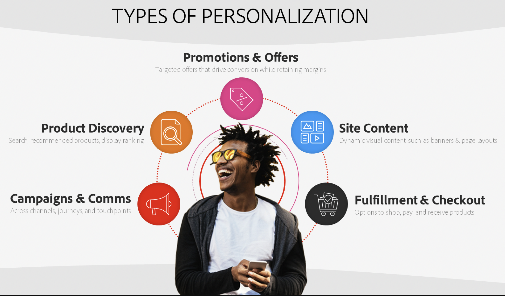

# Crie experiências atraentes e personalizadas em escala

O Adobe [!DNL Commerce] oferece um kit de ferramentas avançado para personalizar cada ponto de contato do cliente, aumentando a participação, a conversão e a receita do comprador.

Neste artigo, você aprenderá:

- O que é personalização?
- Quais dados são necessários para realizar a personalização?
- Como o Adobe [!DNL Commerce] desbloqueia a personalização?
- Casos de uso de personalização disponíveis

## O que é personalização?

O Personalization significa adaptar os aspectos da experiência de compra de cada cliente para atender às suas necessidades, contexto e preferências exclusivas. O Personalization não está limitado ao conteúdo do site ou à recomendação de produtos de melhor ajuste, mas abrange todos os pontos de contato na jornada do cliente, incluindo:

- **Campanhas e comunicações** - fornecendo mensagens relevantes e consistentes por meio de campanhas e comunicações
- **Descoberta de Produtos** - Mostrando os produtos certos aos clientes certos no momento certo
- **Promoções e ofertas** - Promoções e ofertas de direcionamento para impulsionar cada cliente a converter
- **Experiências de conteúdo** - Personalizar o conteúdo do site para que ele se sinta hiper-relevante para cada cliente e sua jornada

{width="700" zoomable="yes"}

Embora esses tipos de experiências personalizadas possam parecer viáveis para um pequeno subconjunto de clientes, personalizar em escala para milhares ou milhões de clientes em cada ponto de contato e canal, tudo em tempo real pode parecer impossível. Nas seções a seguir, veja como o Adobe [!DNL Commerce] e o Adobe Experience Cloud podem ajudar.

## Quais dados são necessários para realizar a personalização?

Uma personalização eficiente requer contexto ou sinais que fornecem informações sobre os clientes que podem ser usadas para modificar sua experiência. A tabela a seguir fornece os vários tipos de dados e a função que o Adobe [!DNL Commerce] desempenha no suporte à coleta e ativação desses dados.

| Tipos de dados | Dados da vitrine (Eventos comportamentais) | Dados de back office (eventos do lado do servidor) | Perfil do cliente e dados do segmento |
|---|---|---|---|
| **Definição** | Cliques ou ações que os clientes realizam no site. | Informações sobre o ciclo de vida e detalhes de cada pedido (passado e atual). | Quem são seus compradores e para quais segmentos eles se qualificam. |
| **Eventos capturados pelo Adobe Commerce** | [pageView](https://experienceleague.adobe.com/en/docs/commerce-merchant-services/data-connection/event-forwarding/events#pageview) [productPageView](https://experienceleague.adobe.com/en/docs/commerce-merchant-services/data-connection/event-forwarding/events) [searchRequestSent](https://experienceleague.adobe.com/en/docs/commerce-merchant-services/data-connection/event-forwarding/events#searchrequestsent) [searchResponseReceived](https://experienceleague.adobe.com/en/docs/commerce-merchant-services/data-connection/event-forwarding/events#searchresponsereceived) [addToCart](https://experienceleague.adobe.com/en/docs/commerce-merchant-services/data-connection/event-forwarding/events#addtocart) [openCart](https://experienceleague.adobe.com/en/docs/commerce-merchant-services/data-connection/event-forwarding/events#opencart) [signIn](https://experienceleague.adobe.com/en/docs/commerce-merchant-services/data-connection/event-forwarding/events#signin) [signOut](https://experienceleague.adobe.com/en/docs/commerce-merchant-services/data-connection/event-forwarding/events#signout) [startCheckout](https://experienceleague.adobe.com/en/docs/commerce-merchant-services/data-connection/event-forwarding/events#startcheckout) [completeCheckout](https://experienceleague.adobe.com/en/docs/commerce-merchant-services/data-connection/event-forwarding/events#completecheckout) [createRequisitionList](https://experienceleague.adobe.com/en/docs/commerce-merchant-services/data-connection/event-forwarding/events#createrequisitionlist) [addToRequisitionList](https://experienceleague.adobe.com/en/docs/commerce-merchant-services/data-connection/event-forwarding/events#addtorequisitionlist) [removeFromRequisitionList](https://experienceleague.adobe.com/en/docs/commerce-merchant-services/data-connection/event-forwarding/events#removefromrequisitionlist) | **Status do pedido**: [orderPlaced](https://experienceleague.adobe.com/en/docs/commerce-merchant-services/data-connection/event-forwarding/events-backoffice#orderplaced) [orderItemsReturnedInitiated](https://experienceleague.adobe.com/en/docs/commerce-merchant-services/data-connection/event-forwarding/events-backoffice#orderitemsreturnedinitiated) [orderItemsShipped](https://experienceleague.adobe.com/en/docs/commerce-merchant-services/data-connection/event-forwarding/events-backoffice#orderitemsshipped) [orderCancelled](https://experienceleague.adobe.com/en/docs/commerce-merchant-services/data-connection/event-forwarding/events-backoffice#ordercancelled) [**Histórico de pedidos**](https://experienceleague.adobe.com/en/docs/commerce-merchant-services/data-connection/fundamentals/connect-data#send-historical-order-data): - SKU, Nome, Quantidade de Preço, Desconto - Categoria do Produto - Valor do Pagamento, Tipo, Moeda - Método de Remessa e Valor - ID de Reembolso, Valor, Moeda  - Motivo da Devolução, Condição, Resolução - Endereço - Email | [**Registro de perfil**](https://experienceleague.adobe.com/en/docs/commerce-merchant-services/data-connection/event-forwarding/events-profilerecord): (Nome, Gênero, Endereço, Status de Fidelidade, Número de Telefone, Endereço de Email) **Status da conta**: [accountCreated](https://experienceleague.adobe.com/en/docs/commerce-merchant-services/data-connection/event-forwarding/events-backoffice#accountcreated) [accountUpdated](https://experienceleague.adobe.com/en/docs/commerce-merchant-services/data-connection/event-forwarding/events-backoffice#accountupdated) [accountDeleted](https://experienceleague.adobe.com/en/docs/commerce-merchant-services/data-connection/event-forwarding/events-backoffice#accountdeleted) |

Com todos esses dados avançados de [!DNL Commerce] primários, você está pronto para direcionar e personalizar a experiência de cada comprador. Na próxima seção, saiba como o [!DNL Commerce] e o Adobe Experience Cloud ajudam a criar experiências personalizadas e os casos de uso que você pode ativar.

## Como o Adobe [!DNL Commerce] capacita a personalização?

O Compartilhamento de dados do Adobe [!DNL Commerce] permite coletar e compartilhar os tipos de dados na tabela anterior com outros produtos da Adobe Experience Cloud para potencializar perfis e públicos-alvo de clientes unificados, campanhas personalizadas e análises e insights avançados.

{width="700" zoomable="yes"}

O Compartilhamento de Dados do Adobe [!DNL Commerce] inclui dois componentes principais:

1. [Conexão de Dados](https://experienceleague.adobe.com/en/docs/commerce-merchant-services/data-connection/overview): Compartilhar dados de vitrine, back office e perfil do cliente do Adobe [!DNL Commerce] com a rede de borda da Adobe Experience Platform para uso em aplicativos da Adobe Experience Cloud, incluindo:

   - [Adobe [!DNL Real-Time CDP]](https://experienceleague.adobe.com/en/docs/experience-platform/rtcdp/intro/rtcdp-intro/overview): compile os dados do cliente de várias fontes (ERP, CRM, POS) em perfis unificados e crie segmentos baseados em regras ou AI.
   - [Adobe [!DNL Journey Optimizer]](https://experienceleague.adobe.com/en/docs/journey-optimizer/using/get-started/get-started): inicie jornadas personalizadas omnicanal, incluindo campanhas de email, SMS, notificações por push e muito mais.
   - [Customer Journey Analytics](https://experienceleague.adobe.com/en/docs/analytics-platform/using/cja-overview/cja-overview) e [Adobe [!DNL Analytics]](https://experienceleague.adobe.com/en/docs/analytics/analyze/admin-overview/analytics-overview): obtenha informações sobre o cliente e a empresa.
   - [Adobe [!DNL Target]](https://experienceleague.adobe.com/en/docs/target/using/introduction/intro): testar e otimizar conteúdo, produtos recomendados, ofertas, navegação e muito mais.

1. [[!DNL Audience Activation]](https://experienceleague.adobe.com/en/docs/commerce-admin/customers/audience-activation): use [!DNL Real-Time CDP] públicos-alvo para personalizar blocos de conteúdo dinâmico, promoções e regras de produto relacionadas no seu site Adobe [!DNL Commerce].

### Experiências personalizadas de vitrine em qualquer canal, em escala

O Adobe [!DNL Commerce] pode aproveitar uma vitrine de alto desempenho, chamada [Edge Delivery Services](https://experienceleague.adobe.com/developer/commerce/storefront/), para fornecer experiências personalizadas em todos os seus canais, com recursos de IA no núcleo, e velocidade como base.

Com os Edge Delivery Services, é possível:

- **Criar conteúdo personalizado**: use a criação baseada em documentos, a experimentação nativa com variações de texto e imagem da IA gerativa para personalizar a experiência em escala. Use a criação de conteúdo do Assets e da IA gerativa para produzir imagens de produtos e marketing em escala.

- **Gerar variações**: permite que os autores de conteúdo usem a IA gerativa para criar grandes volumes de [variações de conteúdo de texto e de imagem](https://experienceleague.adobe.com/en/docs/experience-manager-learn/sites/generative-ai/generate-variations) personalizadas, orientadas por IA, com o Adobe Firefly.

- **Implantar via Loja do Edge Delivery Services**: recursos de conteúdo na Edge e no Commerce viabilizados por componentes internos, para criar experiências de compra personalizadas para seus públicos.

- **Commerce e Adobe Experience Manager Assets**: criação de ativos de produtos de IA gerativa e variações em escala. Crie, entregue e monitore a entrega de conteúdo em qualquer canal.

{width="700" zoomable="yes"}

### Personalization pronto para uso: Introdução aos recursos nativos do Adobe [!DNL Commerce]

O Adobe [!DNL Commerce] fornece personalização poderosa com seus recursos nativos prontos para uso. A tabela a seguir descreve os recursos do [!DNL Commerce] que você pode ativar imediatamente para começar a usar a jornada de personalização.

| Categoria | Recursos |
|---|---|
| Descoberta personalizada de produtos | [[!DNL Live Search]](https://experienceleague.adobe.com/en/docs/commerce-merchant-services/live-search/overview): Personalize e otimize os resultados da pesquisa com base nas ações comportamentais e afinidades de um comprador no site com a pesquisa habilitada por IA. [Merchandising de categoria inteligente](https://experienceleague.adobe.com/en/docs/commerce-merchant-services/live-search/live-search-admin/category-merch): classificação de produto orientada por IA em páginas de categoria com base nas ações e afinidades comportamentais no site de um comprador. [Recommendations de Produtos](https://experienceleague.adobe.com/en/docs/commerce-merchant-services/product-recommendations/guide-overview): recomendações de produtos alimentados por IA com base no comportamento, nas tendências e nas afinidades do comprador. [Regras de Produto Relacionadas](https://experienceleague.adobe.com/en/docs/commerce-admin/marketing/promotions/product-relationships/product-related-rules): defina regras personalizadas para exibir produtos do seu catálogo para impulsionar venda cruzada e venda adicional. |
| Conteúdo personalizado do site | [Blocos de conteúdo dinâmico](https://experienceleague.adobe.com/en/docs/commerce-admin/content-design/elements/dynamic-blocks/dynamic-blocks): exibir blocos de conteúdo personalizados, por exemplo, banners, com base em segmentos de clientes no Adobe Commerce. |
| Ofertas e promoções personalizadas | [Regras de Preço do Carrinho](https://experienceleague.adobe.com/en/docs/commerce-admin/marketing/promotions/cart-rules/price-rules-cart): aplique descontos a itens do carrinho com base em um conjunto de condições, incluindo segmentos de clientes no Adobe [!DNL Commerce]. |
| Insights e medição | [Adobe [!DNL Commerce] Inteligência](https://experienceleague.adobe.com/en/docs/commerce-business-intelligence/mbi/getting-started): entenda como suas estratégias de personalização estão funcionando e melhoram com o tempo. |

## Principais casos de uso de personalização

Os clientes do Adobe [!DNL Commerce] estão usando recursos prontos para uso e compartilhando dados com a Adobe Experience Cloud para uma variedade de casos de uso. As seções a seguir destacam os principais casos de uso e descrevem como eles são implementados usando Apenas o Adobe [!DNL Commerce] ou [!DNL Commerce] mais os aplicativos Experience Cloud.

### Campanhas e comunicações personalizadas

| Caso de uso | Solução |
|---|---|
| **Carrinho e navegação abandonados** - Forneça um email personalizado de reengajamento ou uma notificação quando um cliente abandonar o carrinho ou a sessão de navegação após demonstrar alto engajamento | **Adobe [!DNL Commerce] Only**: [Lembretes de Email](https://experienceleague.adobe.com/en/docs/commerce-admin/marketing/communications/email-reminders/email-reminder-rules) **Adobe [!DNL Commerce] com Adobe Journey Optimizer**: [!DNL Commerce], os dados servem como disparador para uma jornada de abandono de omnicanal. Personalize essa jornada com base nos atributos do cliente, no que ele abandonou, em outros comportamentos de compra e em compras anteriores. Commerce com Adobe Journey Optimizer e Real-Time CDP: adapte campanhas de abandono com base em perfis unificados de clientes e públicos gerenciados centralmente, por exemplo, criando um público com alta taxa de abandono. |
| **Criação de público-alvo centralizada** - Crie públicos-alvo baseados em regras ou habilitados por IA com base no comportamento no site, compras anteriores, atributos de perfil, afinidades de categoria, status de fidelidade, valor do cliente e muito mais | **Adobe [!DNL Commerce] Somente**: Colete informações sobre o perfil do cliente quando [!DNL Commerce] clientes criarem contas. Crie [segmentos de clientes](https://experienceleague.adobe.com/en/docs/commerce-admin/customers/segments/customer-segments) baseados em regras e grupos de clientes para personalizar o conteúdo e as promoções. **Adobe [!DNL Commerce] com Adobe Real-Time CDP**:  [Perfis unificados](https://experienceleague.adobe.com/en/docs/experience-platform/segmentation/home) entre fontes de dados e canais; públicos baseados em regras ou habilitados por IA. |
| **Oferta de Email/SMS personalizada com base no comportamento do comprador** - Envie ofertas personalizadas para os clientes por email direcionado com base em compras anteriores e no comportamento do comprador, por exemplo, envie ofertas de produtos ou categorias que os clientes visualizaram ou com as quais participaram. | **Adobe [!DNL Commerce] Only**: Exportar dados para uso com soluções de automação de marketing.Os dados  **Adobe [!DNL Commerce] com Adobe Journey Optimizer e Real-Time CDP**: [!DNL Commerce] servem como disparador para ofertas de email ou SMS e fornecem sinais (comportamentos do comprador) para personalização com base em. O Real-Time CDP não é necessário, mas geralmente essas ofertas e campanhas são criadas em torno de públicos-alvo, que seriam criados e gerenciados no Real-Time CDP. |
| **Produtos/Marcas compatíveis com venda cruzada ou venda adicional** - Se um cliente comprar um produto ou marca compatível ou indicar alta afinidade com outro produto ou marca, envie uma campanha (email/SMS) para impulsionar a conversão de venda cruzada. | **Adobe [!DNL Commerce] Only**: Use Adobe [!DNL Commerce] [Product Recommendations](https://experienceleague.adobe.com/en/docs/commerce-merchant-services/product-recommendations/guide-overview) para recomendar produtos específicos no site. Você também pode usar as [Regras de Produto Relacionadas](https://experienceleague.adobe.com/en/docs/commerce-admin/marketing/promotions/product-relationships/product-related-rules) para sugerir outros produtos.O  **[!DNL Commerce] com [!DNL Target]**: Adobe [!DNL Target] também tem um mecanismo de recomendação de produto interno com recursos avançados, como afinidade de categorias. Isso pode ser usado para venda cruzada ou adicional. **[!DNL Commerce] com Adobe Journey Optimizer**: Use [!DNL Target] ou [!DNL Commerce] para determinar os produtos a serem recomendados e entregues via Adobe Journey Optimizer. |

### Experiências personalizadas do site

| Caso de uso | Solução |
|---|---|
| **Conteúdo do Site Personalizado** - Personalize banners de sites e outros conteúdos de página com base nas ações do comprador, como navegação de produtos e afinidades de categorias. Implante conteúdo de melhor ajuste com base nos resultados de testes A/B ou metas comerciais. | **Adobe [!DNL Commerce] Only**: Implantar [blocos de conteúdo dinâmico](https://experienceleague.adobe.com/en/docs/commerce-admin/content-design/elements/dynamic-blocks/dynamic-blocks) específicos de segmento. **[!DNL Commerce] com Real-Time CDP **: Use [Audience Activation](https://experienceleague.adobe.com/en/docs/commerce-admin/customers/audience-activation) para implantar blocos de conteúdo dinâmico específicos de público-alvo que respondam a ações em tempo real e dados unificados de perfil do cliente, enquanto gerencia perfis e públicos-alvo de forma centralizada no Real-Time CDP. **[!DNL Commerce] com[!DNL Target]**: Personalize todas as partes da experiência do site, incluindo conteúdo, itens de navegação, layouts de página completos e muito mais, usando dados do Adobe [!DNL Commerce] no Adobe [!DNL Target]. Teste A/B do conteúdo, selecione e implante automaticamente o conteúdo vencedor para cada cliente. **[!DNL Commerce] com AEM Assets **: Armazene todo o seu conteúdo no Adobe Experience Manager Assets. Acesse nativamente esse conteúdo no Adobe Commerce. Use a IA gerativa para criar variações de conteúdo para personalizar diferentes segmentos ou públicos. |
| **Oferta personalizada no site com base no comportamento** - Personalize promoções com base nas ações do comprador, como navegação de produtos e afinidades de categorias. Implante a próxima melhor oferta com base nos resultados de testes A/B ou metas de negócios. | **Adobe [!DNL Commerce] Somente**: Implantar catálogo específico de segmento e [regras de preço do carrinho](https://experienceleague.adobe.com/en/docs/commerce-admin/marketing/promotions/cart-rules/price-rules-cart). **Adobe [!DNL Commerce] com Real-Time CDP**: Use [Audience Activation](https://experienceleague.adobe.com/en/docs/commerce-admin/customers/audience-activation) para implantar ofertas específicas de público-alvo, enquanto gerencia de forma centralizada perfis/públicos-alvo no Real-Time CDP. **Commerce com[!DNL Target]**: use o offer decisioning para determinar qual oferta implantar, teste A/B ou defina metas comerciais para orientar as ofertas implantadas no Adobe Commerce. |

### Analytics e Insights

| Caso de uso | Solução |
|---|---|
| **Comportamento do cliente por canal** - Entenda as nuances de como os clientes se envolvem em cada canal (Web, presencial, de aplicativo, outro) para afetar as estratégias de marketing para cada canal; entenda o funil do comprador e as fraquezas na experiência do cliente. | **Adobe [!DNL Commerce] Only**: [Adobe [!DNL Commerce] Intelligence](https://experienceleague.adobe.com/en/docs/commerce-business-intelligence/mbi/getting-started) fornece análises avançadas no canal digital [!DNL Commerce], mas não entre canais ou partes mais amplas da jornada do cliente. **Adobe [!DNL Commerce] com Customer Journey Analytics**: [!DNL Commerce] feeds de dados dashboards para detalhes completos e avançados sobre todos os estágios da experiência do cliente (entre canais). Entenda cada ponto de contato e o funil mais amplo para identificar pontos fracos na jornada do cliente em que os clientes podem cair. |
| **Tendências de Compra** - Entenda os comportamentos de compra em um período específico (por exemplo, análise da cesta de compras, análise de produtos) para identificar tendências, sazonalidade e otimizar o marketing com base em padrões de compra históricos. | **Adobe [!DNL Commerce] Only**: [Adobe [!DNL Commerce] Intelligence](https://experienceleague.adobe.com/en/docs/commerce-business-intelligence/mbi/getting-started) fornece análises avançadas no canal digital [!DNL Commerce], mas não entre canais ou partes mais amplas da jornada do cliente. **Adobe [!DNL Commerce] com Customer Journey Analytics**: [!DNL Commerce] feeds de dados dashboards para detalhes completos e avançados sobre todos os estágios da experiência do cliente (entre canais). Entenda cada ponto de contato e o funil mais amplo para identificar pontos fracos na jornada do cliente em que os clientes podem cair. |

## Exemplo de casos de uso

- Saiba como você pode usar o Adobe Journey Optimizer para [enviar um email de carrinho abandonado](https://experienceleague.adobe.com/en/docs/commerce-merchant-services/data-connection/use-cases/using-ajo).
- Saiba como [criar um público no Real-Time CDP](https://experienceleague.adobe.com/en/docs/commerce-merchant-services/data-connection/use-cases/create-audience) para informar uma regra de preço de carrinho no Adobe [!DNL Commerce].
